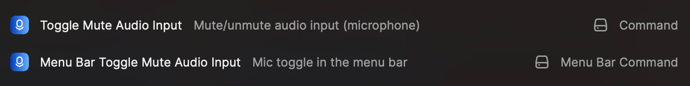
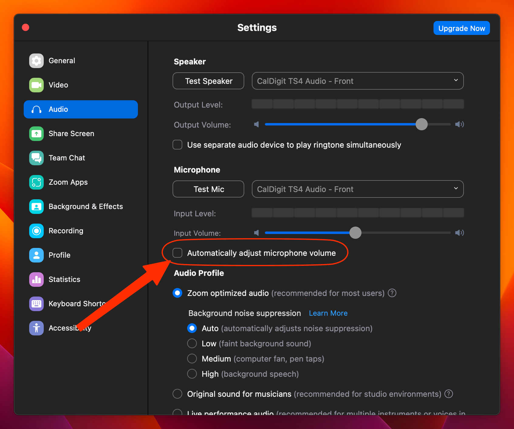

# Toggle Audio Input (microphone)
A [Raycast](https://www.raycast.com/) extension to mute/unmute audio input (microphone)



The extension has a command to directly mute/unmute the audio input, but there's also a menu bar extension showing if it's either muted or not, and lets you click on the menu item to toggle its state.

## Notes
<details>
  <summary>Zoom users</summary>

You have to disable the "Automatically adjust microphone volume" in the audio settings otherwise Zoom will unmute the microphone everytime


</details>


## Development

Open the project in your IDE of choice (❤️Jetbrains) and install the dependencies via:

```bash
$ npm install
```

To run and test extension locally:

```bash
$ npm run dev
```

## Project structure

Inside the `/src` directory you will find the source files for this extension.

| Directory      | Description                                                   |
|----------------|---------------------------------------------------------------|
| src/           | The Raycast commands                                          |
| src/shared     | Shared functions                                              |

