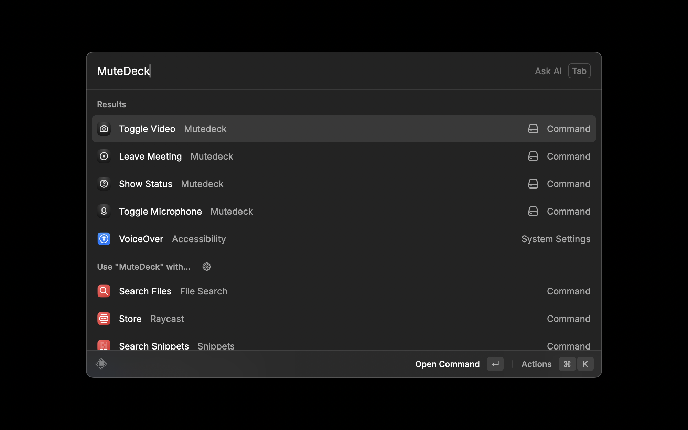
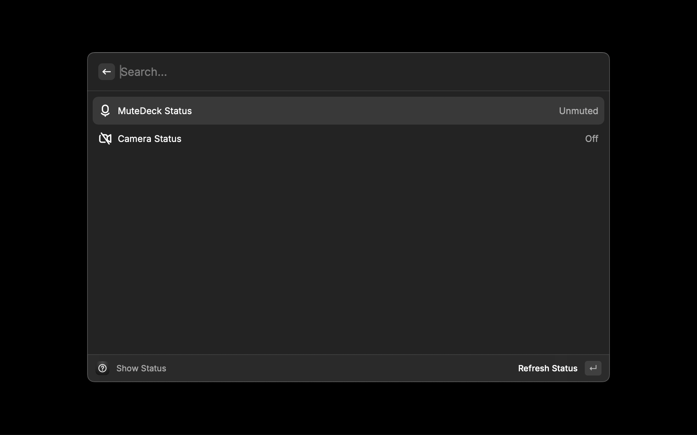
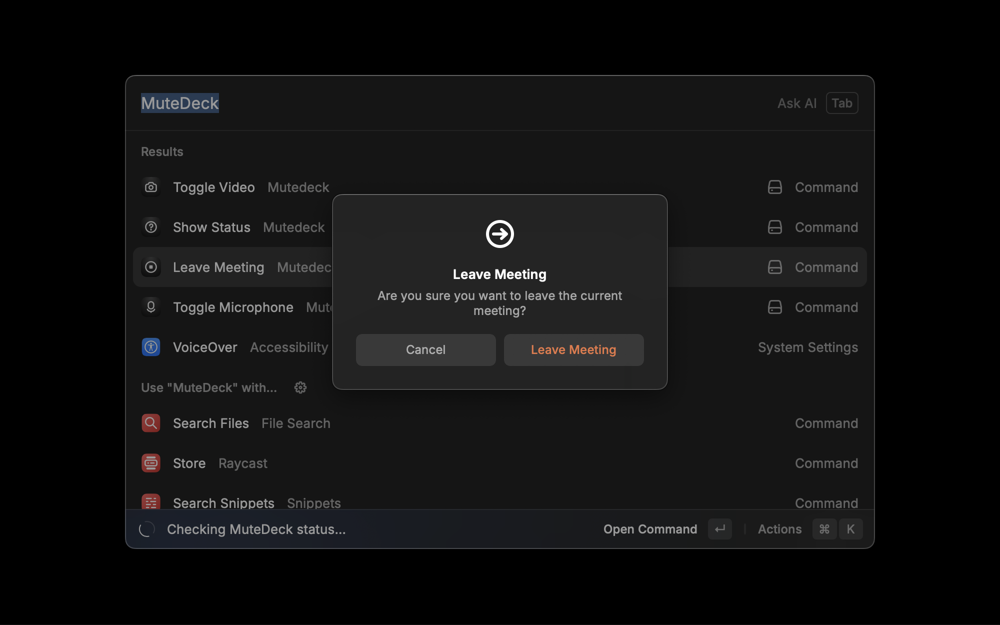

# MuteDeck for Raycast

Control your meeting audio and video directly from Raycast. MuteDeck provides quick access to essential meeting controls, making it easy to manage your presence in online meetings.

## Demo

## Screenshots

## Features

- 🎤 **Microphone Control**
  - Quick mute/unmute toggle
  - Status indicator
  - Safety confirmations while presenting

- 📹 **Camera Control**
  - Toggle video on/off
  - Visual status display
  - Confirmation dialogs for safe operation

- 🚪 **Meeting Management**
  - One-click meeting exit
  - Current meeting status
  - Optional leave confirmations

- 📊 **Real-time Status**
  - Meeting state indicator
  - Microphone status
  - Camera status
  - Screen sharing status
  - Recording status

## Requirements

- macOS 12 or later
- Raycast 1.50.0 or later
- MuteDeck desktop app installed and running

## Installation

1. Install the MuteDeck desktop app
2. Install this extension from Raycast Store
3. Grant necessary permissions when prompted

## Usage

### Quick Commands

- **Toggle Microphone**: Quickly mute/unmute your microphone
- **Toggle Video**: Turn your camera on/off
- **Leave Meeting**: Exit the current meeting
- **Show Status**: View current meeting state and controls

### Keyboard Shortcuts

You can assign custom keyboard shortcuts to any command through Raycast preferences.

## Troubleshooting

### Common Issues

1. **Commands not working**

   - Ensure MuteDeck desktop app is running
   - Check if you're in an active meeting
   - Verify permissions are granted

2. **Icons not visible**

   - Restart Raycast
   - Clear command cache (⌘ + ⌥ + R)
   - Reinstall extension if needed

3. **Status not updating**
   - Check MuteDeck desktop app status
   - Ensure network connectivity
   - Restart the extension

## Development

See [Development Guidelines](docs/development.md) for detailed information about:

- Setting up the development environment
- Code quality standards
- Testing procedures
- Release process

## Contributing

We welcome contributions! Please see our [Contributing Guide](CONTRIBUTING.md) for details on:

- Code of conduct
- Development process
- Pull request guidelines
- Testing requirements

## Support

- [Report an Issue](https://github.com/chadrwalters/mutedeck-raycast-extension/issues)
- [Request a Feature](https://github.com/chadrwalters/mutedeck-raycast-extension/issues/new)
- [View Documentation](docs/)

## License

MIT License - see [LICENSE](LICENSE) for details
