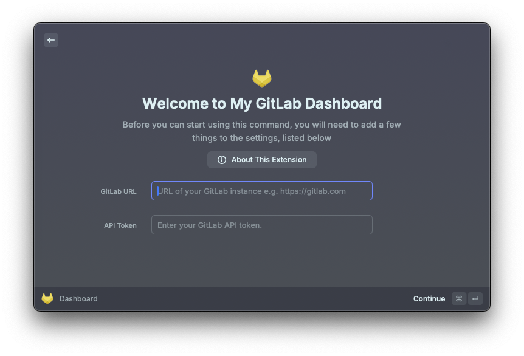
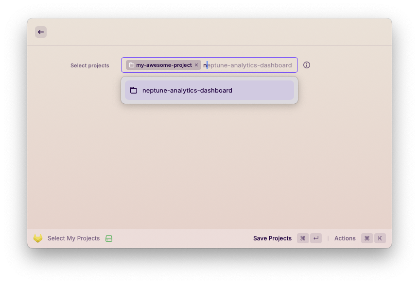
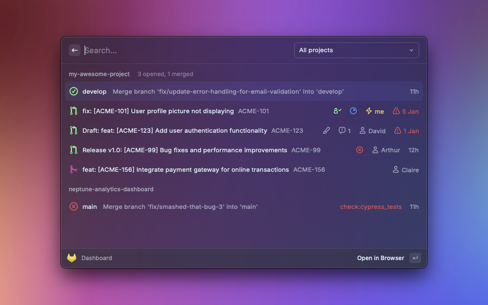

# My GitLab Dashboard

## Why this extension
This extension was born out of pure necessity. It's true that in the Raycast Store you can already find an (excellent)
[GitLab extension](https://www.raycast.com/tonka3000/gitlab) which covers almost all your bases but what I actually
wanted was something that allowed me to see at a glance what was going on with all of my projects without having to go
through each one of them individually.

This extension is therefore not meant to be thorough but rather serve a specific workflow. You can always submit your
suggestions if you find this workflow being pretty close to yours but miss some functionality or rather use this
extension as a foundation to build your own (extensions in Raycast can be run locally).

### Features

* Select which projects you want to manage on your dashboard.
* For each project selected:
    * View the status of the latest pipeline run for the default branch.
    * List all the merge requests that were merged today.
    * List all the merge requests opened.
    * For each MR opened:
        * Figure out the Jira task associated with it (by looking at the MR title) and offer an action to browse it (configuration).
        * View nuggets of information such as the author, the creation date, approvers, regular and unresolved comments
        and more. 
        * MRs created by you will be specially indicated.
        * MRs with changes since last viewed will be specially indicated.
        * Creation dates are coloured to show age (configuration).
        * View pipeline status if failed and offer an action to browse the failing job.
        * Mark as draft/ready actions.
        * Merge action.

## Getting Started

The first time you run the extension you will need to fill in some basic information like the URL of your GitLab
instance and your [API
token](https://docs.gitlab.com/ee/user/profile/personal_access_tokens.html#create-a-personal-access-token). 

As for the token, for the most part you will be good with read scope but some functionality such as the merge or mark as
draft actions will require write scope too.

### Select My Projects

After the initial setup you then need to decide on the projects that will be displaying on your dashboard. You do so by
launching the 'Select My Projects' command.

### Dashboard

Et voilà!

