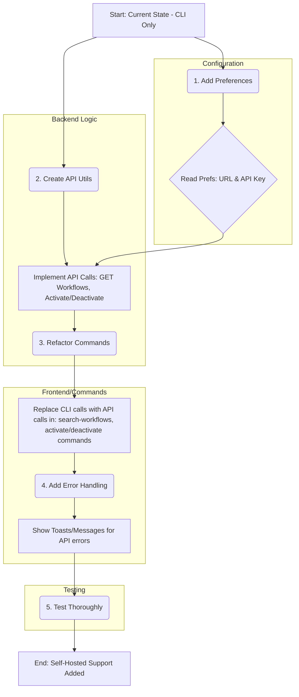

# Plan: Add Self-Hosted n8n Support to Raycast Extension

**Goal:** Enable the extension to connect to any n8n instance (cloud or self-hosted) using a user-provided URL and API key, replacing the current reliance on the local n8n desktop app's CLI.

**Core Changes:**

1.  **Configuration:** Add preferences within Raycast for users to input their n8n instance URL and API Key.
2.  **API Interaction:** Replace the existing functions that call the n8n CLI (`n8n-cli-utils.ts`) with new functions that make direct HTTP requests to the n8n REST API using the configured URL and API Key. Refer to [n8n API Docs](https://docs.n8n.io/api/api-reference/) for specifics.
3.  **Error Handling:** Implement robust error handling for API requests (e.g., invalid URL, incorrect API key, network issues, API errors).
4.  **UI/UX:** Update the UI components to use the new API functions and provide appropriate feedback to the user (e.g., loading states, error messages).

**Proposed Plan Diagram:**

**Detailed Steps:**

1.  **Modify `package.json`:**
    *   Add a `preferences` section to define fields for `n8nInstanceUrl` (type: `text`, title: "n8n Instance URL", placeholder: "https://your-n8n.example.com") and `n8nApiKey` (type: `password`, title: "n8n API Key").
2.  **Create `src/utils/n8n-api-utils.ts`:**
    *   Import necessary modules (`fetch`, `getPreferenceValues`).
    *   Implement a base function for making authenticated API requests (using `X-N8N-API-KEY` header).
    *   Create functions mirroring the n8n API endpoints needed (referencing docs):
        *   `getAllWorkflowsAPI()`: `GET /api/v1/workflows`
        *   `activateWorkflowAPI(id: string, active: boolean)`: `POST /api/v1/workflows/{id}/activate` or `POST /api/v1/workflows/{id}/deactivate`.
    *   Include error handling.
3.  **Refactor Core Command Files:**
    *   **`src/search-workflows.tsx`:** Replace CLI calls with API calls, read preferences, update UI/error handling.
    *   **`src/activate-all-workflows.tsx` / `src/deactivate-all-workflows.tsx`:** Similar refactoring.
    *   **`src/components/action-on-workflow.tsx`:** Update actions to use API calls.
4.  **Update Helper Components/Hooks:**
    *   Ensure components handle API data structures.
    *   Guide users to enter preferences if missing.
5.  **Remove/Deprecate CLI Utils:**
    *   Clean up `src/utils/n8n-cli-utils.ts`.
6.  **Testing:**
    *   Test thoroughly with self-hosted instance.
    *   Test edge cases (invalid credentials, network errors).
    *   Test with n8n cloud instance if possible.