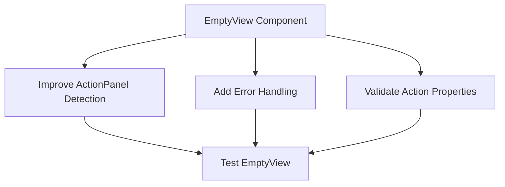

# Plan to Fix "Missing required property 'title' for Unknown" Error

## Problem Summary

The Raycast extension for n8n is displaying the error "Missing required property 'title' for Unknown" specifically when using the "search triggerable workflows" feature. The error occurs consistently every time the feature is used, and it might be related to the persistent filter action. The error persists even after resetting all data.

## Root Cause Analysis

Based on code examination, the most likely causes are:

1. **EmptyView Component Issues**: The EmptyView component in `src/components/empty-view.tsx` is used when there are no workflows to display. The way it handles actions might be causing the error.

2. **ActionPanel Structure**: There might be an issue with how ActionPanel and Action components are structured in `src/search-webhook-workflows.tsx`.

3. **Filter-Related Components**: Since the issue might be related to the persistent filter action, there could be problems with how TriggerFilterForm is integrated.

## Solution Approach

### Phase 1: Fix EmptyView Component

The EmptyView component attempts to handle different types of action components, but there might be edge cases not being handled correctly. We need to:

1. Improve the logic for determining if a node is an ActionPanel
2. Add more robust error handling
3. Ensure all Action components have required properties



### Phase 2: Fix ActionPanel Structure in search-webhook-workflows.tsx

The search-webhook-workflows.tsx file contains several ActionPanel structures that might have issues:

1. Review all Action components to ensure they have title properties
2. Ensure consistent use of ActionPanel.Section elements
3. Fix how components are pushed onto the navigation stack

### Phase 3: Address Filter-Related Issues

Since the issue might be related to the persistent filter action:

1. Review the TriggerFilterForm component
2. Improve validation for filter data
3. Add safeguards when applying filters

### Phase 4: Implement Comprehensive Error Handling

Add more robust error handling throughout the application:

1. Add try-catch blocks around critical sections
2. Implement fallback mechanisms
3. Add more detailed logging

## Specific Code Changes

### 1. Fix EmptyView Component

In `src/components/empty-view.tsx`:

```typescript
// Improve the isActionPanel function to handle more edge cases
const isActionPanel = (node: React.ReactNode): boolean => {
  return React.isValidElement(node) && 
    (node.type === ActionPanel || 
     (typeof node.type === 'function' && node.type.name === 'ActionPanel'));
};

// Add validation for Action components
const validateActions = (node: React.ReactNode): React.ReactNode => {
  if (!React.isValidElement(node)) return node;
  
  // If it's an Action without a title, add a default title
  if (node.type === Action && !node.props.title) {
    return React.cloneElement(node, { title: "Action" });
  }
  
  // Recursively validate children
  if (node.props && node.props.children) {
    return React.cloneElement(node, {
      children: React.Children.map(node.props.children, validateActions)
    });
  }
  
  return node;
};

// Use the validation function in the component
let finalActions: React.ReactNode = undefined;
if (actions) {
  if (isActionPanel(actions)) {
    finalActions = validateActions(actions);
  } else {
    try {
      finalActions = <ActionPanel>{validateActions(actions)}</ActionPanel>;
    } catch (error) {
      console.error("Error wrapping actions in ActionPanel:", error);
      finalActions = <ActionPanel><Action title="Fallback Action" /></ActionPanel>;
    }
  }
} else if (extensionPreferences) {
  finalActions = <ActionPanel><ActionOpenPreferences /></ActionPanel>;
}
```

### 2. Fix ActionPanel Structure in search-webhook-workflows.tsx

In `src/search-webhook-workflows.tsx`:

```typescript
// Ensure all Action components have title properties
<Action
  title="Reset All Data" // Ensure title is provided
  icon={Icon.Trash}
  style={Action.Style.Destructive}
  onAction={async () => {
    try {
      await resetAllStorageData();
      setRefresh(Date.now());
    } catch (error) {
      console.error("Failed to reset storage:", error);
    }
  }}
/>

// Ensure consistent use of ActionPanel.Section
<ActionPanel>
  <ActionPanel.Section title="Troubleshooting">
    {/* Actions here */}
  </ActionPanel.Section>
</ActionPanel>
```

### 3. Improve Filter Handling

In `src/components/TriggerFilterForm.tsx` and related files:

```typescript
// Add validation for filter data
const validateFilters = (filters: unknown): string[] => {
  if (!Array.isArray(filters)) return [];
  return filters.filter(item => typeof item === 'string');
};

// Use validation when loading filters
const storedFilters = await LocalStorage.getItem<string>(TRIGGER_FILTERS_KEY);
let currentFilters: string[] = [];

if (storedFilters) {
  try {
    const parsedFilters = JSON.parse(storedFilters);
    currentFilters = validateFilters(parsedFilters);
    
    // If validation changed the filters, save the cleaned version
    if (JSON.stringify(currentFilters) !== JSON.stringify(parsedFilters)) {
      await LocalStorage.setItem(TRIGGER_FILTERS_KEY, JSON.stringify(currentFilters));
    }
  } catch (error) {
    console.error("Failed to parse filters:", error);
    await LocalStorage.removeItem(TRIGGER_FILTERS_KEY);
  }
}
```

### 4. Add Comprehensive Error Handling

Throughout the codebase:

```typescript
// Add try-catch blocks around critical sections
try {
  // Critical code
} catch (error) {
  console.error("Operation failed:", error);
  // Fallback behavior
}

// Add defensive rendering
{someCondition ? (
  <ComponentThatMightFail />
) : (
  <FallbackComponent />
)}
```

## Testing Plan

1. Test the "search triggerable workflows" feature with:
   - No workflows
   - With workflows but no filters
   - With workflows and filters
   - After resetting all data

2. Test filter-related functionality:
   - Setting filters
   - Clearing filters
   - Using filters with different workflow states

3. Test error handling:
   - Simulate corrupted data
   - Test with invalid inputs
   - Verify graceful degradation

## Implementation Timeline

1. Phase 1 (Fix EmptyView Component): 1 day
2. Phase 2 (Fix ActionPanel Structure): 1 day
3. Phase 3 (Address Filter-Related Issues): 1 day
4. Phase 4 (Implement Error Handling): 1 day
5. Testing and Refinement: 2 days

Total: 6 days