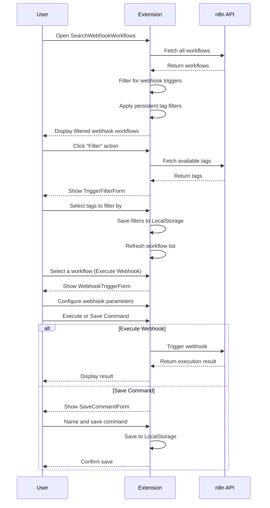
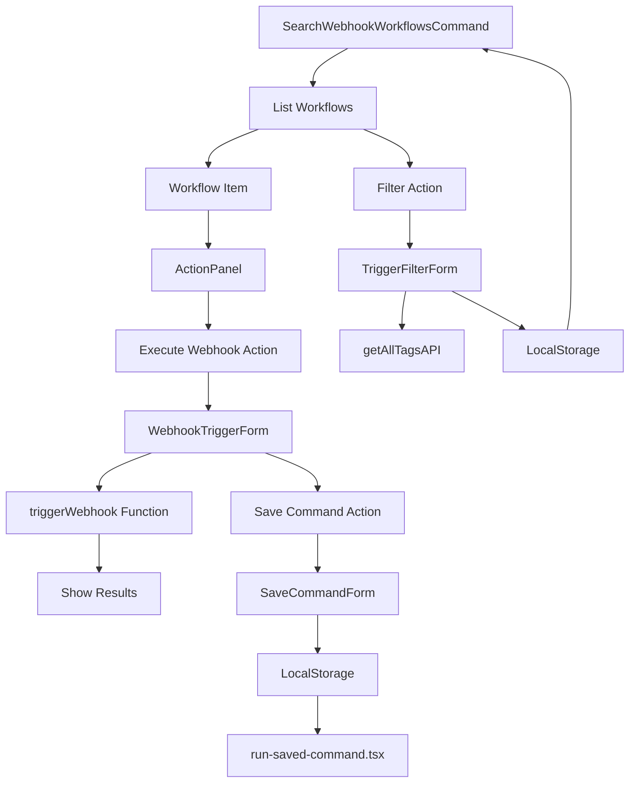

# Implementation Plan for n8n Raycast Extension

## Overview

This plan outlines the implementation of three key features for the n8n Raycast extension:

1. **Persistent Tag Filtering** - Allow users to filter webhook workflows by tags
2. **Execute Webhook Command** - Make this the default action for workflow items
3. **Save Command Option** - Allow saving webhook executions with custom parameters

## User Flow

## Component Interactions

## Implementation Details

### 1. Persistent Tag Filtering

#### UI Components
- Add a "Filter" action at the list level (not on individual items)
- Use the existing `TriggerFilterForm` component to:
  - Fetch tags from n8n using `getAllTagsAPI`
  - Allow selection of multiple tags
  - Save selected tags to LocalStorage

#### Data Flow
- On component mount, load saved filters from LocalStorage
- Fetch all workflows and first filter for webhook triggers
- Then apply tag filters to show only workflows with matching tags
- Provide visual indication when filters are active

#### Storage
- Use the `TRIGGER_FILTERS_KEY` constant for LocalStorage
- Store filters as a JSON array of tag names
- Include validation when loading to handle potential corruption

### 2. Execute Webhook Command (Default Action)

#### UI Components
- Make "Execute Webhook" the default action for each workflow item
- Use the existing `WebhookTriggerForm` component to:
  - Display webhook details (method, path)
  - Allow customization of request parameters
  - Show execution results

#### Data Flow
- When a workflow is selected, extract webhook details
- Present form for customizing the request
- On execution, call the `triggerWebhook` function
- Display results to the user with proper formatting

#### Error Handling
- Validate input parameters before execution
- Handle network errors and API response errors
- Provide clear feedback on success or failure

### 3. Save Command Option

#### UI Components
- Add "Save Command" option in the WebhookTriggerForm
- Use the existing `SaveCommandForm` component to:
  - Allow naming and describing the command
  - Preview the command that will be saved

#### Data Flow
- Capture current webhook parameters and custom fields
- Allow user to name and save the configuration
- Store in LocalStorage for later use

#### Integration
- Ensure saved commands can be executed via `run-saved-command.tsx`
- Allow management (viewing, editing, deleting) of saved commands

## Implementation Sequence

1. **Restore Persistent Tag Filtering**
   - Uncomment and fix filter-related code
   - Ensure proper LocalStorage integration
   - Add filter action to the main list

2. **Implement Execute Webhook as Default Action**
   - Update ActionPanel to make Execute Webhook the primary action
   - Ensure WebhookTriggerForm works correctly
   - Implement proper error handling and result display

3. **Add Save Command Functionality**
   - Integrate SaveCommandForm with WebhookTriggerForm
   - Implement storage of customized commands
   - Ensure saved commands can be executed later