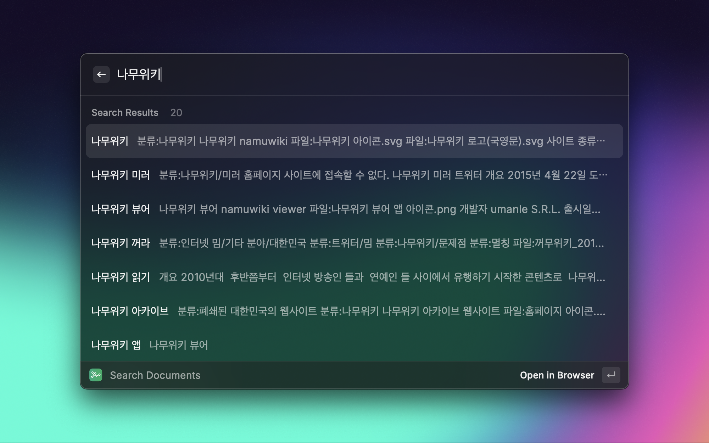

<h1 align="center">Namuwiki for Raycast</h1>

A raycast extension that allows you to search for documents, etc. in a namuwiki.

> This extension is based on Korean wiki [Namuwiki(나무위키)](https://namu.wiki). To search documents, you must use Korean.

## Command Features

| Command                         | Description                                            |
|---------------------------------|--------------------------------------------------------|
| Search Documents                | Search documents in namu.wiki                          |
| View Recently Changed Documents | View documents that have recently changed in namu.wiki |
| View Trending Documents         | View current live trending searches in namu.wiki       |

## Installation

No setup is required.

## Author
- [Jonggil Song (123period)](https://github.com/123period)