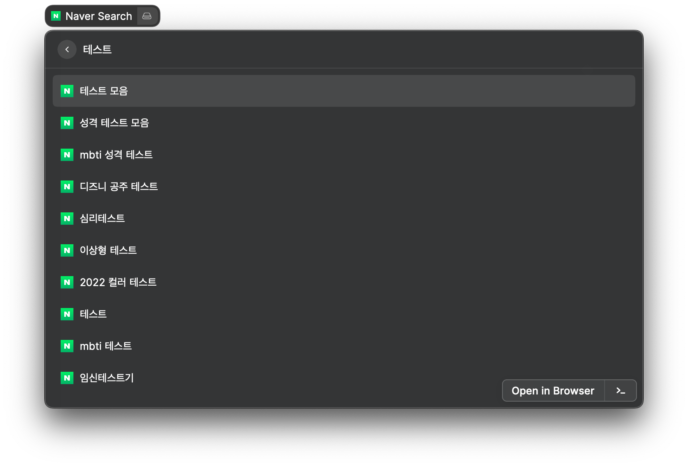
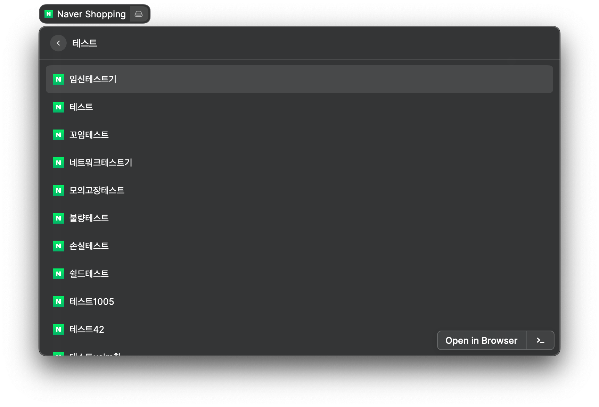
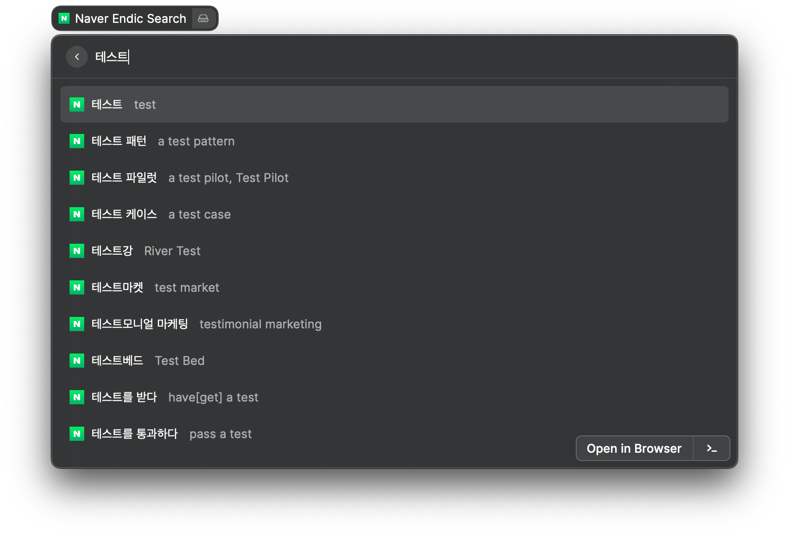
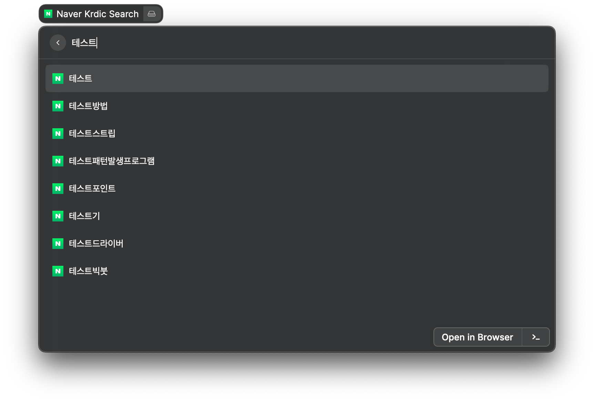
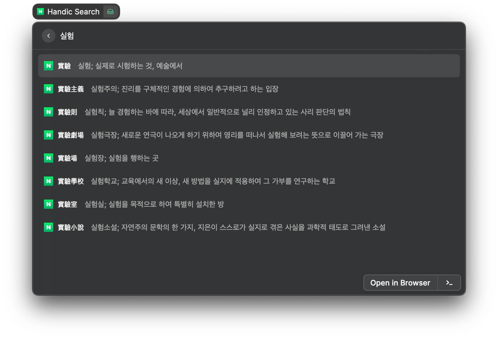

# Naver Search Extension for Raycast

[Naver](https://naver.com) search with autosuggestions is an extension for [Raycast](https://www.raycast.com/).

This extension is inspired by [alfnaversearch : Naver Search Workflow for Alfred](https://github.com/Kuniz/alfnaversearch).

## Supported Features

* Searching

* Shopping

* English dictionary

* Korean dictionary

* Hanja (Chinese character) dictionary

## Author

**Kyeongwon Lee** 
- [GitHub](https://www.github.com/kw-lee)
