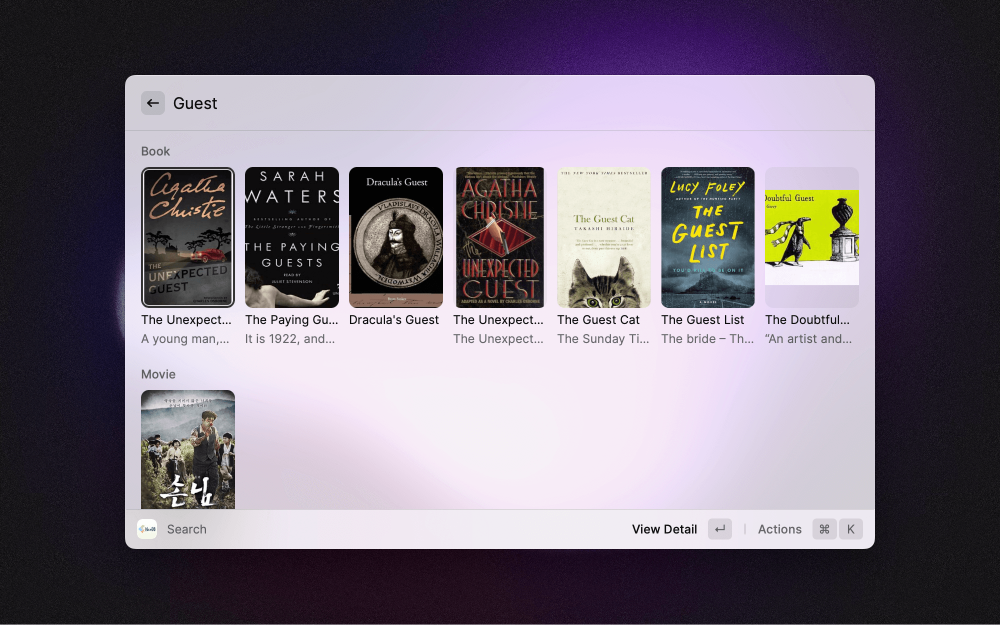
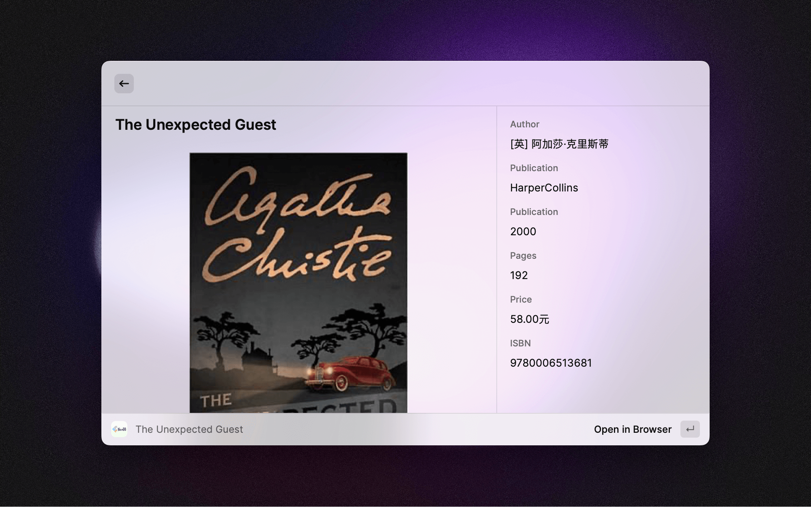
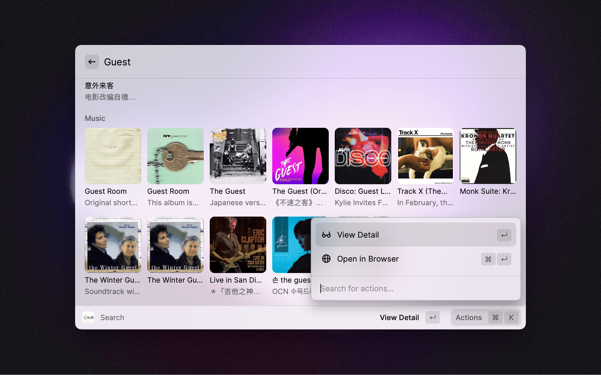

## NeoDB 

This extension seamlessly integrates [Raycast](https://raycast.com) and [NeoDB](https://neodb.social/), allowing you to easily search NeoDB items and view item details directly within Raycast. 

## API Key (optional)

If you are using the `View` command you will need your API Key:

1. `Log in` or `Sign up` at [NeoDB](https://neodb.social/account/login?next=/developer/)
2. `Navigate` to [Developer Console](https://neodb.social/discover/)
3. Under "Test Access Token", `click` on "Generate"
4. `Copy` the Token and paste in Preferences

## Screenshots

