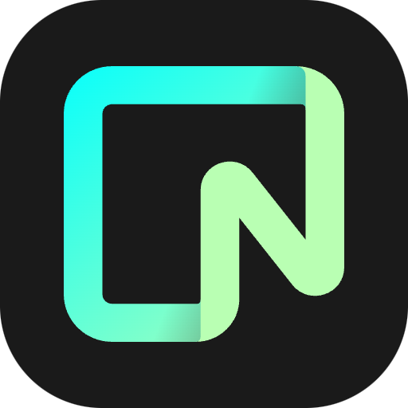

    

# Neon

This is a Raycast extension for [Neon](https://neon.tech/) - _The database you love, on a serverless platform designed to help you build reliable and scalable applications faster_. With this extension you can: 

- List, Revoke, Create API Keys
- List Projects
    - Create Project
    - Delete Project
    - View Project monitoring (System operations)
    - Update Project (basic): Edit a few fields of an existing project
    - List Project Branches
        - List Roles & Databases in Project Branches: Similar to the Neon UI
            - Update Database (name, owner_name)
            - View Database schema
        - View Compute Endpoints in Project Branches

## 🚀 Getting Started

1. **Install extension**: Click the `Install Extension` button in the top right of [this page](https://www.raycast.com/xmok/neon) OR `install` via Raycast Store

2. **Enter your Neon API Key**: The first time you use the extension, you'll need to enter the Token in Preferences OR at first prompt:

    a. `Navigate` to  [Account settings](https://console.neon.tech/app/settings/profile)

    b. `Click` on [API keys](https://console.neon.tech/app/settings/api-keys)

    c. `Click` "Create new API key"

    d. `Enter` name of your choice

    e. `Copy` the Token and `Paste` in Preferences

## ➕ More

Looking for similar extensions? Try these:

