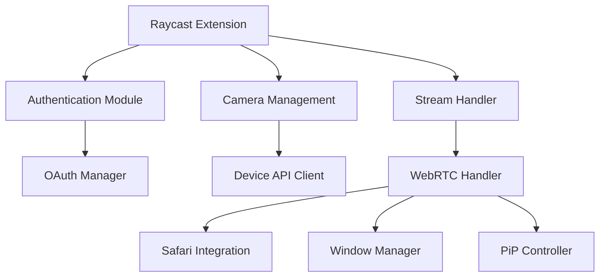

# Technical Design Document: Nest Camera Raycast Extension

## Architecture Overview

### System Components


## Core Components

### 1. Authentication Module

#### OAuth Implementation
```typescript
interface OAuth2Token {
  accessToken: string;
  refreshToken?: string;
  expiresIn: number;
  updatedAt: Date;
  isExpired: () => boolean;
}

interface OAuth2Config {
  clientId: string;
  clientSecret: string;
  projectId: string;
  scope: string[];
}

class OAuthManager {
  private static instance: OAuthManager;
  private client: OAuth.PKCEClient;
  private config: OAuth2Config;
  private refreshTimer?: NodeJS.Timeout;
  private isAuthorizing = false;

  private constructor() {
    // Initialize with Google Nest configuration
    this.client = new OAuth.PKCEClient({
      redirectMethod: OAuth.RedirectMethod.Web,
      providerName: "Google Nest",
      providerIcon: "command-icon.png",
      providerId: "google-nest",
      description: "Connect your Google Nest account to view your camera feeds"
    });
  }

  static getInstance(): OAuthManager {
    if (!OAuthManager.instance) {
      OAuthManager.instance = new OAuthManager();
    }
    return OAuthManager.instance;
  }

  async getValidToken(): Promise<OAuth2Token> {
    // Check existing token
    // Handle concurrent authorization requests
    // Refresh if expired
    // Return valid token
  }

  private async authorize(): Promise<OAuth2Token> {
    // Generate PKCE verifier and challenge
    // Request authorization with code challenge
    // Exchange code for tokens using verifier
    // Set up refresh timer
  }

  private async refreshToken(token: OAuth2Token): Promise<OAuth2Token> {
    // Implement token refresh with error handling
    // Update stored tokens
    // Reset refresh timer
  }
}
```

Key Security Features:
- PKCE (Proof Key for Code Exchange) for enhanced security
- Concurrent authorization handling
- Automatic token refresh before expiration
- Secure token storage using Raycast's SecureStorage
- Error recovery with automatic re-authentication

### 2. Camera Management

#### Device API Client
```typescript
interface NestCamera {
  id: string;
  name: string;
  roomHint?: string;
  traits: {
    streamingSupport: 'WEB_RTC';  // Only WebRTC in V1
    online: boolean;
  };
}

class DeviceAPIClient {
  private authManager: OAuthManager;
  
  constructor() {
    this.authManager = OAuthManager.getInstance();
  }

  async listCameras(): Promise<NestCamera[]> {
    const token = await this.authManager.getValidToken();
    // Implement camera list retrieval
  }

  async getCameraDetails(id: string): Promise<NestCamera> {
    // Get detailed camera information
  }
}
```

### 3. Stream Handler

```typescript
interface StreamOptions {
  pipMode?: boolean;
  fullscreen?: boolean;
}

interface WindowPosition {
  x: number;
  y: number;
  width: number;
  height: number;
  display: number;  // Display index for multi-monitor support
}

enum StreamErrorCode {
  AUTH_FAILED = 'AUTH_FAILED',
  FORBIDDEN = 'FORBIDDEN',
  CAMERA_NOT_FOUND = 'CAMERA_NOT_FOUND',
  SERVER_ERROR = 'SERVER_ERROR',
  BROWSER_FAILED = 'BROWSER_FAILED',
  STREAM_TIMEOUT = 'STREAM_TIMEOUT',
  WEBRTC_ERROR = 'WEBRTC_ERROR'
}

class StreamError extends Error {
  constructor(
    message: string,
    public readonly code: StreamErrorCode,
    public readonly recoverable: boolean
  ) {
    super(message);
  }
}

class StreamHandler {
  private browserManager: BrowserManager;
  private windowManager: WindowManager;

  constructor() {
    this.browserManager = new BrowserManager();
    this.windowManager = new WindowManager();
  }

  async openCameraStream(camera: NestCamera, options: StreamOptions = {}): Promise<void> {
    try {
      // Get WebRTC URL from Google's API
      const streamUrl = await this.generateStreamUrl(camera.id);
      
      // Get saved window position
      const position = await this.windowManager.getSavedPosition(camera.id);
      
      // Open stream in Safari
      await this.browserManager.openStream(streamUrl, position, options);
      
    } catch (error) {
      this.handleStreamError(error);
    }
  }

  private async generateStreamUrl(cameraId: string): Promise<string> {
    // Implementation for generating Google's WebRTC URL
  }

  private handleStreamError(error: Error): never {
    // Error handling implementation
  }
}

class BrowserManager {
  private readonly SAFARI_PATH = '/Applications/Safari.app';
  
  async openStream(url: string, position: WindowPosition, options: StreamOptions): Promise<void> {
    // Open Safari with appropriate window position
    // Enable PiP mode if requested
  }

  private generatePiPScript(): string {
    // Generate AppleScript for PiP mode
  }

  private async setWindowPosition(position: WindowPosition): Promise<void> {
    // Set window position using AppleScript
  }
}

class WindowManager {
  async getSavedPosition(cameraId: string): Promise<WindowPosition | null> {
    // Get saved window position from LocalStorage
  }

  async savePosition(cameraId: string, position: WindowPosition): Promise<void> {
    // Save window position to LocalStorage
  }

  private async getDisplays(): Promise<Display[]> {
    // Get information about connected displays
  }
}
```

### 4. UI Components

#### Camera List View
```typescript
interface CameraListProps {
  cameras: NestCamera[];
  onSelect: (camera: NestCamera) => void;
}

function CameraList({ cameras, onSelect }: CameraListProps) {
  const [searchText, setSearchText] = useState("");
  const groupedCameras = groupByRoom(cameras);
  
  return (
    <List
      searchText={searchText}
      onSearchTextChange={setSearchText}
      searchBarPlaceholder="Search cameras..."
    >
      {Object.entries(groupedCameras).map(([room, cameras]) => (
        <List.Section key={room} title={room}>
          {cameras.map(camera => (
            <CameraListItem
              key={camera.id}
              camera={camera}
              onSelect={onSelect}
            />
          ))}
        </List.Section>
      ))}
    </List>
  );
}
```

## Implementation Details

### 1. Package Structure
```
src/
├── components/
│   ├── CameraList.tsx
│   ├── CameraListItem.tsx
│   └── Settings.tsx
├── services/
│   ├── auth/
│   │   ├── OAuthManager.ts
│   │   └── types.ts
│   ├── camera/
│   │   ├── NestDeviceService.ts
│   │   └── types.ts
│   └── stream/
│       ├── StreamHandler.ts
│       ├── BrowserManager.ts
│       ├── WindowManager.ts
│       └── types.ts
├── utils/
│   ├── config.ts
│   ├── process.ts
│   └── logger.ts
└── index.ts

assets/
└── fetch_and_restart.sh
```

### 2. State Management
```typescript
interface AppState {
  cameras: NestCamera[];
  selectedCamera?: NestCamera;
  streamStatus: 'idle' | 'connecting' | 'streaming' | 'error';
  error?: Error;
}

// Use React Context for state management
const AppContext = React.createContext<AppState>(initialState);
```

### 3. Error Handling
```typescript
function handleStreamError(error: StreamError): void {
  switch (error.code) {
    case StreamErrorCode.BROWSER_FAILED:
      // Handle browser launch failures
      break;
    case StreamErrorCode.WEBRTC_ERROR:
      // Handle WebRTC stream failures
      break;
    // ... other error cases
  }
}
```

### 4. Performance Optimizations

#### Stream Initialization
- Cache WebRTC tokens
- Preload Safari for faster launch
- Remember window positions

#### Resource Management
- Monitor browser process
- Clean up on stream end
- Handle connection timeouts

## Security Considerations

### 1. Token Storage
- Use Raycast's secure storage for tokens
- Implement token encryption
- Regular token rotation

### 2. Stream Security
- Validate WebRTC URLs
- Use secure WebRTC connections
- Monitor stream health
- Clean up resources

### 3. Error Logging
- Sanitize sensitive data
- Implement secure logging
- Rate limit error reporting

## Testing Strategy

### 1. Unit Tests
```typescript
describe('BrowserManager', () => {
  test('should launch Safari', async () => {
    // Test Safari launch
  });

  test('should handle PiP mode', async () => {
    // Test PiP activation
  });

  test('should set window position', async () => {
    // Test window positioning
  });
});

describe('WindowManager', () => {
  test('should save and restore positions', async () => {
    // Test position memory
  });
});
```

### 2. Integration Tests
- Test WebRTC stream setup
- Verify PiP functionality
- Test window management
- Verify error handling
- Test resource cleanup

### 3. Performance Tests
- Measure stream startup time
- Monitor resource usage
- Test window positioning
- Verify cleanup effectiveness

## Deployment and Distribution

### 1. Build Process
- TypeScript compilation
- Asset bundling
- Dependency management

### 2. Release Process
- Version management
- Changelog generation
- Distribution through Raycast store

## Future Considerations

### 1. Feature Expansion
- Multi-camera grid view
- Recording capability
- Motion detection integration
- Advanced stream controls

### 2. Performance Improvements
- Faster stream initialization
- Better window management
- Enhanced error recovery
- Improved PiP reliability

### 3. Integration Opportunities
- Other camera brands
- Additional browsers
- Advanced automation
- Custom video player

## References

1. [Google Nest Device Access API Documentation](https://developers.google.com/nest/device-access)
2. [WebRTC Documentation](https://webrtc.org/getting-started/overview)
3. [Raycast Extensions Guide](https://developers.raycast.com)
4. [OAuth 2.0 with PKCE](https://oauth.net/2/pkce/)
5. [Safari WebRTC Guide](https://webkit.org/blog/11353/webrtc-is-now-supported-across-all-major-browsers/)