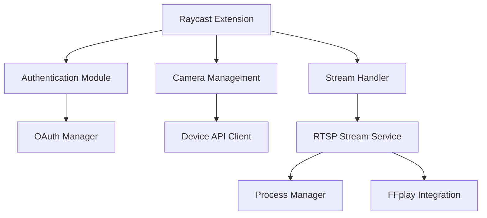

# Technical Design Document: Nest Camera Raycast Extension

## Architecture Overview

### System Components


## Core Components

### 1. Authentication Module

#### OAuth Implementation
```typescript
interface OAuth2Token {
  accessToken: string;
  refreshToken?: string;
  expiresIn: number;
  updatedAt: Date;
  isExpired: () => boolean;
}

interface OAuth2Config {
  clientId: string;
  clientSecret: string;
  projectId: string;
  scope: string[];
}

class OAuthManager {
  private static instance: OAuthManager;
  private client: OAuth.PKCEClient;
  private config: OAuth2Config;
  private refreshTimer?: NodeJS.Timeout;
  private isAuthorizing = false;

  private constructor() {
    // Initialize with Google Nest configuration
    this.client = new OAuth.PKCEClient({
      redirectMethod: OAuth.RedirectMethod.Web,
      providerName: "Google Nest",
      providerIcon: "command-icon.png",
      providerId: "google-nest",
      description: "Connect your Google Nest account to view your camera feeds"
    });
  }

  static getInstance(): OAuthManager {
    if (!OAuthManager.instance) {
      OAuthManager.instance = new OAuthManager();
    }
    return OAuthManager.instance;
  }

  async getValidToken(): Promise<OAuth2Token> {
    // Check existing token
    // Handle concurrent authorization requests
    // Refresh if expired
    // Return valid token
  }

  private async authorize(): Promise<OAuth2Token> {
    // Generate PKCE verifier and challenge
    // Request authorization with code challenge
    // Exchange code for tokens using verifier
    // Set up refresh timer
  }

  private async refreshToken(token: OAuth2Token): Promise<OAuth2Token> {
    // Implement token refresh with error handling
    // Update stored tokens
    // Reset refresh timer
  }
}
```

Key Security Features:
- PKCE (Proof Key for Code Exchange) for enhanced security
- Concurrent authorization handling
- Automatic token refresh before expiration
- Secure token storage using Raycast's SecureStorage
- Error recovery with automatic re-authentication

### 2. Camera Management

#### Device API Client
```typescript
interface NestCamera {
  id: string;
  name: string;
  roomHint?: string;
  traits: {
    streamingSupport: 'WEB_RTC';  // Only WebRTC in V1
    online: boolean;
  };
}

class DeviceAPIClient {
  private authManager: OAuthManager;
  
  constructor() {
    this.authManager = OAuthManager.getInstance();
  }

  async listCameras(): Promise<NestCamera[]> {
    const token = await this.authManager.getValidToken();
    // Implement camera list retrieval
  }

  async getCameraDetails(id: string): Promise<NestCamera> {
    // Get detailed camera information
  }
}
```

### 3. Stream Handler

```typescript
interface StreamOptions {
  fullscreen?: boolean;
  lowLatency?: boolean;
}

enum StreamStatus {
  IDLE = 'IDLE',
  STARTING = 'STARTING',
  STREAMING = 'STREAMING',
  ERROR = 'ERROR',
  STOPPED = 'STOPPED'
}

class RtspStreamService {
  private static instance: RtspStreamService;
  private processManager: ProcessManager;
  private deviceService: NestDeviceService;
  private streamStatuses: Map<string, StreamStatus>;

  private constructor() {
    this.processManager = ProcessManager.getInstance();
    this.deviceService = NestDeviceService.getInstance();
    this.streamStatuses = new Map();
  }

  static getInstance(): RtspStreamService {
    if (!RtspStreamService.instance) {
      RtspStreamService.instance = new RtspStreamService();
    }
    return RtspStreamService.instance;
  }

  async startStream(deviceId: string, options: StreamOptions = {}): Promise<void> {
    try {
      this.streamStatuses.set(deviceId, StreamStatus.STARTING);
      showToast(Toast.Style.Animated, "Starting stream...");
      
      const rtspUrl = await this.deviceService.getRtspUrl(deviceId);
      await this.processManager.startStream(deviceId, rtspUrl, options);
      
      this.streamStatuses.set(deviceId, StreamStatus.STREAMING);
      showToast(Toast.Style.Success, "Stream started successfully");
    } catch (error) {
      this.streamStatuses.set(deviceId, StreamStatus.ERROR);
      showToast(Toast.Style.Failure, `Failed to start stream: ${error.message}`);
      throw error;
    }
  }

  async stopStream(deviceId: string): Promise<void> {
    try {
      this.streamStatuses.set(deviceId, StreamStatus.STOPPED);
      await this.processManager.stopStream(deviceId);
      showToast(Toast.Style.Success, "Stream stopped successfully");
    } catch (error) {
      showToast(Toast.Style.Failure, `Failed to stop stream: ${error.message}`);
      throw error;
    }
  }

  getStreamStatus(deviceId: string): StreamStatus {
    return this.streamStatuses.get(deviceId) || StreamStatus.IDLE;
  }

  async cleanup(): Promise<void> {
    await this.processManager.cleanup();
    this.streamStatuses.clear();
  }
}

class ProcessManager {
  private static instance: ProcessManager;
  private processes: Map<string, execa.ExecaChildProcess>;
  private readonly SCRIPT_PATH = path.join(environment.assetsPath, 'scripts', 'play-rtsp.sh');

  private constructor() {
    this.processes = new Map();
  }

  static getInstance(): ProcessManager {
    if (!ProcessManager.instance) {
      ProcessManager.instance = new ProcessManager();
    }
    return ProcessManager.instance;
  }

  async startStream(deviceId: string, rtspUrl: string, options: StreamOptions = {}): Promise<void> {
    // Stop any existing stream for this device
    await this.stopStream(deviceId);

    // Make sure script is executable
    await fs.chmod(this.SCRIPT_PATH, 0o755);

    // Start the FFplay process
    const process = execa(this.SCRIPT_PATH, [rtspUrl], {
      detached: true,
      stdio: 'ignore',
      env: {
        ...process.env,
        DISPLAY: ':0',
      },
    });

    // Store the process
    this.processes.set(deviceId, process);

    // Handle process exit
    process.on('exit', (code) => {
      if (code !== 0) {
        console.error(`Stream process for device ${deviceId} exited with code ${code}`);
      }
      this.processes.delete(deviceId);
    });
  }

  async stopStream(deviceId: string): Promise<void> {
    const process = this.processes.get(deviceId);
    if (process) {
      try {
        process.kill('SIGTERM', { forceKillAfterTimeout: 2000 });
      } catch (error) {
        console.error(`Error stopping stream for device ${deviceId}:`, error);
      } finally {
        this.processes.delete(deviceId);
      }
    }
  }

  async cleanup(): Promise<void> {
    const deviceIds = Array.from(this.processes.keys());
    await Promise.all(deviceIds.map(id => this.stopStream(id)));
  }
}
```

### 4. RTSP Integration

```bash
#!/bin/bash
# play-rtsp.sh - Script to play RTSP streams using FFplay

# Check if RTSP URL is provided
if [ -z "$1" ]; then
  echo "Error: No RTSP URL provided"
  echo "Usage: $0 <rtsp_url>"
  osascript -e 'display notification "No RTSP URL provided" with title "Nest Camera Error"'
  exit 1
fi

RTSP_URL="$1"

# Store URL in temporary file to avoid command line length issues
URL_FILE=$(mktemp)
echo "$RTSP_URL" > "$URL_FILE"

# Define common paths for FFplay on macOS
FFPLAY_PATHS=(
  "/opt/homebrew/bin/ffplay"
  "/usr/local/bin/ffplay"
  "/usr/bin/ffplay"
)

# Find FFplay
FFPLAY=""
for path in "${FFPLAY_PATHS[@]}"; do
  if [ -x "$path" ]; then
    FFPLAY="$path"
    break
  fi
done

# Check if FFplay was found
if [ -z "$FFPLAY" ]; then
  echo "Error: FFplay not found. Please install FFmpeg."
  osascript -e 'display notification "FFplay not found. Please install FFmpeg with: brew install ffmpeg" with title "Nest Camera Error"'
  rm "$URL_FILE"
  exit 1
fi

# Launch FFplay with optimal parameters
echo "Starting FFplay with RTSP URL..."
"$FFPLAY" -hide_banner -loglevel error \
  -fflags nobuffer \
  -flags low_delay \
  -framedrop \
  -avioflags direct \
  -rtsp_transport tcp \
  -i "$(cat "$URL_FILE")" \
  -probesize 32 \
  -sync ext \
  -vf "setpts=0.5*PTS" \
  -window_title "Nest Camera" \
  -x 1280 -y 720

# Check if FFplay exited with an error
if [ $? -ne 0 ]; then
  osascript -e 'display notification "Failed to play RTSP stream. Please try again." with title "Nest Camera Error"'
  echo "FFplay exited with an error"
fi

# Clean up
rm "$URL_FILE"
```

### 4. UI Components

#### Camera List View
```typescript
interface CameraListProps {
  cameras: NestCamera[];
  onSelect: (camera: NestCamera) => void;
}

function CameraList({ cameras, onSelect }: CameraListProps) {
  const [searchText, setSearchText] = useState("");
  const groupedCameras = groupByRoom(cameras);
  
  return (
    <List
      searchText={searchText}
      onSearchTextChange={setSearchText}
      searchBarPlaceholder="Search cameras..."
    >
      {Object.entries(groupedCameras).map(([room, cameras]) => (
        <List.Section key={room} title={room}>
          {cameras.map(camera => (
            <CameraListItem
              key={camera.id}
              camera={camera}
              onSelect={onSelect}
            />
          ))}
        </List.Section>
      ))}
    </List>
  );
}
```

## Implementation Details

### 1. Package Structure
```
src/
├── components/
│   ├── CameraList.tsx
│   ├── CameraListItem.tsx
│   └── Settings.tsx
├── services/
│   ├── auth/
│   │   ├── OAuthManager.ts
│   │   └── types.ts
│   ├── camera/
│   │   ├── NestDeviceService.ts
│   │   └── types.ts
│   └── stream/
│       ├── StreamHandler.ts
│       ├── BrowserManager.ts
│       ├── WindowManager.ts
│       └── types.ts
├── utils/
│   ├── config.ts
│   ├── process.ts
│   └── logger.ts
└── index.ts

assets/
└── fetch_and_restart.sh
```

### 2. State Management
```typescript
interface AppState {
  cameras: NestCamera[];
  selectedCamera?: NestCamera;
  streamStatus: 'idle' | 'connecting' | 'streaming' | 'error';
  error?: Error;
}

// Use React Context for state management
const AppContext = React.createContext<AppState>(initialState);
```

### 3. Error Handling
```typescript
function handleStreamError(error: StreamError): void {
  switch (error.code) {
    case StreamErrorCode.BROWSER_FAILED:
      // Handle browser launch failures
      break;
    case StreamErrorCode.WEBRTC_ERROR:
      // Handle WebRTC stream failures
      break;
    // ... other error cases
  }
}
```

### 4. Performance Optimizations

#### Stream Initialization
- Cache WebRTC tokens
- Preload Safari for faster launch
- Remember window positions

#### Resource Management
- Monitor browser process
- Clean up on stream end
- Handle connection timeouts

## Security Considerations

### 1. Token Storage
- Use Raycast's secure storage for tokens
- Implement token encryption
- Regular token rotation

### 2. Stream Security
- Validate WebRTC URLs
- Use secure WebRTC connections
- Monitor stream health
- Clean up resources

### 3. Error Logging
- Sanitize sensitive data
- Implement secure logging
- Rate limit error reporting

## Testing Strategy

### 1. Unit Tests
```typescript
describe('BrowserManager', () => {
  test('should launch Safari', async () => {
    // Test Safari launch
  });

  test('should handle PiP mode', async () => {
    // Test PiP activation
  });

  test('should set window position', async () => {
    // Test window positioning
  });
});

describe('WindowManager', () => {
  test('should save and restore positions', async () => {
    // Test position memory
  });
});
```

### 2. Integration Tests
- Test WebRTC stream setup
- Verify PiP functionality
- Test window management
- Verify error handling
- Test resource cleanup

### 3. Performance Tests
- Measure stream startup time
- Monitor resource usage
- Test window positioning
- Verify cleanup effectiveness

## Deployment and Distribution

### 1. Build Process
- TypeScript compilation
- Asset bundling
- Dependency management

### 2. Release Process
- Version management
- Changelog generation
- Distribution through Raycast store

## Future Considerations

### 1. Feature Expansion
- Multi-camera grid view
- Recording capability
- Motion detection integration
- Advanced stream controls

### 2. Performance Improvements
- Faster stream initialization
- Better window management
- Enhanced error recovery
- Improved PiP reliability

### 3. Integration Opportunities
- Other camera brands
- Additional browsers
- Advanced automation
- Custom video player

## References

1. [Google Nest Device Access API Documentation](https://developers.google.com/nest/device-access)
2. [WebRTC Documentation](https://webrtc.org/getting-started/overview)
3. [Raycast Extensions Guide](https://developers.raycast.com)
4. [OAuth 2.0 with PKCE](https://oauth.net/2/pkce/)
5. [Safari WebRTC Guide](https://webkit.org/blog/11353/webrtc-is-now-supported-across-all-major-browsers/)