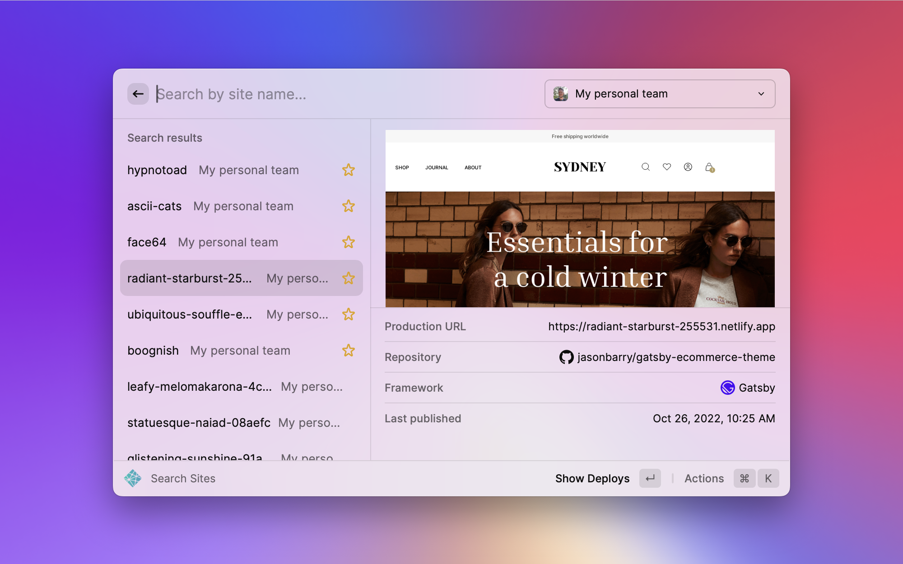
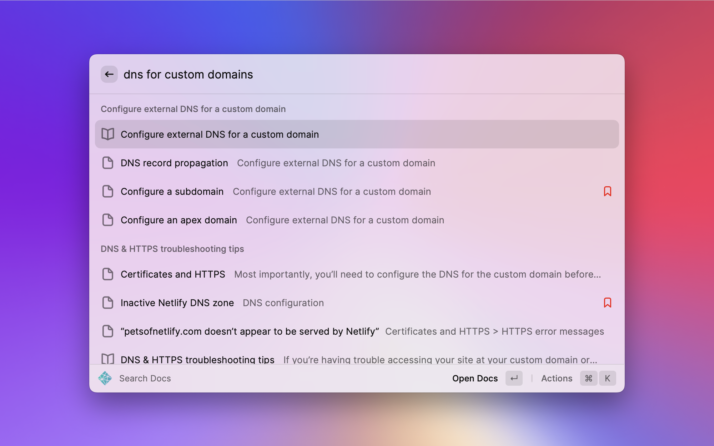
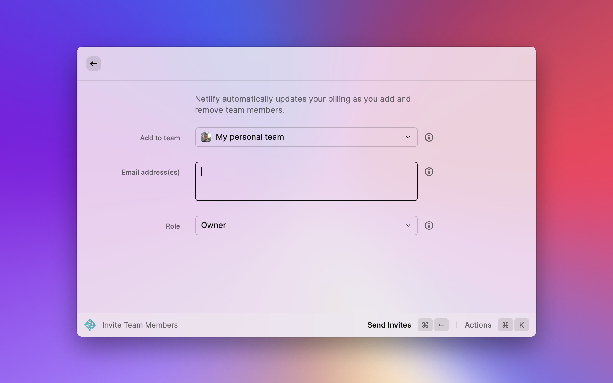

# Netlify

This extension allows to search your [Netlify](https://www.netlify.com) sites, deploys, environment variables, domains, team members, audit log, official documentation, and more.

## Getting started

To use this extension, you'll need to [create a personal access token](https://app.netlify.com/user/applications/personal). If your Netlify team requires SAML/SSO logins, you'll need to check the "Allow access to my SAML-based team" checkbox for your team's data to appear in Raycast.

You can read more about creating and using personal access tokens in the [Netlify docs](https://docs.netlify.com/accounts-and-billing/user-settings/#connect-with-other-applications).

## Commands

### Search Sites

Use this command to quickly search your sites. By default, your sites will be searched across all your teams &mdash; you can narrow this scope by using the team dropdown in the top right corner if you're a member of multiple teams.

Toggle your favorites sites by pressing <kbd>⌘F</kbd>. Favorite sites appear at the top of search results for matching queries.

You can drill down to open individual deploys in a detail view by pressing the <kbd>return</kbd> key. This is useful for quickly finding an individual deploy, perhaps of a failing build. From here you can open this deploy's logs in Netlify.

### Find Local Sites

This command is similar to the [Git Repos](https://github.com/raycast/extensions/tree/main/extensions/git-repos) extension, except that it finds local Netlify sites rather than local Git repositories.

What is a local site, and how is it different than a local Git repo? A local site is any directory that contains a `.netlify` directory. This directory gets created automatically when you use the [Netlify CLI](https://www.netlify.com/products/cli/) to run the `netlify link` command, which links your local directory to an associated site on Netlify. Linking your local sites lets you run useful commands like [`netlify dev`](https://github.com/netlify/cli/blob/main/docs/netlify-dev.md), and provides actions to conveniently open the site in Netlify from within a local directory.

The first time using this command, you'll be prompted to enter a _scan path_. This is the path of the directory that contains your local Netlify sites. For example, if you have multiple Netlify sites checked out within subdirectories of your home directory's Sites folder, you would enter `~/Sites` as your scan path. The scanning depth has a maximum of 4 levels from the path you provide, so if your directory tree is deeper than that, provide multiple paths by using the `:` character as a delimiter.

Once you supply a scan path, the initial scan will begin. The first time might take a while depending on the size of your hard drive. Subsequent invocations are cached.

If this command is not working at all for you, be sure you have granted permission to Raycast in macOS **Settings > Security & Privacy > Privacy > Automation**.

### Search Docs

This command searches the [official Netlify documentation](https://docs.netlify.com). You can press <kbd>⌘B</kbd> to bookmark your favorite results.

### Search Audit Log

Searching the audit log is a quick way to determine if anything has changed within the scope of your team &mdash; for example, updates to environment variables, site build plugins, team membership, etc.

This command searches the 100 most recent entries in your team's audit log. Pressing the <kbd>return</kbd> key opens the entry in a detail view, where you can see a JSON representation of what changed. If you want reach farther back in time, visit your team's audit log in the [Netlify UI](https://app.netlify.com).

Read more about the [audit log in the docs](https://docs.netlify.com/accounts-and-billing/team-management/team-audit-log/).

### Search Domains and Manage DNS Records

This command searches for domain names registered to your team. Each result will show if the domain is set to auto-renew, if it is expiring soon, if it has already expired, or if it has been registered externally.

For domains on Netlify DNS, you can view, create and delete DNS records all from the extension.

You can also search to query if a given domain name is available to register. If your team has a credit card on file, you can purchase a domain with this command. A confirmation dialog will prompt you to confirm your transaction before any payment is processed.

Read more about [domain registration in the docs](https://docs.netlify.com/domains-https/netlify-dns/domain-registration/). 

### Search Team Members

Use this command to show the team members, Git contributors, and reviewers for your team. If the Netlify user has connected to GitHub, GitLab, or Bitbucket, their handles for those services will show in a tooltip.

Learn more about [team member roles in the docs](https://docs.netlify.com/accounts-and-billing/team-management/team-member-roles/).

### Invite Team Members

Add new people to your team by sending invites to their email address. You can invite multiple people at a time if the email addresses are separated by a comma or a new line.

Be aware that you can only invite new members if you are an Owner of your team, and if your team does not require [strict SAML/SSO](https://docs.netlify.com/accounts-and-billing/team-management/saml-single-sign-on/#only-sso-allowed) to authenticate. Therefore, you may not see all of your teams in the team dropdown.

Netlify [automatically updates your billing](https://docs.netlify.com/accounts-and-billing/billing-faq/#how-does-team-membership-affect-billing) as you add and remove team members.

Learn more about [team member roles in the docs](https://docs.netlify.com/accounts-and-billing/team-management/team-member-roles/).

## Bug reports and feature requests

Please submit bug reports and feature requests on the `raycast/extensions` repo using the links below:

- [Bug reports](https://github.com/raycast/extensions/issues/new?assignees=&labels=extension%2Cbug&template=extension_bug_report.yml&title=%5BNetlify%5D+...)
- [Feature requests](https://github.com/raycast/extensions/issues/new?assignees=&labels=extension%2Cfeature+request&template=extension_feature_request.yml&title=%5BNetlify%5D+...)
