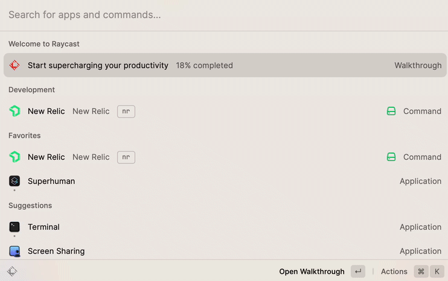
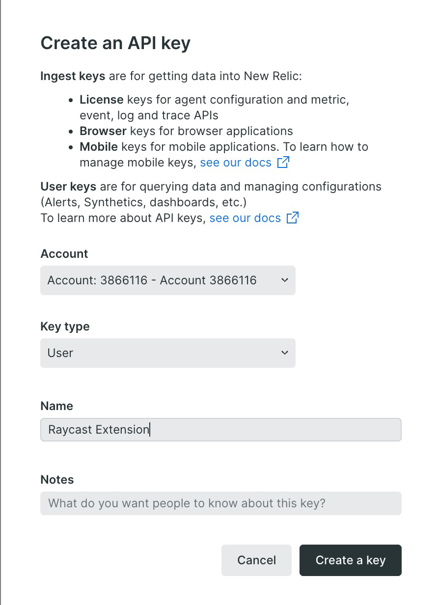

# New Relic
[Raycast](https://raycast.com) extension to search and view New Relic entities.

## New Relic User API License Key
To use this extension, you need a [New Relic](https://newrelic.com) account. You can sign up [here](https://newrelic.com/signup).

Once you have an account, you need to provide your New Relic
User Api Key. You can also create a separate access
token just for this extension. To see and manage your API
Keys, go to https://one.newrelic.com/api-keys. 

Once you have provided a valid API Key, you will be able
to search New Relic for APM Applications, Hosts, Dashboards,
Alerts, or any other Entity managed by New Relic. 

Summary status and metrics are provided in-context so you 
can see applicaiton health and golden metrics at a glance
in Raycast.

Press enter to jump directly to your selected result in New Relic.

## Troubleshooting
Sometimes the New Relic API Key you provide may be rejected as invalid. You will see an error message
at the bottom of the Rayast window `Failed to Fetch latest data: Invalid API Key`.

To work around this, you can create a new **User** API Key in New Relic in the [API Keys](https://one.newrelic.com/api-keys) page.

