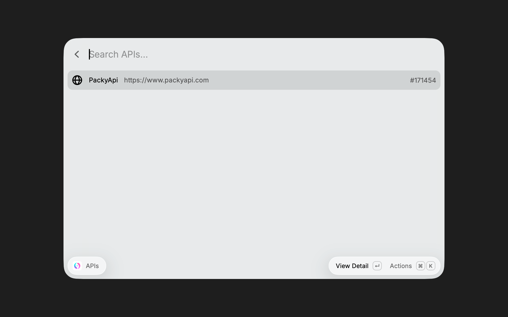
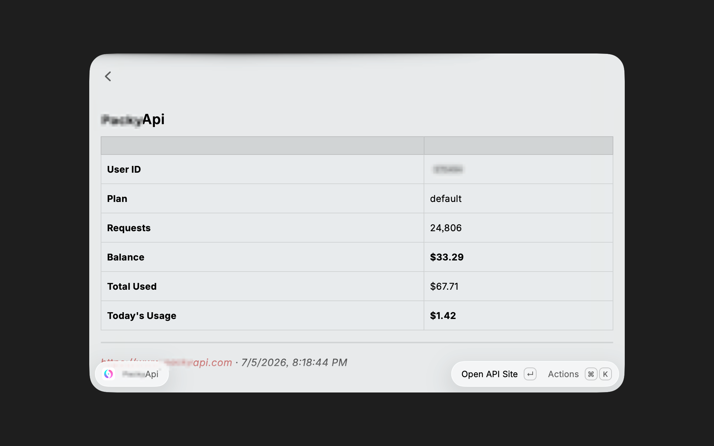
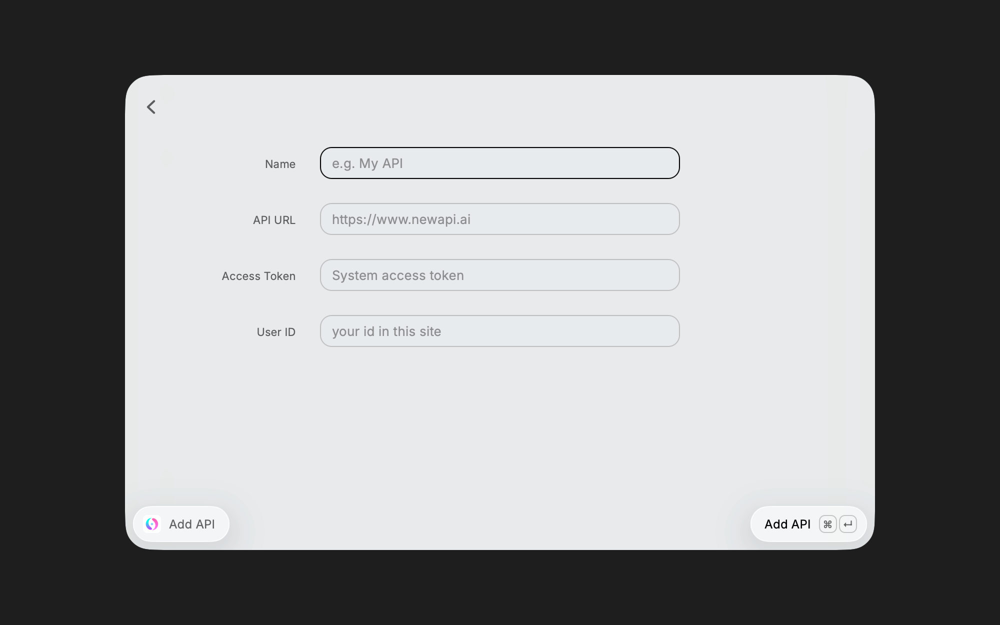

# NewAPI Helper

Raycast extension for managing multiple NewAPI relay stations — check balance, usage, and today's consumption at a glance.

一个管理多个 NewAPI 中转站的 Raycast 扩展，一键查看余额、历史用量和今日消耗。

## Features

- **Multi-API Management** — Add unlimited NewAPI-compatible relay stations
- **Dashboard View** — See user info, plan, request count, and balance
- **Today's Usage** — Auto-fetches hourly consumption via `/api/data/self`
- **Data stored locally** — All configs saved in Raycast LocalStorage

## Screenshots

<table>
  <tr>
    <td></td>
    <td></td>
    <td></td>
  </tr>
  <tr>
    <td align="center">API List</td>
    <td align="center">Dashboard Detail</td>
    <td align="center">Add API Form</td>
  </tr>
</table>

## Install

```bash
# Clone the repo
git clone https://cnb.cool/sfk/newapi-helper.git

# Install dependencies
npm install

# Build
npm run build

# Or use in dev mode
npm run dev
```

In Raycast, run `APIs` to start managing your relay stations.

### Adding a Station

| Field | Description |
|---|---|
| Name | A friendly label for this station |
| API URL | Base URL of the NewAPI relay (e.g. `https://www.newapi.ai`) |
| Access Token | `System access token` from the relay admin panel |
| User ID | Your user ID in this site |

## Development

```bash
npm run dev       # Start dev mode
npm run build     # Production build
npm run lint      # Check code style
npm run publish   # Publish to Raycast Store
```

## License

MIT
