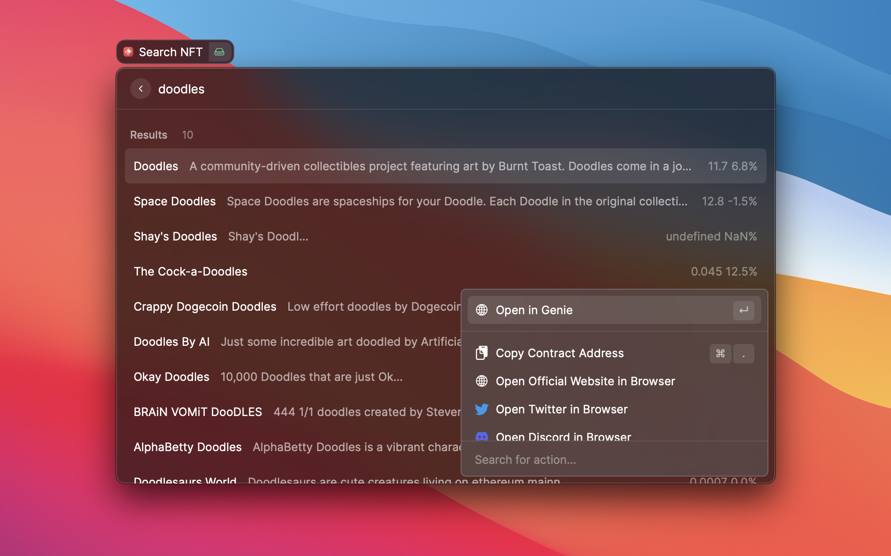
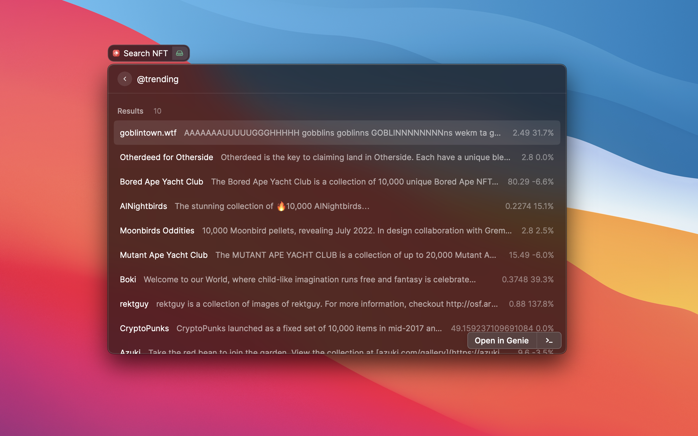

# NFT Searching

This project is developed by Glaze from un.Block. **We are trying to improve the crypto UX for Raycast community.** Check out our Twitter account [@unblock256](https://www.twitter.com/unblock256) and [@unblcok256_en](https://twitter.com/unblock256_en) for more information.

For crypto community, check out our [guide](raycast.unblock256.com) for crypto kit including necessary crypto plugin for raycast users.

# Tech

We use Gem search API to perform the search. We don't choose to use Moralis becasuse the searchin result is not accurate. It is hard to find an approriate API for NFT search since we search by NFT name and most APIs provide NFT search based on smart contract.

# Roadmap

- add to favourite
- support detail page
- query address held NFTs
