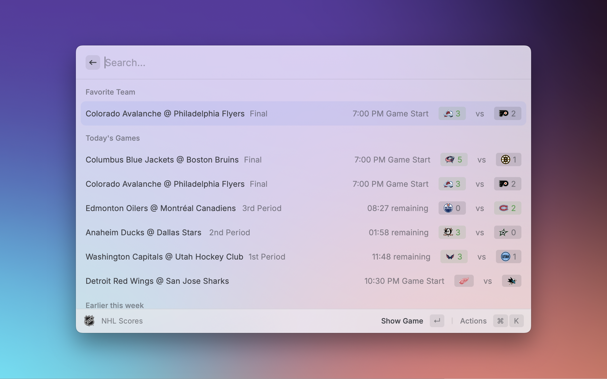

# NHL for Raycast

Access real-time NHL scores, standings, and comprehensive player statistics directly from Raycast.

## Features

### 🏒 Live Scores

- View today's games and scores
- Check upcoming matchups
- Review recent game results

### 📊 League Standings

- Conference rankings
- Divisional standings
- Live updates during season

### 🏃‍♂️ Player Search

- Search active and retired players
- View detailed player statistics
- Access career histories and achievements
- Review player biographical information

#### Preferences

There are a few preferences in this extension you can use to enhance your experience:

- Timezone: Useful for getting times in your local timezone.
- Language: Raycast doesn't support multi-languages by default, but the NHL API supports both English and French. This preference lets you get your data back in either of these languages.
- Favorite Team: Save your favorite to have that data filtered to the top in the Standings & Scores commands.

## Commands

| Command              | Description                                                    |
| -------------------- | -------------------------------------------------------------- |
| `Search NHL Players` | Find and explore stats for both current and former NHL players |
| `NHL Standings`      | View up-to-date league standings by conference and division    |
| `NHL Scores`         | Track live scores, upcoming games, and recent results          |

## Data Source

All data is sourced directly from the official NHL API.

## Disclaimer

This is an unofficial Raycast extension and is not affiliated with, endorsed by, or connected to the National Hockey League (NHL) or its teams.

All data is sourced from publicly available NHL APIs and services. Team logos, player images, and other NHL-related marks and content are properties of their respective owners and are used for informational purposes only.

This extension is provided "as is" without any warranties, and the accuracy of the data depends on the NHL's public APIs.

NHL and team logos are trademarks of the NHL and its teams. NHL statistics and content © NHL. All Rights Reserved.
