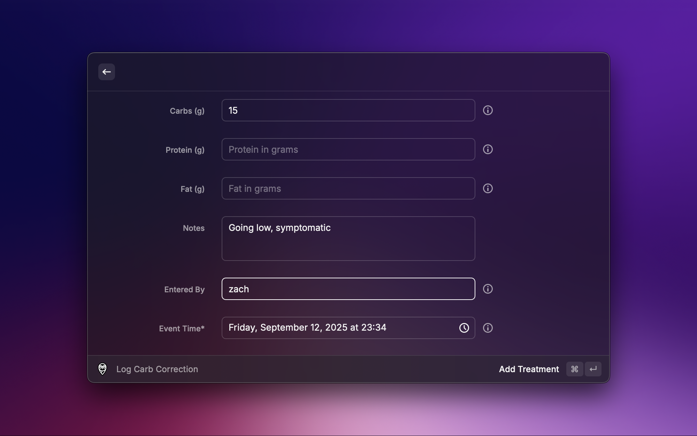

  

  <h1>
    Nightscout
  </h1>

Fetches and displays glucose data from a Nightscout server instance.

  

    
    
  

## Features

- View current glucose readings in a dedicated view, root search, or the menu bar
- Visualize recent glucose trends (last 24 hours)
- Filter readings by time and glucose level
- View and add treatments (insulin, carbs, notes)
- Abides by your Nightscout profiles/configuration for glucose targets and units

## Setup

Raycast will guide you through setting up the basic requirements. If your Nightscout instance is not publicly accessible, you will need to specify an access token in preferences. This is not marked as required since some instances are public, the extension will fail and prompt you if it is needed, providing the following instructions:

### How to get your token

1. Sign in to your Nightscout instance
2. Go to `Admin Tools` → `Subjects - People, Devices, etc`
3. Create a subject with `readable` role (if you want to add treatments, also assign the `careportal` role)
4. Copy the access token and add it to extension preferences

### Enable Background Refresh

> [!NOTE]
> You do not need to enable this specific background refresh command if you plan to use the menu bar item and don't care for the root search display, as that will also automatically refresh the cached readings in the background once per minute.

Enable background refresh for "Show Glucose Reading" command to see up-to-date readings in the root search. This will also ensure the other commands have fresh data when opened, running once every minute and caching results.

## Disclaimer

As a friendly reminder, Nightscout's disclaimer also applies to the use of this extension:

> Nightscout is purely DIY software, built by patient volunteers or their caregivers, each to meet their own needs. All code is available online, and each user of Nightscout must decide for themselves whether they consider it safe. While all development takes place with safety as a first priority, the information shown on Nightscout cannot replace your primary, approved information source, i.e. the software or device provided with your glucose monitor.
>
>- Do not use any of the Nightscout information or code to make medical decisions.
>- There is no support or any warranty of any kind.
>- The quality and performance of the project is with you if you choose to use it.
>
> Regulatory authorities require each submitted product to have a legal manufacturer. Given there is no central organization responsible for Nightscout, it cannot be formally approved.

## Contributing

I am newly diagnosed T1D, and I don't have access to many different Nightscout setups or devices, nor do I have a full understanding of my condition yet and how it relates to the use of Nightscout. If you have experience with more devices and treatment types, please feel free to open issues or PRs to improve the extension for everyone (please reach out too!).

Anything related to device status is currently missing, I will get around to this but if anyone else wants to tackle it, feel free :\)

## Screenshots

### Glucose Graph

### Entries and Treatments

### Add Treatment

### Profiles

### Menu Bar Glucose Reading

