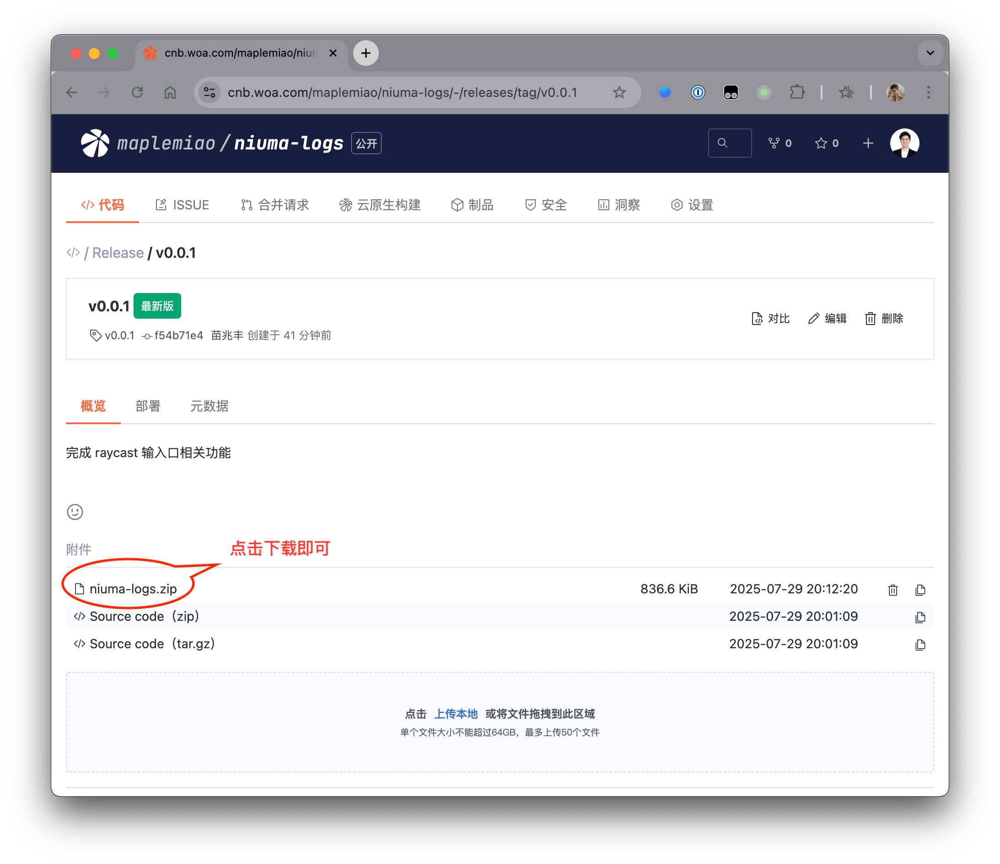
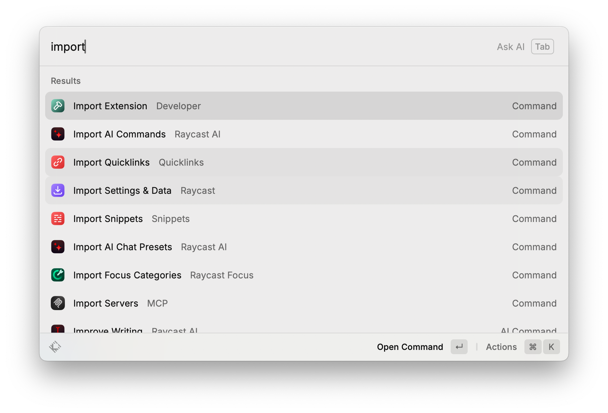
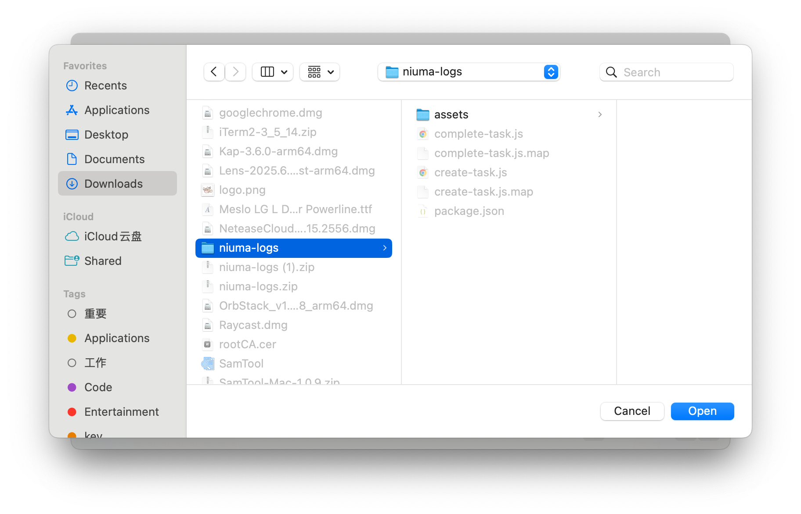
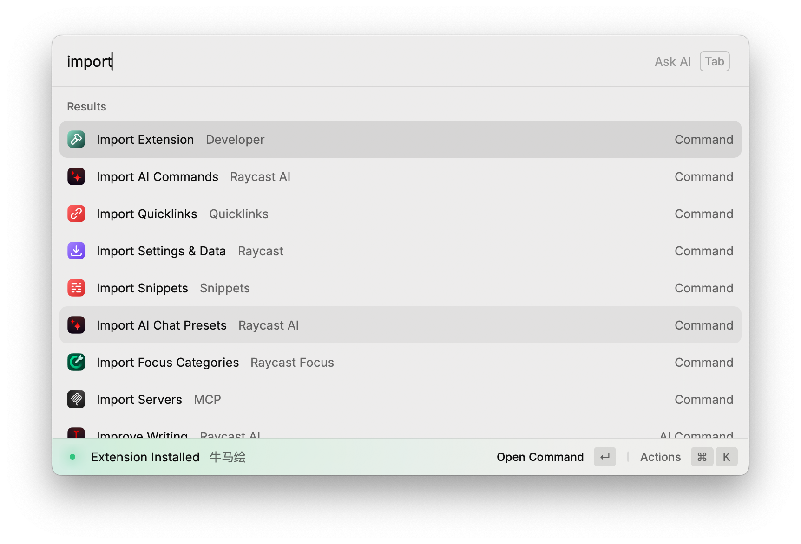
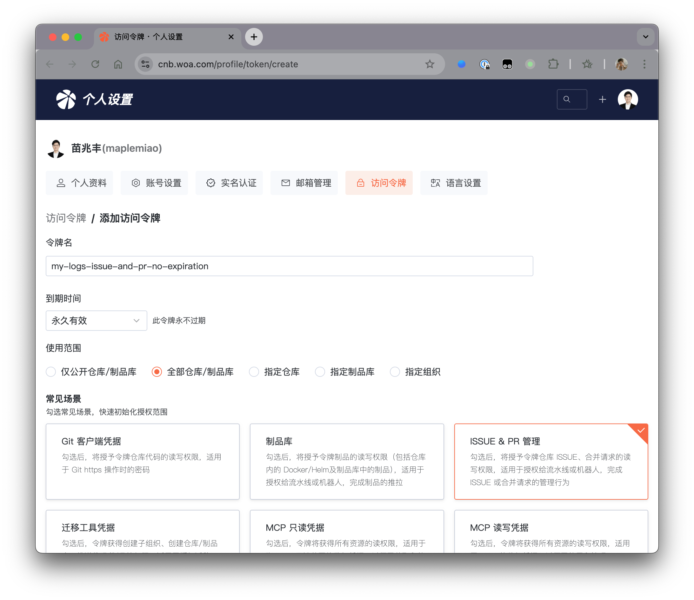
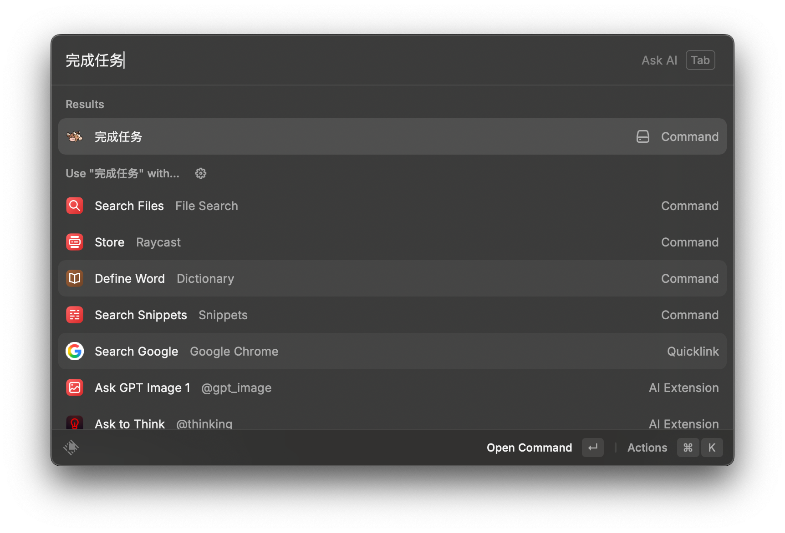
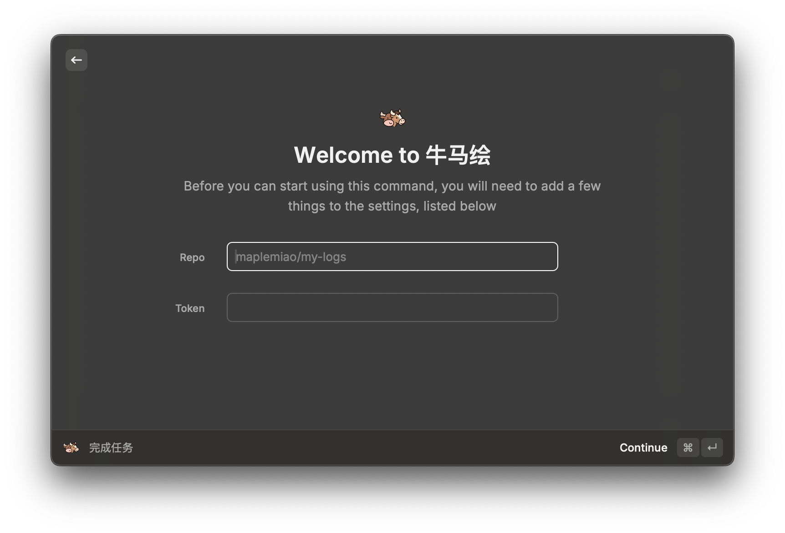

# 快速开始

快速开始前请确保使用 Mac OS，并且已安装了 [Raycast](https://www.raycast.com/) 且知道如何使用它。

## 安装

### 1. 前往 [Release 页面](https://cnb.cool/maplemiao/niuma-logs/-/releases/latest)

### 2. 下载 `niuma-logs.zip`

### 3. 解压缩 `niuma-logs.zip`

### 4. 在 Raycast 中 import extension，选择刚才解压出来的文件夹（名称为 `niuma-logs`）

### 5. 🎉 安装成功

左下角出现 `Extension installed 牛马绘` 表示安装成功

## 项目初始化

### 1. 登录 [CNB](https://cnb.cool)

### 2. [创建组织](https://cnb.cool/new/groups)

如已有可用组织，则可以忽略这一步。

### 3. [创建仓库](https://cnb.cool/new/repos)

仓库归属，选择刚才创建的组织名称即可。
仓库名称，建议选择 `my-logs`。此仓库用于存放我们的任务记录，和流水线用于定时输出我们的工作报告。
仓库可见性，可以选择私有，如果你的工作能够被公开，那么选择公开也是可以的。

### 4. [添加访问令牌](https://cnb.cool/profile/token/create)

令牌名称，可以选择一个清楚标识此令牌作用范围的，比如 `niuma-logs`。
指定组织，指定刚才创建的组织名称即可。
授权范围，勾选如下：
- repo-issue 读写
- repo-notes 读写
- mission-delete 读写
- mission-manage 读写
- group-resource:rw 读写

提交之后保存好访问令牌信息。

### 5. 配置 Raycast 中相应信息

打开 Raycast 面板，默认是 `Opt + Space`。输入 `完成任务`，回车。

此时，需要输入两行信息：

`Repo` 即刚才的创建的仓库名称，以如下格式填写 `组织名/仓库名` 即可。
`Token` 即访问令牌信息。

### 6. 🎉 全部配置已完成

接下来就可以开心食用了。
