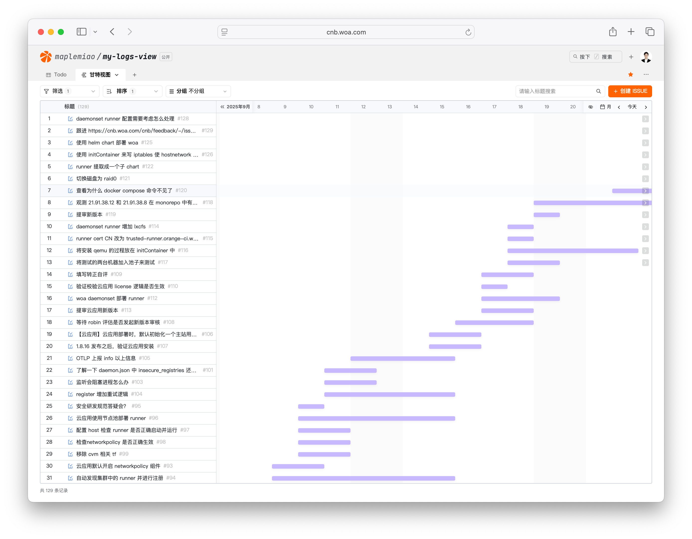

<h1 align="center">牛马绘</h1>

每一行日志，都是赛博牛马的史诗。

> 时间，它都去哪儿了？
>
> —— 鲁迅

## 原来时间都在这儿

> 如果你也想知道你的时间去哪儿了
>
> 如果你也想用最流畅的方式记录你的日常工作
>
> 如果你也想拥有如下图一样的甘特图来 review 自己的工作
>
> 如果你也不想在 OKR 考核季抓耳挠腮、绞尽脑汁、苦思冥想，不知自己忙了些什么
>
> 如果你刚好用 Mac
>
> 如果你刚好使用 [Raycast](https://www.raycast.com/) 或者有兴趣了解它

🎉 恭喜你，找到了宝藏 ：）

它工作起来是这个样子的：

## 高亮特点

⚡️ **零摩擦力**记录日常任务，不让记录任务也成为一项任务

🎥 通过甘特图透视，让**你的时间去向一目了然**

🔐 数据权限可设置，**大可放心**

## 快速开始

[👉 点击这里查看安装教程](./QUICKSTART.md)

## 食用技巧

- 当开始做一件事情的时候，可以呼起 Raycast 面板，输入 `开始`、`start`、`^` 均可以找到《开始任务》。

- 当完成一件事情的时候，可以呼起 Raycast 面板，输入 `完成`、`complete`、`$` 等字样，均可找到《完成任务》。回车后查看未完成列表，选择后即可标记完成。

- 无需担心任务的颗粒度，大到半年的长期目标，小到半小时内即可完成的小任务，都可以随手记上。记上之后，就可以减少你脑部 RAM 的使用，从而减缓焦虑，更专注做眼前的事情。

- 个人事项、工作任务，无需区分，只要是接到任务时，手在键盘上，一股脑往里面塞就可以了。数据安全无需担心，一切都存放在你的私有仓库中。且在 woa 内网中。

- 当你完成了任务，不知道接下来做什么的时候，可以呼起《完成任务》。方便地找到待办事项，从容决定下一个工作事项。

- 当你怀疑自己的工作和人生是否有意义的时候，打开甘特图。希望你看着一路走来的印记，能重拾积极乐观和勇气。

- 如果你觉得这个小工具对你有一点点积极作用，别犹豫，分享给你的朋友吧。牛马之间亦有真情！
