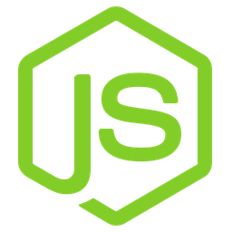

  
  <h1>
    Node Development Projects
  </h1>
  

    Raycast extension to view and open your NodeJS projects in your Development directory.
  

  

      
    
  

### Actions

Two actions are available to perform on each project:
- Open a project in Visual Studio Code
- Open Hyper Terminal at the projects file system path

### Preferences

- Development Direcotry: The path from the file systems root to your Development direcotry. The extension needs this to know where to look for your NodeJS projects. In your terminal navigate to your development direcotry, run `pwd` and enter the results into this field.

### Current Supported NodeJS Projects
- NextJS
- React
- Vue
- GraphQL
