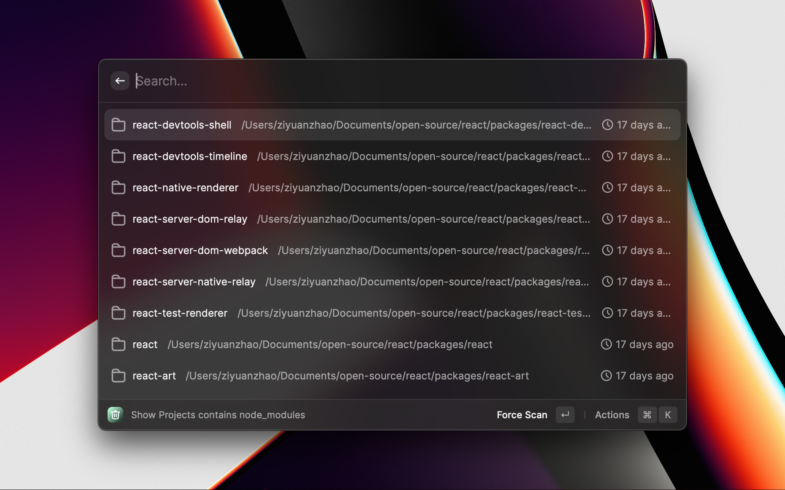

# NodeModules Cleaner

This extension can help you find out projects with `node_modules` and delete `node_modules`.

## Getting start

First you need complete some configurations. You need to select a folder which you want to scan.

Then you can use the command `Show Projects with node_modules`. After seconds, you will see all projects contains `node_modules` in the folder you configured before. The list will sorted by the project's last modified time by default now.

This extension will cache the result after scan. If you want to force scan again, there's an action too. Also you can you the `Move to trash` action to delete the project's `node_modules` which you select.
