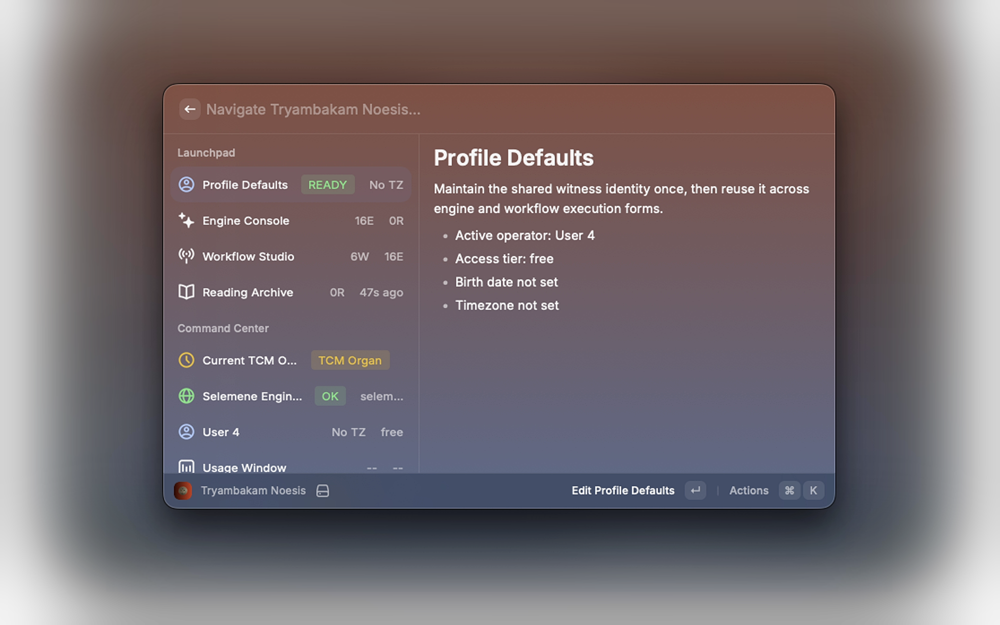
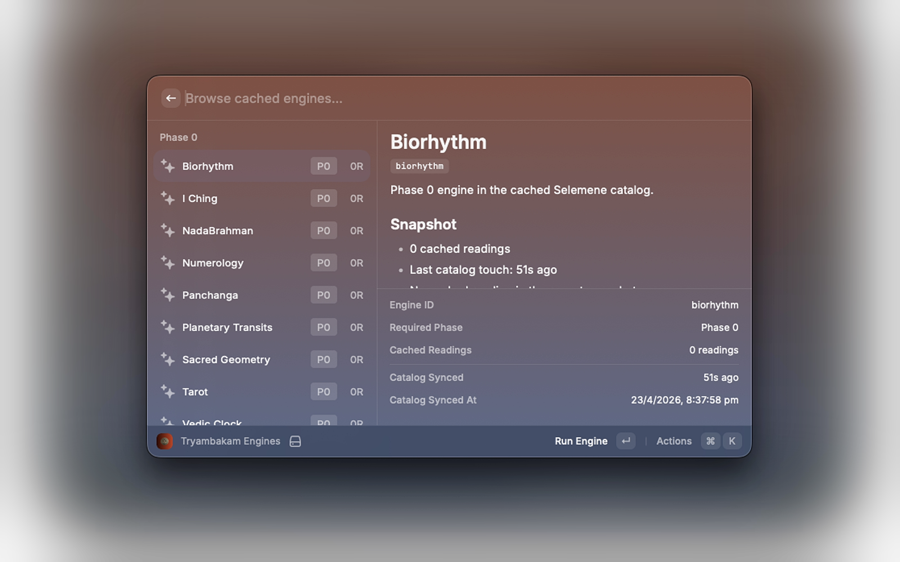
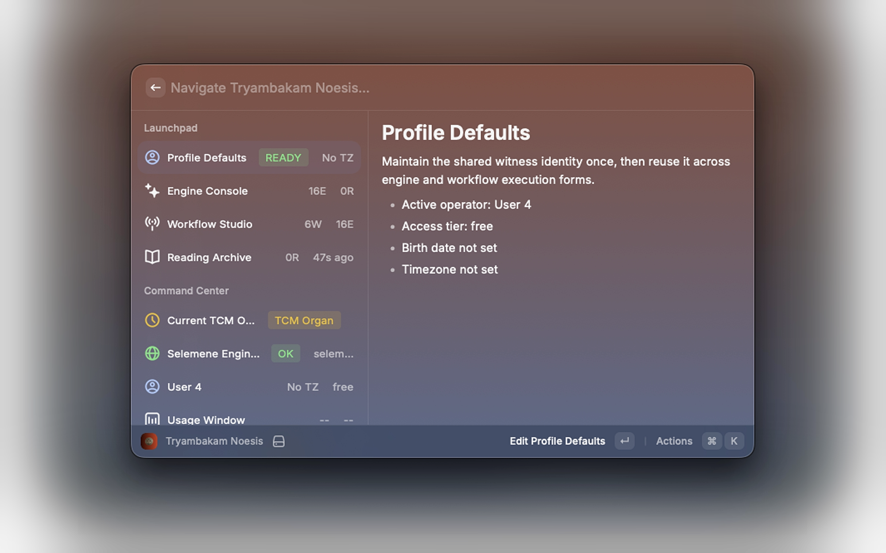
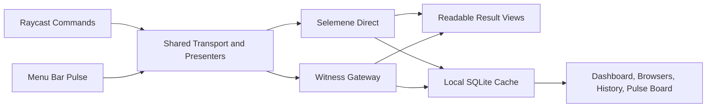

# Tryambakam Noesis

[](https://www.raycast.com/)
[](https://www.typescriptlang.org/)
[](https://react.dev/)
[](https://www.sqlite.org/)
[](./LICENSE)
[](https://github.com/Sheshiyer/noesis)

**Self-consciousness as technology. Body as medium. Breath as interface.**

Tryambakam Noesis is a native Raycast field console for running Selemene readings, workflow syntheses, Daily Witness reflections, and pulse-aware menu bar insight without turning the experience into a browser dashboard. It is designed for two audiences at once: practitioners who want fast, readable access to what is active now, and reviewers or contributors who need a clear view of routing, caching, storage, and execution behavior.

[Quick Start](./QUICKSTART.md) · [Store Submission Notes](./docs/store-submission.md) · [Changelog](./CHANGELOG.md) · [GitHub Repository](https://github.com/Sheshiyer/noesis)

| Dashboard | Engine Console | Profile Defaults |
| --- | --- | --- |
|  |  |  |

## Why This Surface Exists

- Raycast is the operator layer. It should show the active pattern, the next action, and the readable outcome.
- Selemene is the computational layer. It calculates engine outputs, workflows, and reading history.
- Witness is an optional execution route, not hidden magic. The extension makes that path explicit.
- SQLite is a local memory layer for accessibility and continuity, not the source of truth.

## Highlights

- Run individual engines, multi-engine workflows, and the Daily Witness flow from one native command surface.
- Keep the current pulse in the menu bar while also mirroring the full pulse board inside Raycast detail views.
- Read interpreted result pages first, with raw JSON available only through explicit copy and debug actions.
- Route engine and workflow execution explicitly through `Selemene Direct` or `Witness Gateway`.
- Store secrets in Raycast preferences and keep recent history in a local SQLite cache with minimized payloads by default.
- Surface partial refresh failures as structured sync issues instead of silently degrading the UI.

## Command Surface

| Command | What It Does |
| --- | --- |
| `Dashboard` | Central command center for service state, profile defaults, recent readings, pulse state, and navigation. |
| `Engines` | Browse Selemene lenses by phase, inspect recent context, and run a new engine reading. |
| `Workflows` | Browse workflow chains, review engine composition, and execute multi-engine runs. |
| `Readings` | Review cached reading history with interpreted result pages and explicit payload copy actions. |
| `Profile` | Maintain shared birth data, timezone, default precision, and default workflow preferences. |
| `API Key` | Connect or rotate the Selemene key, warm the cache, and manage local account state safely. |
| `Daily Witness` | Open the somatic witness reading flow backed by the Daily Mirror engine. |
| `Pulse` | Show the current organ, biorhythm, or Vimshottari pulse in the menu bar and mirrored detail view. |

## Runtime Model



## Privacy And Local Storage

- Secrets: the preferred storage path is the Raycast secure password preference for `apiKey`. A legacy local storage fallback still exists for compatibility.
- Cache: local snapshots live in `environment.supportPath/noesis-cache.sqlite`.
- Payload policy: readings and pulse snapshots are minimized before caching unless `Store Raw Payloads` is explicitly enabled.
- Retention: the reading history cache can be capped at `25`, `50`, or `100` rows.
- Clearing: personal cache data can be removed without deleting the shared engine catalog or service metadata.

## Configuration

The extension exposes the following preferences:

- `apiKey` - secure Raycast password preference for Selemene access
- `baseUrl` - optional Selemene base URL override
- `witnessUrl` - trusted Witness gateway URL
- `executionRoute` - `Selemene Direct` or `Witness Gateway`
- `readingHistoryLimit` - local SQLite history cap
- `cacheRawPayloads` - opt-in raw JSON retention
- `pulseMode` - menu bar title priority (`TCM Organ`, `Biorhythm`, or `Vimshottari`)

Default Selemene base URL:

- `https://selemene.tryambakam.space`

## Getting Started

1. Open `API Key` in Raycast.
2. Add the Selemene API key, confirm the base URL if needed, and validate the connection.
3. Leave execution routing on `Selemene Direct` unless you intentionally want the Witness gateway path.
4. Open `Dashboard` to warm the cache and navigate into `Engines`, `Workflows`, `Readings`, `Daily Witness`, or `Pulse`.

More setup detail lives in [QUICKSTART.md](./QUICKSTART.md).

## Development

```bash
PATH=/opt/homebrew/bin:$PATH npm install
PATH=/opt/homebrew/bin:$PATH npm run dev
```

## Verification

```bash
PATH=/opt/homebrew/bin:$PATH npx tsc --noEmit
PATH=/opt/homebrew/bin:$PATH npm run build
```

## Project Frame

The governing product language is Kha-Ba-La:

- `Kha` - observer, witness, author-drive
- `Ba` - body, vehicle, embodiment
- `La` - inertia, resistance, materiality

Tryambakam Noesis keeps that frame visible without asking the interface itself to become mystical. The product goal is practical: surface the pattern, preserve authorship, and keep the infrastructure legible.
