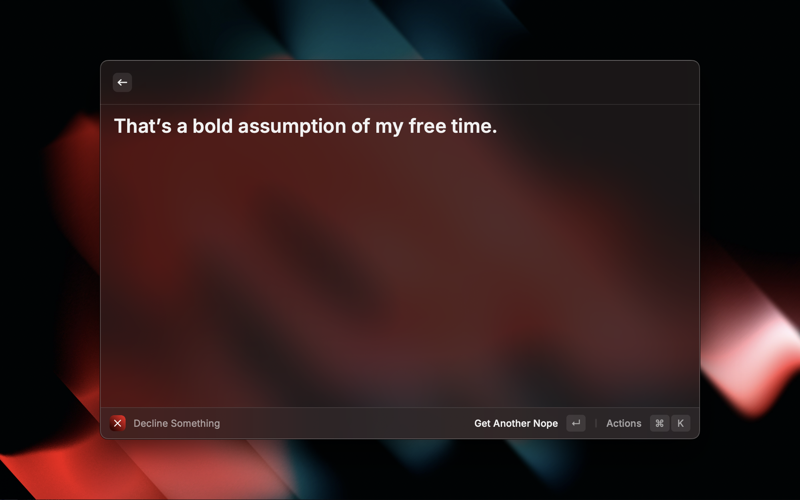

# Nope! 
Say 'no' to people with style!

Accourding to wikipedia:
> No is an English word that has a negative meaning. It is the opposite of the word yes, which is a positive term.

This extension is a compilation of the best - and most savage - ways of declining someone or something without really saying the word "no".

### Credits
[Error430](https://error430.dev/) - API Creator