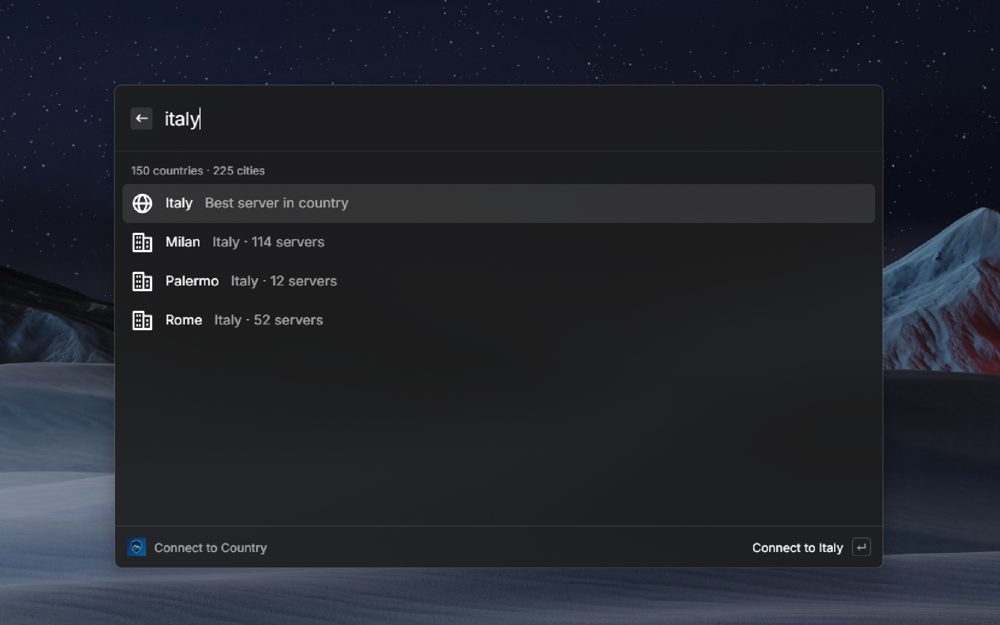

# NordVPN for Raycast on Windows

Control the NordVPN Windows app from Raycast. The extension uses the NordVPN app already installed on your PC; it does not include or install the VPN client.

This is an independent, unofficial extension and is not affiliated with, endorsed by, or sponsored by NordVPN.

## Screenshots



## Requirements

- Windows, with Windows PowerShell (`powershell.exe`) available.
- The NordVPN Windows app, installed and signed in.
- The **NordLynx** protocol selected in the NordVPN app. The extension detects the VPN state through the network adapter named `NordLynx`, so other protocols (for example OpenVPN) are not supported.

## Setup

1. Install and sign in to the NordVPN Windows app and make sure NordLynx is the selected protocol.
2. Install this extension in Raycast.
3. In Raycast preferences for this extension, set **NordVPN executable path** to the NordVPN CLI executable. The default is:

   ```text
   C:\Program Files\NordVPN\NordVPN.exe
   ```

   Change the path if NordVPN is installed elsewhere. The preference is required and is passed directly to Windows process execution; it is not run through a shell.

## Commands

- **Status** reads the `NordLynx` network adapter status with PowerShell and shows the public IP and country reported by the geolocation service.
- **Quick Connect** runs `NordVPN.exe --connect`, then waits until the NordLynx adapter is up and the public IP has changed from the one it had before connecting.
- **Connect to Country** loads countries and cities from NordVPN's public server API. Search for a country to connect to its recommended group, or search for a city to connect to the online NordLynx server with the lowest reported load in that city. If the country API is unavailable, a built-in country list is shown; city server selection requires the live NordVPN server API.
- **Disconnect** first reads the NordLynx adapter status. If it is already `Disconnected`, nothing is run. If it is `Up`, the command runs `NordVPN.exe --disconnect` and waits for the adapter to report `Disconnected`. If the adapter is in any other state, the command stops with an error because the VPN state cannot be confirmed.

Disconnect does not depend on the geolocation service. If the service is unreachable, times out, or its quota is exhausted, the VPN is still disconnected and the success toast simply omits the public IP and country.

## How connections are verified

NordVPN's Windows CLI may exit successfully without reporting whether a connection succeeded. Connect and disconnect commands therefore poll the NordLynx adapter (and the public IP/location) for up to 15 seconds:

- A connection is confirmed when the adapter is `Up` and the public IP has changed. For country and city connections, the public location must also be in the requested country.
- A disconnection is confirmed when the adapter reports `Disconnected`.

A success toast is shown only when the requested state is confirmed; otherwise Raycast shows a failure or timeout.

## Known limitations

- **Reconnecting to the server you are already connected to may time out.** The public IP does not change in that case, so the extension cannot confirm the connection by IP and reports a timeout even though the VPN is still connected. This is deliberate: accepting an unchanged IP would also report a disconnected user, whose public IP is their ISP's, as connected. Use **Status** to check the real state.
- **Connect commands need the geolocation service.** Connecting records your public IP before the command and uses it to verify the change. If the service is unavailable, connect commands fail instead of running unverified. Disconnect is not affected.
- **City connections need the live NordVPN server API.**

## Troubleshooting

- **"NordLynx adapter was not found"**: NordVPN is not installed, or the NordLynx adapter has not been created yet. Select the NordLynx protocol in the NordVPN app and connect once from the app.
- **"Set the NordVPN executable path in the extension preferences"** or a process error: check that the **NordVPN executable path** preference points to the real `NordVPN.exe`.
- **Timeouts after connecting**: run **Status** to see the real adapter state. If the geolocation daily quota is exhausted, lookups fail until it resets.

## Network and privacy

The extension does not ask for or store NordVPN account credentials. The installed NordVPN app handles authentication and VPN configuration.

- `https://ipwho.is/` is queried to obtain the public IP, country, and country code. This is used to display status, to record your public IP before a connection, and to verify that connecting changed it. After a disconnect it is queried only to show your new location, and a failure there is ignored.
- `https://api.nordvpn.com/v1/servers/countries` supplies the country/city list.
- `https://api.nordvpn.com/v1/servers` supplies server names and locations when selecting a city. The extension picks an online NordLynx server with the lowest reported load in that city.

These HTTPS services can see the requester's public IP as part of the network request. `ipwho.is` specifically geolocates and returns that IP. During connection verification, the geolocation service may be queried approximately once per second for up to 15 seconds. No NordVPN credentials are sent to either service.

The extension also runs two local programs, both without a shell: `powershell.exe` with a fixed read-only script that reads the status of the `NordLynx` adapter, and the NordVPN executable you configured.

The `ipwho.is` free endpoint documents a limit of 1,000 requests per day per client IP. If that limit is reached, status lookups and connection verification may fail until the quota resets.