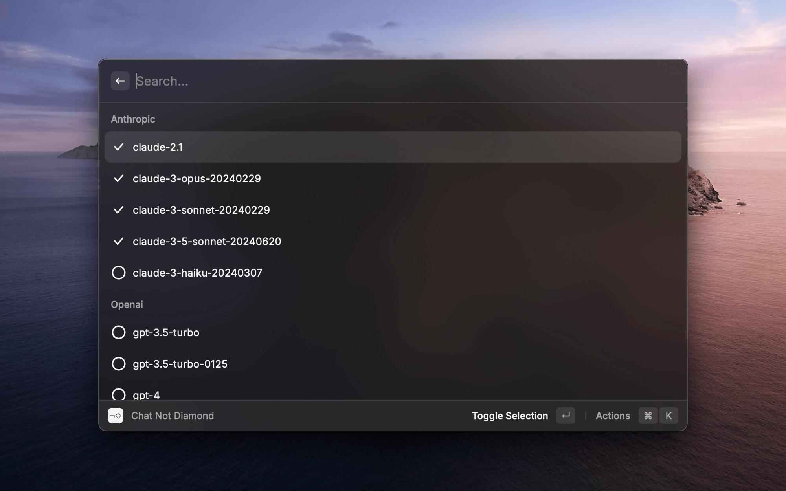
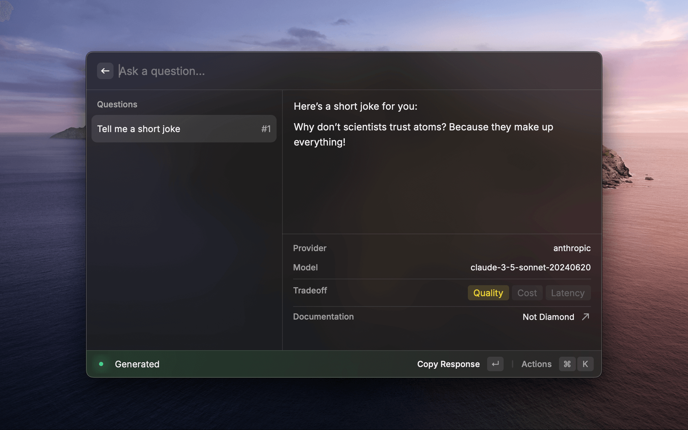

<h1 align="center">Not Diamond</h1>

<h3 align="center">
Call the right model at the right time with the world's most powerful AI model router.
</h3>

# Features

### Use your favourite models

Add your favourite models to your Raycast extension and call them with a single command.

### Get best results based on your question

Set trade-offs between speed, cost, and quality to get the best results for your question.

# How to use

In order to use this extension you will to generate an API Key from [Not Diamond](https://app.notdiamond.ai/keys). Then add API Keys for your favourite providers and then you're all set up. Choose your models and you're ready to go. 

> **Warning**
> 
> In order to benefit from the best results, make sure to select at least 2 models. All API Keys are optional, but you need to have at least 1 to use Not Diamond Raycast Extension.

> All the preferences value will be stored locally using [Preferences API](https://developers.raycast.com/api-reference/preferences)
