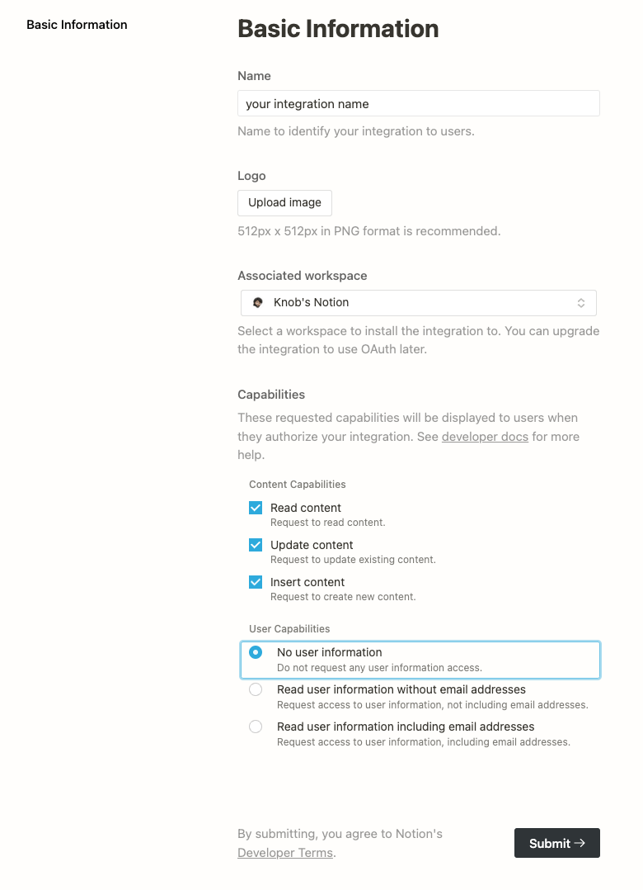

# Notion-ctrl

Notion のデータベースに素早くメモを保存できるようにする

## 使い方（Usage）

### Notion Integration Token の発行

この拡張機能は [Notion API](https://developers.notion.com/) を使用しています。これを
使用するために Notion のアカウントで[My Integrations](https://www.notion.so/my-integrations)にアクセスし、Integration を作成します。


設定内容は画像のようにしてください。（デフォルトのままでも構いません）



作成し終えたら、Secrets/Internal Integration Token をコピーし、Notion Ctrl の 初期画面で求められるので入力します。


間違って指定した or 変更する場合は、Raycast の Preferences（設定）から Extensions の Notion-ctrl を選択すると再設定することができます。

### Database の登録

まず、使用する Database を Notion で作成します。

`/database` と入力し、選択すると、Database が作成されます。（Inline と Full page のどちらでも構いません）

Database の properties の名前だけは以下で指定したものにしてください。

- `Name` を `title` にする...（必須）
- Database の Title と Icon を設定する...（任意）
- select を `category` にする...（使用する場合のみ）
- multi select を `tags` にする...（使用する場合のみ）
- date を `date` にする...（使用する場合のみ）
- checkbox を `check` にする...（使用する場合のみ）

次に、Database ID を取得します。

`Copy link` からこの database ブロックのリンクをコピーしてください。（Full page の場合は Share の右下にあります）

以下のリンクの `da169b5851f34e48a97f263deee9ef85` 部分が Database ID になります。

```
sample: https://www.notion.so/xxxxx/da169b5851f34e48a97f263deee9ef85?v=d3cd4f2bc8fe40e7b0f38b44f3e29055
```

「Setting Database」→「+ Add New a Database」 より Database ID を登録します。

### Raycast から Database に保存する

「Post Content」で Database を選択して登録できます。
title のみ必須です。content に入力されたものは改行区切りで、ページ内のテキストブロックとして保存されます。
