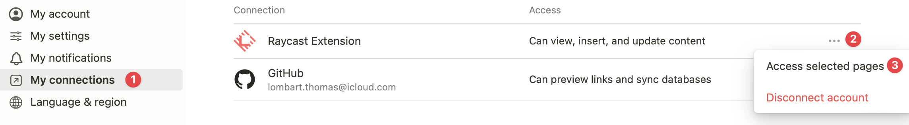

# Notion

The fastest way to search and create Notion pages.

## Using internal integration

If you are not logging in through OAuth, you can still use the extension with an internal integration secret. Follow the steps below to do so:

1. Create a new integration over [here](https://www.notion.so/my-integrations)
2. Copy the `Internal Integration Secret` (under `Secrets`)
3. Manually give the integration access to the specific pages or databases by [adding connections to them](https://www.notion.so/help/add-and-manage-connections-with-the-api#add-connections-to-pages)

## I can't find the Notion page or database from Raycast

If you have connected your Notion account to Raycast, you need to grant the Raycast Extension access to new root pages.

To do so, open `Settings & Members`. Then, in the `My Connections` section, click the three dots next to the Raycast Extension, and hover over the "Access Selected Pages" menu item. You will be able to grant access to new pages.

If you are unable to do so or if you used an internal integration secret, you can follow the steps on the page: [Add connections to pages](https://www.notion.so/help/add-and-manage-connections-with-the-api#add-connections-to-pages).
