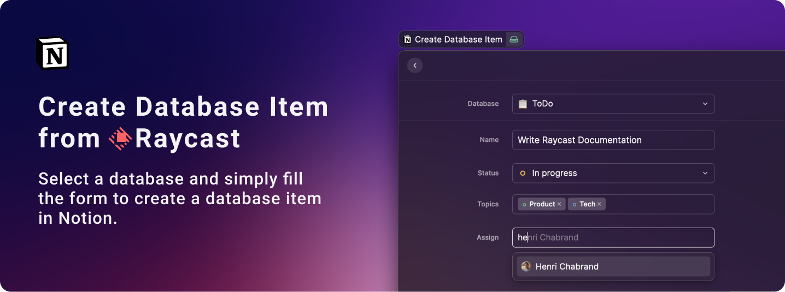

## Setup Extension

### Create Notion Integration

Go to [Notion > My Integrations](https://www.notion.so/my-integrations) and create a new integration.

1️⃣ Give it a name, 2️⃣ select the Notion workspace you want to access from Raycast and 3️⃣ submit it.

### Copy Notion Token

Once saved, copy the `secret_xxxxx` token and save it in Raycast extension's preference under `Notion Token`.

### Share Database

Now go into your workspace, find a database you want to use with Raycast and `Share` this database with your newly created Notion integration.

  

### Copy Notion Workspace Domain

Finally, retrieve from your navigator URL the domain slug of your workspace and ave it in Raycast extension's preference under `Notion Workspace Domain`.

The domain slug can be found in any page of your workspace and respect this pattern `https://www.notion.so/{domain-slug}/ba3e7890ojaj7884675a580d8e` 

You're all set 🙌
Go back to Raycast to start using the extension.

## Create Database Item

From Raycast, type `Create Database Item` to load the command and select a database.

All editable fields will be retrieved from this database.

As of today, here are the compatible properties:
- ✏️ Text
- 📞 Phone number
- ✉️ Email
- 🔢 Number
- 🔻 Select
- 🏷 Multi-select

And coming soon:
- 👥 People
- 🔀 Database relations
