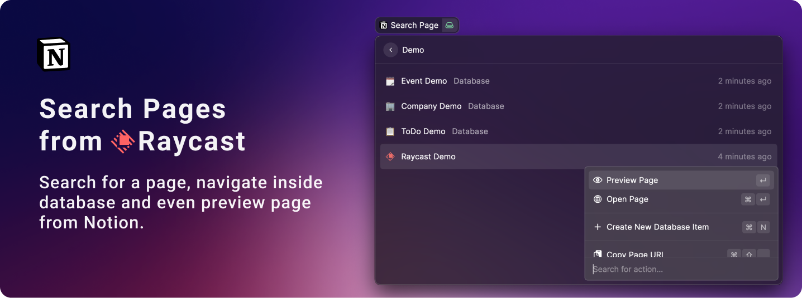
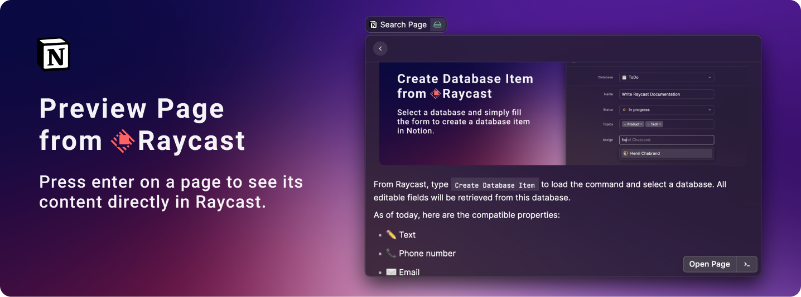
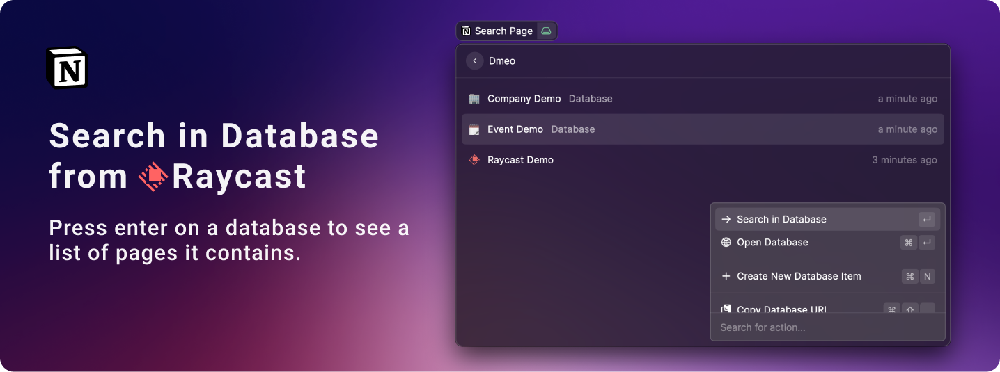
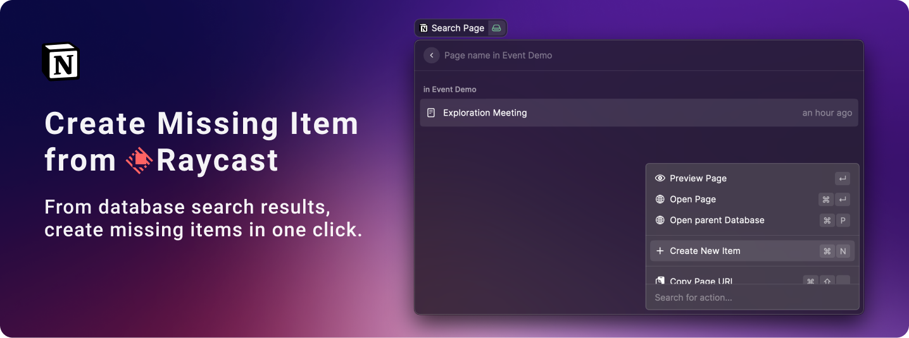

# Raycast Demo

## Create Database Item

From Raycast, type `Create Database Item` to load the command and select a database.

All editable fields will be retrieved from this database.

As of today, here are the compatible properties:

- ✏️ Text
- 📞 Phone number
- ✉️ Email
- 🔢 Number
- 🔻 Select
- 🏷 Multi-select
- 👥 People
- 🔀 Database realtions

Once filled, press `cmd + k` to create the database item – and find the link of the newly created page in your clipboard 📋

## Search Pages

From Raycast, type `Search Pages` to start browsing through your Notion workspace content.

On the list of result, you'll find **Page** and **Database** matching your query.

From each element, you will be able to:

- 👀 Preview the page
- 🌎 Open page in browser
- 📋 Copy page URL

## Preview Page

On **Page** items, press `Enter` to get a preview of the Notion page directly in Raycast.

## Search in Database

On **Database** items, press `Enter` to get a preview of the Notion page directly in Raycast.

## Create missing Items

While search pages within a database, simply press `cmd + N` to open the `Create Database Item` command and add any missing pages in no time.