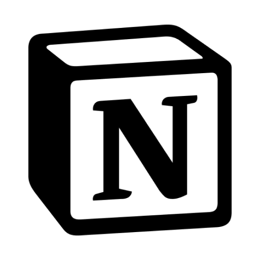
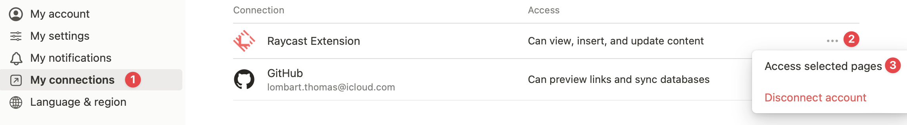

    

# Notion

The fastest way to search and create [Notion](https://notion.com) pages.

## Using internal integration

If you are not logging in through OAuth, you can still use the extension with an internal integration secret. Follow the steps below to do so:

1. Create a new integration over [here](https://www.notion.so/my-integrations)
2. Copy the `Internal Integration Secret` (under `Secrets`)
3. Manually give the integration access to the specific pages or databases by [adding connections to them](https://www.notion.so/help/add-and-manage-connections-with-the-api#add-connections-to-pages)
4. Paste the secret into **Internal Integration Secret** in the extension preferences.

## Sign-in or invalid-token errors

Open **Manage Notion Connection** in Raycast. This command works without signing in first and checks whether Notion accepts your saved credentials.

- For browser sign-in, use **Reconnect Notion** to replace the saved connection and choose which pages to share. Then reopen the command you were using.
- If an internal integration secret is configured, it takes precedence over browser sign-in. Update it in extension preferences, or clear it and reopen **Manage Notion Connection** to use browser sign-in.
- Use **Test Connection** to retry after a network failure. A failed check does not erase saved credentials.

If browser authorization still returns to the sign-in screen, use an internal integration secret as a workaround. Include your Raycast version, operating system, and any connection-test error when reporting the problem. Never share your secret.

## I can't find the Notion page or database from Raycast

If you have connected your Notion account to Raycast, you need to grant the Raycast Extension access to new root pages.

To do so, open `Settings & Members`. Then, in the `My Connections` section, click the three dots next to the Raycast Extension, and hover over the "Access Selected Pages" menu item. You will be able to grant access to new pages.

If you are unable to do so or if you used an internal integration secret, you can follow the steps on the page: [Add connections to pages](https://www.notion.so/help/add-and-manage-connections-with-the-api#add-connections-to-pages).

Search matches page and database titles. Use **Refresh Results** after changing access. Notion's search index can take time to update and does not guarantee that every accessible page will be returned. For a missing database record, navigate into its database and search there. See [Notion's search limitations](https://developers.notion.com/reference/search-optimizations-and-limitations).

## Development checks

Run `npm test`, `npx tsc --noEmit`, `npm run build`, and `npm run lint`.

In Raycast, check a page whose title contains both plain and bold text, paste **Copy Formatted URL** into a plain-text editor and a rich-text app, and browse a database with more than 20 records. Test **Manage Notion Connection** with browser sign-in, a revoked connection, and an internal integration secret on macOS and Windows.
