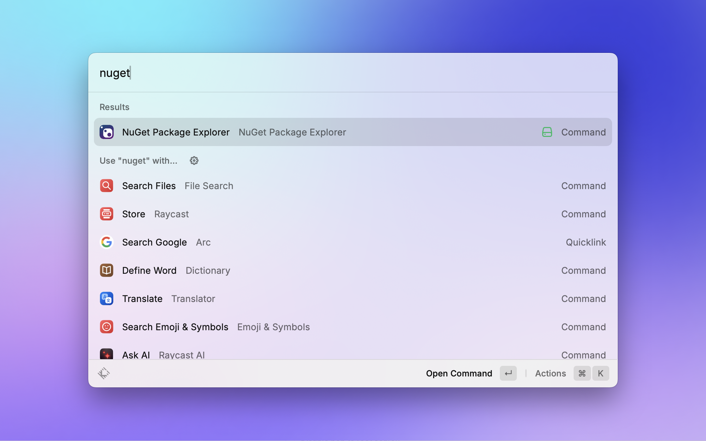
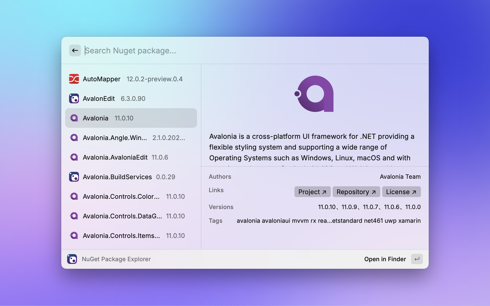
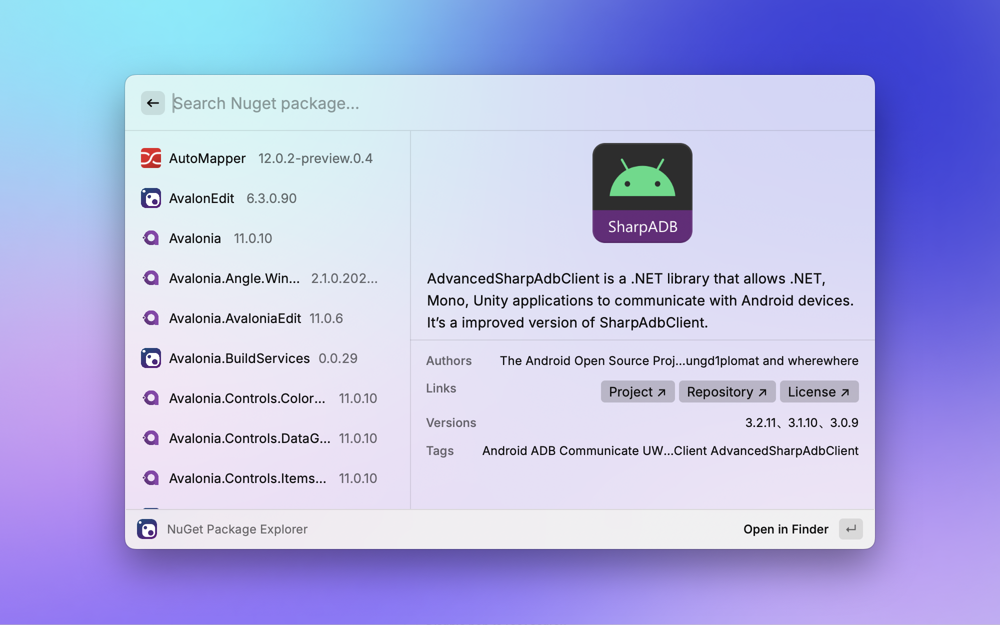

# NuGet Package Explorer

  
  <h1 align="center">NuGet Package Explorer Extension for Raycast</h1>

🌟 Quickly browse and manage locally installed NuGet packages!

## Features

- Support displaying all locally installed NuGet packages
- Support quickly opening package directories in Finder
- Support quick search

## Author

[ 🇨🇳 ] **gaoyang**

- [GitHub](https://www.github.com/gaoyang)

## Preview

