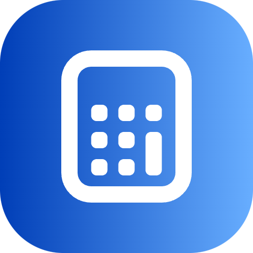

# NumPad Extension for Raycast

## Overview

The NumPad Extension for Raycast is a convenient tool designed to enhance your workflow by providing easy access to a virtual numpad on devices that lack a physical numpad, such as Mac computers. This extension was created to address the challenges of using a virtual keyboard or configuring external keyboards to simulate numpad functionality, especially when dealing with tasks that require numerical input, such as passwords, calculations, and data entry.

## Key Features

The extension offers three main functionalities:

1. **Paste the Numbers** : With the NumPad Extension, you can effortlessly input numbers onto your computer just like you would with a physical numpad. This feature is particularly useful for quickly inputting numbers into various applications, such as spreadsheets, calculators, and password fields.
2. **Copy the Numbers** : You can also copy numbers from the extension's virtual numpad, enabling easy transfer of numerical data from the extension to other applications. This eliminates the need to manually type in numbers or switch between different input methods.
3. **Save the Numbers** : The NumPad Extension goes a step further by allowing you to save frequently used numbers as favorites. This feature is especially handy when you have a set of numbers that you use regularly, such as PIN codes, account numbers, or phone numbers.

## Why Use the NumPad Extension?

### The Mac Numpad Challenge

One of the primary motivations for creating this extension was to address the lack of a physical numpad on Mac computers. Many professionals and users, like yourself, rely heavily on the numpad for various tasks. The absence of a numpad on Macs can lead to inefficiencies, especially when working with numbers. The NumPad Extension bridges this gap by providing a seamless virtual numpad experience.

### Simplifying Numerical Input

Typing numbers using the standard number keys at the top of the keyboard can be cumbersome, especially when dealing with tasks that require frequent numerical input. The NumPad Extension streamlines this process, making numerical input faster and more intuitive.

### Limited Resources Online

While there are solutions available online for simulating numpad functionality, they often involve complex setups or third-party software. Additionally, resources specifically addressing the need for a numpad extension within the context of Raycast are scarce. This extension aims to fill that gap by offering a dedicated and user-friendly solution tailored to Raycast users.

## Getting Started

To use the NumPad Extension for Raycast, follow these simple steps:

1. **Installation** : Install the NumPad Extension from the Raycast Extension Marketplace.
2. **Accessing the Numpad** : Once installed, open the extension within Raycast to access the virtual numpad.
3. **Interact** : Use the virtual numpad to input numbers, copy them to your clipboard, or save frequently used numbers as favorites.
4. **Efficiency Boost** : Enjoy a more efficient numerical input experience, especially when working on tasks that involve numbers.

## Feedback and Support

Your feedback is valuable in improving the NumPad Extension. If you encounter any issues, have suggestions for improvements, or need assistance, please reach out to us through the Raycast Extension support channels.

## Credits

The NumPad Extension for Raycast was developed by Paulo Victor Duarte. I would like to express my gratitude to the Raycast community for their input and support in creating this extension.

_Note: The images used in this document are for illustrative purposes only and may not represent the actual user interface of the extension._
