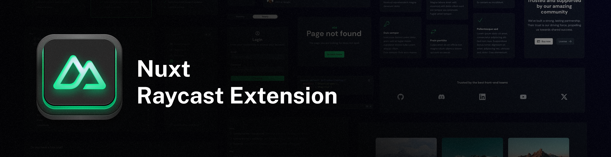

Made with 💚 for the Nuxt community

---

# 🚀 Supercharge Your Nuxt Development

**Nuxt for Raycast** is the ultimate productivity booster for Nuxt developers. Access documentation, explore the entire Nuxt ecosystem, and enhance your development workflow without ever leaving your editor.

## ✨ Why You'll Love This Extension

- **Instant Access**: Get answers, documentation, and code examples in seconds
- **Seamless Integration**: Works directly within your development environment
- **Comprehensive Coverage**: Supports the entire Nuxt ecosystem, not just UI components
- **Time-Saving**: Eliminate context switching and stay in your flow state
- **AI-Powered**: Use natural language to get exactly what you need

## ⚡️ Powerful Features

### 🔮 `@nuxt` Command
The central command hub for all your Nuxt needs:
- Ask questions in natural language about any Nuxt topic
- Generate component code with simple prompts
- Get instant documentation and usage examples
- Explore modules and their capabilities
- Solve common Nuxt development challenges

### 🧩 Nuxt Modules Explorer
Discover and learn about the vast Nuxt ecosystem:
- Browse modules by category (UI, CMS, SEO, etc.)
- Get detailed information about specific modules
- Explore compatibility, maintainers, and documentation
- Find the perfect module for your specific needs

### 🎨 Nuxt UI Integration
Access Nuxt UI documentation and tools instantly:
- `Search Component Theme`: Jump directly to any component's theme documentation
- `Get Component Source Code`: View the source code of any Nuxt UI component
- Preview components and their variations

### ⚙️ Smart Configuration
Customize to match your workflow:
- Configure component prefixes to match your project style
- Set up shortcuts for your most-used commands
- Seamless support for both Nuxt UI v2 and v3

## 🎬 See It In Action

I recommend setting up a shortcut like `✦ + N` or `⌘ + N` for quick access.

## 🔥 Real-World Use Cases

- **Component Development**: "Create a responsive navigation bar with dropdown menus"
- **Module Discovery**: "Find the best SEO modules for my Nuxt project"
- **Troubleshooting**: "Why isn't my Nuxt data fetching working?"
- **Learning**: "Show me examples of using Nuxt composables"
- **Theme Customization**: "How do I customize the UButton component theme?"

## 🚀 Roadmap

This is just the beginning. Here's what's coming:

- 🔍 Lightning-fast component and module search with intelligent filtering
- 📝 Code snippet library with copy-paste ready solutions
- 💡 Project-aware suggestions based on your codebase
- ⚙️ Interactive property explorer for components
- 🧩 Integration with more Nuxt ecosystem tools and services
- 📱 Mobile app preview capabilities

## 👥 Contributing

Got ideas to make this even better? Issues and PRs are welcome!

<!-- automd:fetch url="gh:hugorcd/markdown/main/src/sponsors.md" -->

## Sponsors

  

<!-- /automd -->

## Contributors

<!-- automd:contributors github="HugoRCD/nuxt-raycast-extension" -->

Made by [community](https://github.com/HugoRCD/nuxt-raycast-extension/graphs/contributors) 💛
  

<!-- /automd -->

<!-- automd:with-automd lastUpdate -->

---

_🤖 auto updated with [automd](https://automd.unjs.io) (last updated: Tue May 06 2025)_

<!-- /automd -->
