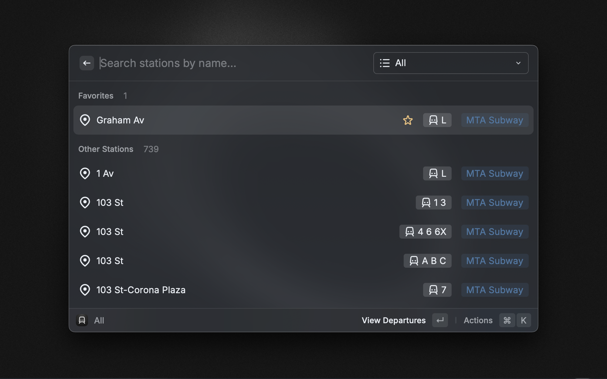
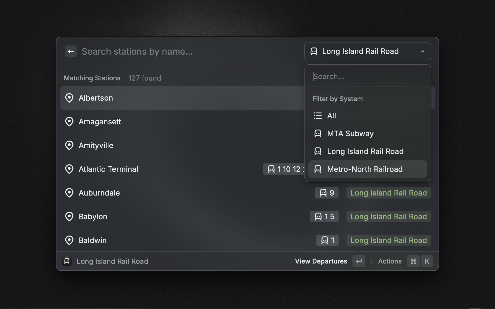
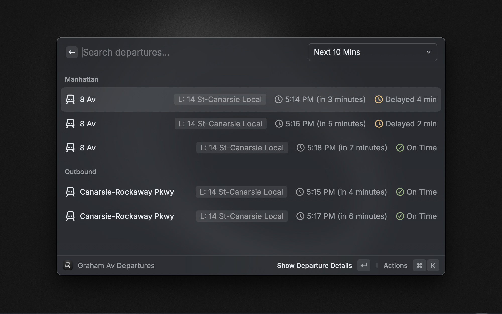
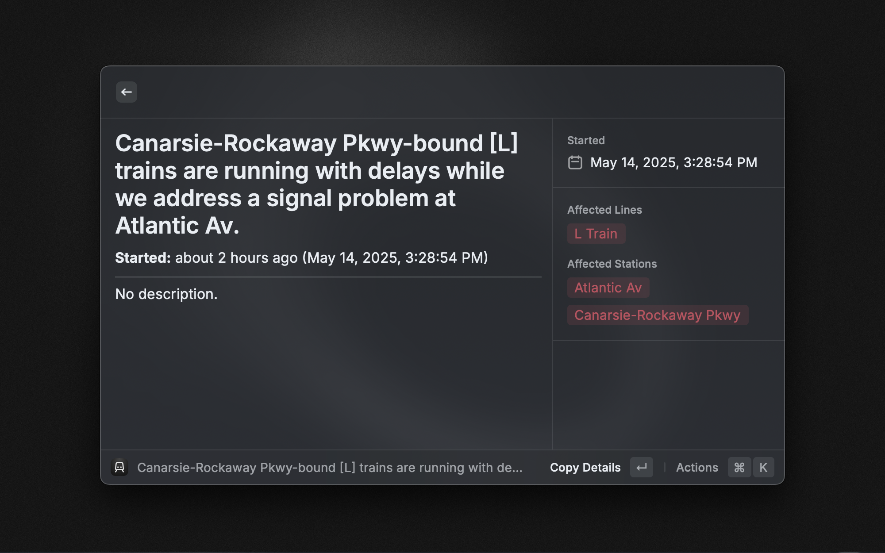
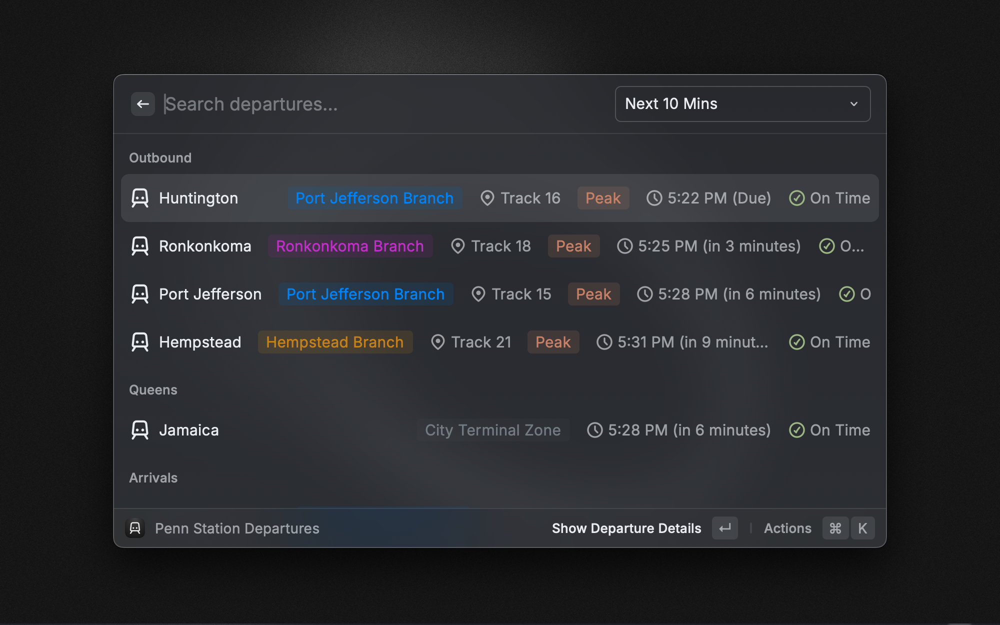

# NYC Train Tracker

The NYC Train Tracker extension allows you to look up train departures and service alerts for MTA Subway, Long Island Rail Road (LIRR), and Metro-North Railroad (MNR).

| Description                                                   | Preview                                                                            |
| ------------------------------------------------------------- | ---------------------------------------------------------------------------------- |
| Searching for stations                                        |               |
| Filtering by transit system                                   |      |
| Viewing upcoming departures                                   |      |
| Viewing service alerts                                        |           |
| Support for Long Island Railroad and Metro-North Railroad |  |

---

**Disclaimer**
This extension is not affiliated with, licensed nor endorsed by the Metropolitan Transportation Authority (MTA). The data utilized within this app is provided by a third-party MTA wrapper API which stores and sends data on its own servers.

## Features

- **Search for stations** across all NYC transit systems
- **View real-time departures** with status information
- **Check for service alerts** that may affect your commute
- **Save favorite stations** for quick access
- **Filter by transit system** (Subway, LIRR, Metro-North)
- **Accessibility information** provided for stations when available
- **Customizable time windows** for viewing upcoming departures

## Usage

1. **Find Train Departures**: Search for any station by name and view upcoming departures
2. **Favorites**: Add stations to your favorites for quick access
3. **Service Alerts**: Check for active service disruptions
4. **System Filtering**: Filter stations by transit system using the dropdown
5. **Departure Details**: View detailed information about any specific departure

## Commands

- **Find Train Departures**: Search for stations and view train departures

## Preferences

- **Default Departure Window**: Choose how far in advance to display departures
- **Show Accessibility Status**: Toggle visibility of station accessibility indicators

## Keyboard Shortcuts

- **⌘ + F**: Add/Remove station from favorites
- **⌘ + R**: Refresh data
- **⌘ + .**: Copy departure information to clipboard

## Data Sources

This extension fetches real-time and scheduled data using an open-source MTA wrapper API hosted by [Ainslie Digital](https://ainslie.digital).
