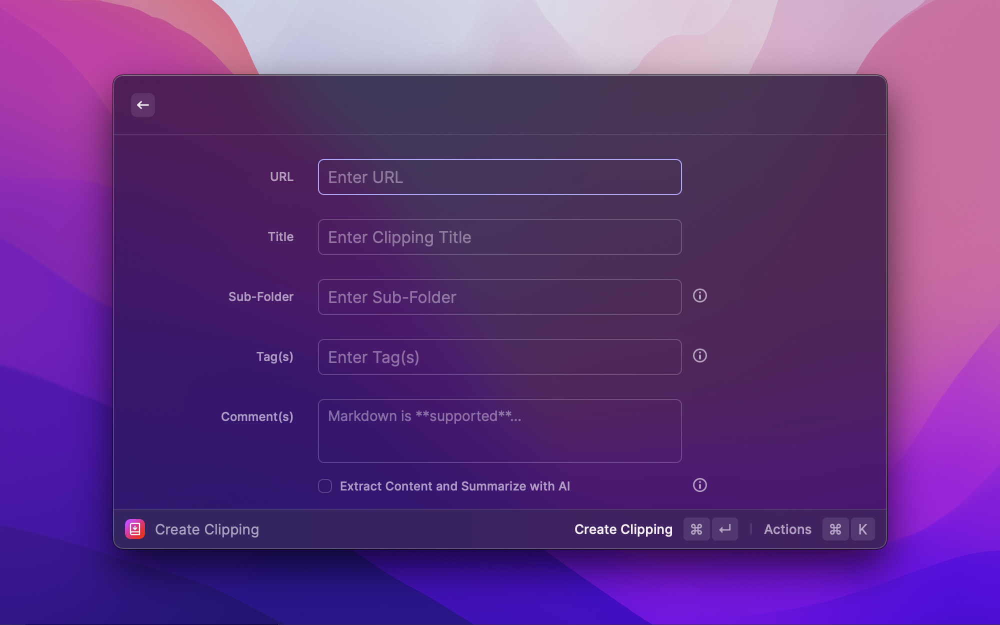
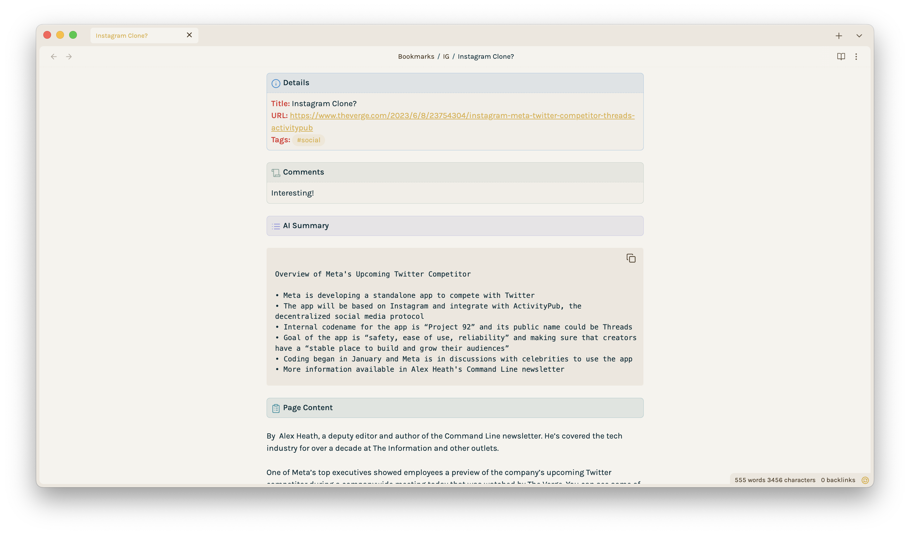

# Obsidian Clippings 

Obsidian Clippings is an **opionated** extension for Raycast that allows users to save things from the web directly to their Obsidian Vault. The extension will save and format the page metadata supplied, including title, sub-folder, tag(s), and comments, with the option to extract and summarize the contents of the page using Raycast AI. If the sub-folder does not yet exist, it will create it. 

Currently, the _format_ of the clipping is hardcoded, though as a markdown file it can be easily manipulated. Choosing to extract the contents of the page will download only **paragraph elements** for a cleaner, minimal look. Pages with no paragraph elements will only save the supplied metadata, and AI summaries will not be included.

### Configuration

When first using Obsidian Clippings, you must select the root "Clippings" folder to which sub-folders will be created. You can also customize the AI prompt used to generate the optional summaries. 

### Usage

Once you have filled out the form and submitted it, the bookmark will be saved as a markdown file in the specified Obsidian vault and folder. The file name will be in the following format:
<Vault><Root>/<Sub-Folder>/<Title>.md. Clippings are saved in the background.

Raycast AI has a limit on the amount of tokens that can be used to request a summary. If the page exceeds this threshold it will _not_ be summarized. While there are workarounds to this that can be built, the resulting summaries take **significantly** longer (20-30s+) to create.

### Actions

The extension includes the following actions:
   * **Create Obsidian Bookmark:** Submits the form and creates a new clipping in Obsidian.
   * **Open Extension Preferences:** Opens the extension preferences.
   * **Adjust AI Prompt:** Allows you to adjust the AI prompt.

### Screenshots

