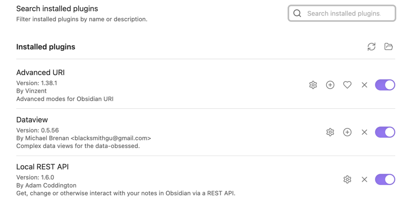
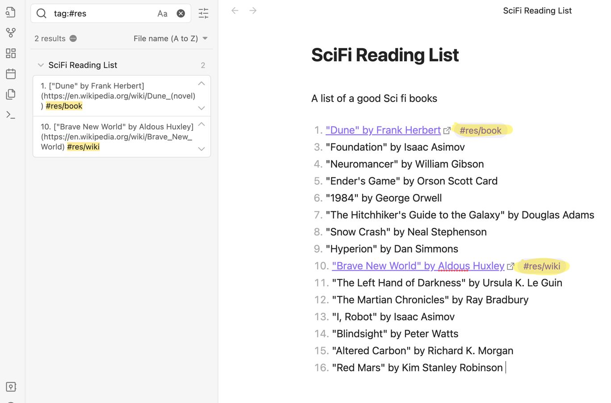
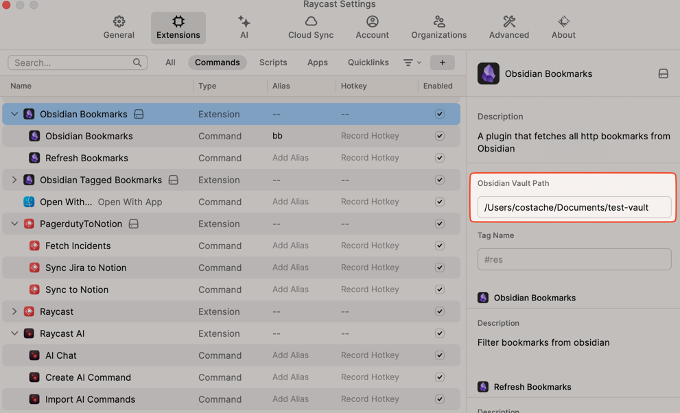
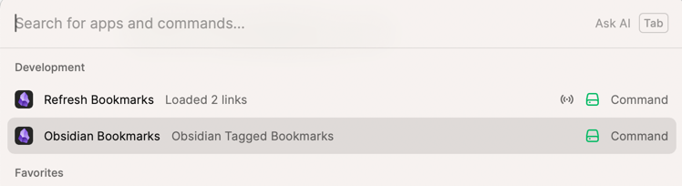
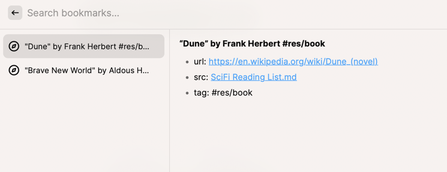

# Obsidian Bookmarks

## Configuring

### In Obsidian
- Install required plugins:
  - [DataView](https://github.com/blacksmithgu/obsidian-dataview) 
  - [Obsidan Local Rest API Plugin](https://github.com/coddingtonbear/obsidian-local-rest-api)
- Optionally: install the Advanced URI plugin if you want to directly open notes containing bookmarks directly from Raycast

## In Raycast
- Add the extension to Raycast, configure the fully qualified vault path when prompted `/Users/user/Documents/Vault Path`

## Usage

Simply add tags in obsidian to URLs that you want to then show in your bookmark search in a note. 
Note: currently, DataView requires these to be part of a bulleted list to be queried properly 

Ex: `#res/dashboard` or `#res`. All `#res` bookmarks are going to be fetched

Example Obisidian Note:

```

## Resources

- A good resource to read later [here](a-link) #res/read-later
- [My dashboard to see the data](another-link) #res/dashboard
```

## Screenshots

### Obsidian Configuration: Required Plugins




### Obsidian Usage: Easy Link Tags within notes



### Raycast Configuration



### Raycast Usage






