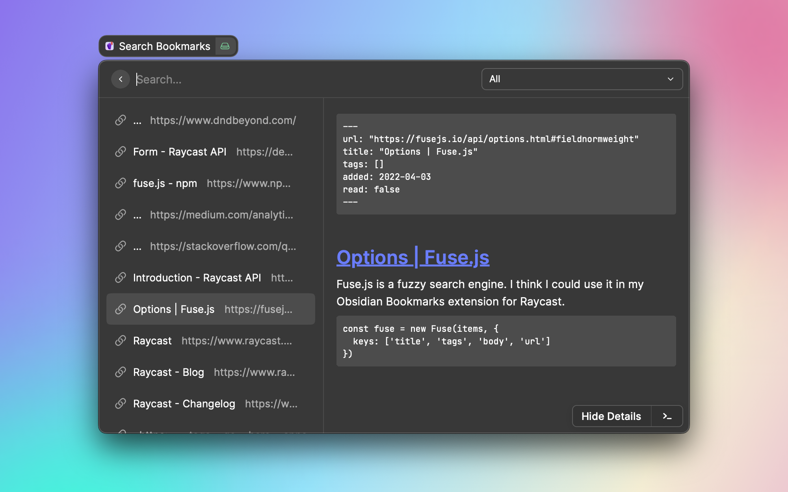

# Obsidian Bookmarks

> Manage your bookmarked links with Obsidian. Save, search, and access your bookmarks.

Obsidian Bookmarks lets you use Raycast and Obsidian as a place to manage your bookmarks.

Putting your bookmarks in Obsidian means that you can add your own metadata, including any notes or context about why you might be saving a link.

## Configuration

Obsidian Bookmarks supports the following preferences:

### Vault Path

The absolute path to your Obsidian vault. If you're storing the Vault in iCloud, this will be something like:

```
/Users/<name>/Library/Mobile Documents/iCloud~md~obsidian/Documents/<Vault>
```

### Bookmarks Subfolder

The subpath inside your vault where links should be saved to and searched from.

By default, bookmarks get saved into a folder called "Bookmarks" at the root level of your vault.

### Default Form Action

The default action to take whenever you save a new link to your bookmarks and press <kbd>⌘</kbd>+<kbd>⏎</kbd>.

If unchanged, the default action is "Open Obsidian", which will open the Obsidian app to your newly saved link. All possible options include:

- **Open Obsidian**: Open the obsidian app to your bookmark.
- **Copy Obsidian Link**: Copy the Obsidian link to your clipboard (as both rich and plain text).
- **Copy Obsidian Link as Markdown**: Copy the Obsidian link to your clipboard as a Markdown-style link.
- **Open Link**: Open the bookmarked link in your browser.
- **Copy Link**: Copy the bookmarked link to your clipboard (as both rich and plain text).
- **Copy Link as Markdown**: Copy the bookmarked link to your clipboard as a Markdown-style link.

### Default Item Action

The default action to take when browsing a list of your bookmarked links and you press <kbd>⏎</kbd>.

If unchanged, the default action is "Show Details", which will open a details panel view of your note in Obsidian.

See [Default Form Action](#default-form-action) for a list of other possible actions to pick from.

## Screenshots



