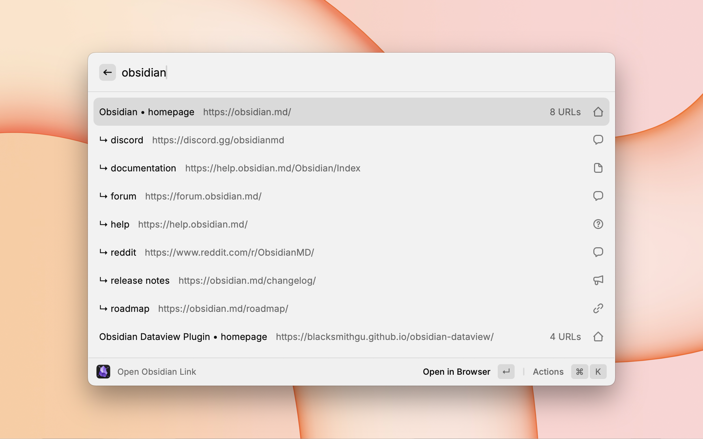
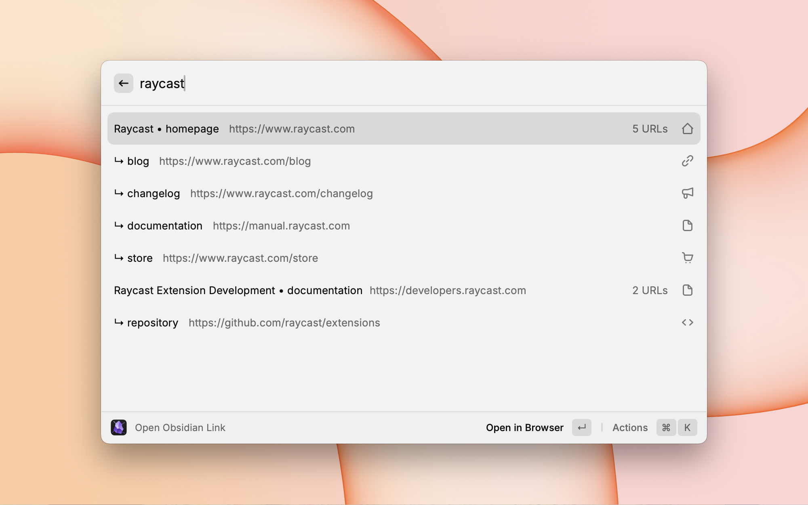

# Obsidian Link Opener

Use your Obsidian vault into a bookmark manager. This extension lets you quickly access URLs stored in your notes' frontmatter, treating your knowledge base as a structured collection of bookmarks organized by project, topic, or any system you prefer.

<div align="center">
  
  
</div>

## Why Use Obsidian as a Bookmark Manager?

- **Contextual Organization**: Keep URLs alongside your project notes, research, and documentation
- **Rich Metadata**: Store multiple related URLs per note (docs, homepage, repo, etc.)
- **No Lock-in**: Your bookmarks live in plain markdown files you control
- **Powerful Search**: Leverage Obsidian's existing organization with Raycast's quick access

## Features

- 🔍 **Direct Vault Scanning**: Scans your Obsidian vault to find all URLs in frontmatter
- 🚀 **Quick URL Access**: Open URLs from your notes without opening Obsidian
- 🎯 **URL Property Detection**: Automatically finds URLs in ANY frontmatter property
- ⚡ **Fast Search**: Quickly find notes by title or URL
- 📊 **Smart Sorting**: Sort by frecency (frequency + recency) or alphabetically
- ⌨️ **Keyboard Shortcuts**: Quick access to related URLs from the same note
- 💾 **Smart Caching**: Intelligent caching system for instant results with large vaults
- 🔄 **Incremental Updates**: Only re-scans changed files for better performance

## Prerequisites

- **Raycast**: This is a Raycast extension, so you need [Raycast](https://raycast.com) installed
- **Obsidian Vault**: An existing Obsidian vault with markdown files containing URLs in frontmatter

## Installation

### From Raycast Store (Coming Soon)
The extension will be available in the Raycast Store once published.

### Manual Installation
See the [Development Guide](DEVELOPMENT.md#development-setup) for instructions on installing from source.

## Configuration

Configure the extension in Raycast preferences:

### Settings
- **Use Frecency Sorting**: Sort notes by frequency and recency of use (default: enabled). When disabled, sorts alphabetically by note title.
- **Cache TTL (minutes)**: How long to cache vault data before refreshing (default: 5 minutes). Lower values mean more frequent updates but slower performance.


## Usage

### Open Link
The main command that displays a list of all notes with URLs in their frontmatter. You can:
- Search notes by title or URL
- Open URLs in your default browser
- Copy URLs to clipboard
- Quickly open other URLs from the same note using keyboard shortcuts
- URLs within each note are sorted with homepage first, then alphabetically by property name

### Select Vault
Choose which Obsidian vault to scan for URLs. The extension remembers your selection for future use.

### Refresh Index
Manually clear the cache and rebuild the index of URLs from your vault. This is useful if you've made changes to your notes and want to see them immediately without waiting for the cache to expire.

### Quick Access to Other URLs
When viewing any URL from a note that has multiple URLs, you can use keyboard shortcuts to quickly open other URLs from the same note:
- `⌘D` - Open documentation/docs URL
- `⌘H` - Open help URL
- `⌘G` - Open GitHub repository URL
- `⌘⇧W` - Open web app URL
- `⌘B` - Open dashboard URL
- `⌘O` - Open homepage URL

These shortcuts work regardless of which URL is currently selected, making it easy to jump between different resources for the same project or topic.

## How URL Detection Works

The extension automatically detects any frontmatter property that contains a valid URL. You can use any property name you want - if it contains a valid URL (starting with http:// or https://), it will be found and displayed.

Common property names like `homepage`, `documentation`, `github`, etc. get special icons for easier visual identification, but the extension works with any property name you choose to use.

## Example Frontmatter

The extension will detect URLs in ANY frontmatter property:

```yaml
---
title: "My Project"
homepage: https://example.com
documentation: https://docs.example.com
github: https://github.com/username/project
custom_link: https://custom.example.com
my_special_url: https://special.example.com
---

# My Project Notes
...
```

All URLs above will be found and displayed, regardless of the property name used.

## Troubleshooting

### Extension doesn't find my vault
- Ensure the vault path in preferences points to the root directory of your Obsidian vault
- Check that the directory contains `.obsidian` folder and `.md` files

### URLs not appearing
- Verify your notes have valid URLs in frontmatter properties (any property name works)
- Check that the frontmatter is valid YAML format
- Ensure URLs start with http:// or https://
- Try running a manual refresh

### Performance issues
- The extension uses intelligent caching to improve performance with large vaults
- First scan of a large vault may take a moment, but subsequent loads will be instant
- You can adjust the Cache TTL in preferences for your preferred balance of freshness vs speed
- Use the "Refresh Index" command to manually update the cache when needed

## Related Projects

### Obsidian Extensions for Raycast
- **[Obsidian](https://www.raycast.com/marcjulian/obsidian)**: The main Obsidian extension for note management, search, and creation
- **[Obsidian Bookmarks](https://www.raycast.com/quorafind/obsidian-bookmarks)**: Manages bookmarks where each bookmark is a separate note with metadata

## Why This Extension is Distinct

### Different from Obsidian Bookmarks
While both extensions work with URLs in Obsidian, they use **completely different organizational patterns**:

- **Obsidian Bookmarks**: Each bookmark is a **single note** with metadata properties describing that one bookmark
- **This Extension**: Each note is a **topic page** with multiple URL properties related to that single topic (e.g., a project note containing links to its homepage, documentation, GitHub repo, dashboard, etc.)

These fundamentally different approaches would be confusing to merge into a single extension, as they represent opposite ways of organizing links in Obsidian.

### Different from Main Obsidian Extension
- **Different Purpose**: While the main Obsidian extension focuses on note management and creation, this extension treats Obsidian as a **structured bookmark manager** for URLs stored in frontmatter properties
- **Specialized Workflow**: Designed for users who store project links, documentation URLs, and web resources in their notes' frontmatter and want quick access without opening Obsidian
- **No Feature Overlap**: The commands provided (opening URLs from frontmatter) don't duplicate any functionality from the main extension's note search, creation, or daily note features

## Development

For information about contributing to this project, building from source, or modifying the extension, see the [Development Guide](DEVELOPMENT.md).

## License

MIT - See [LICENSE](LICENSE) file for details

## Author

Oliver Steele - [@osteele](https://github.com/osteele)
