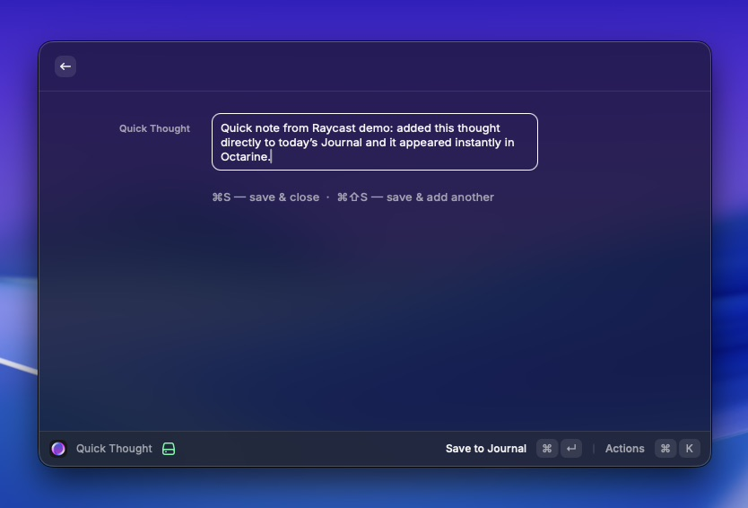
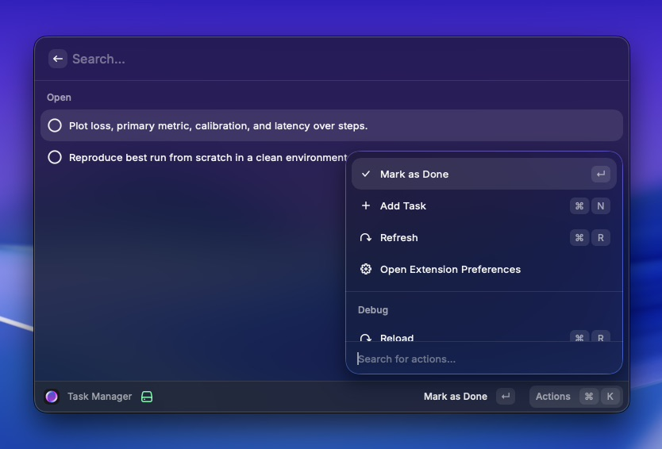
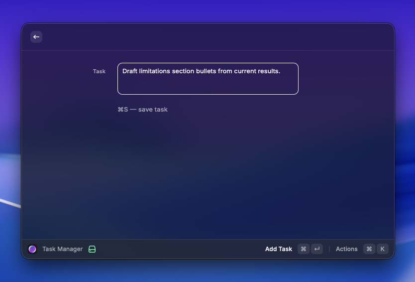
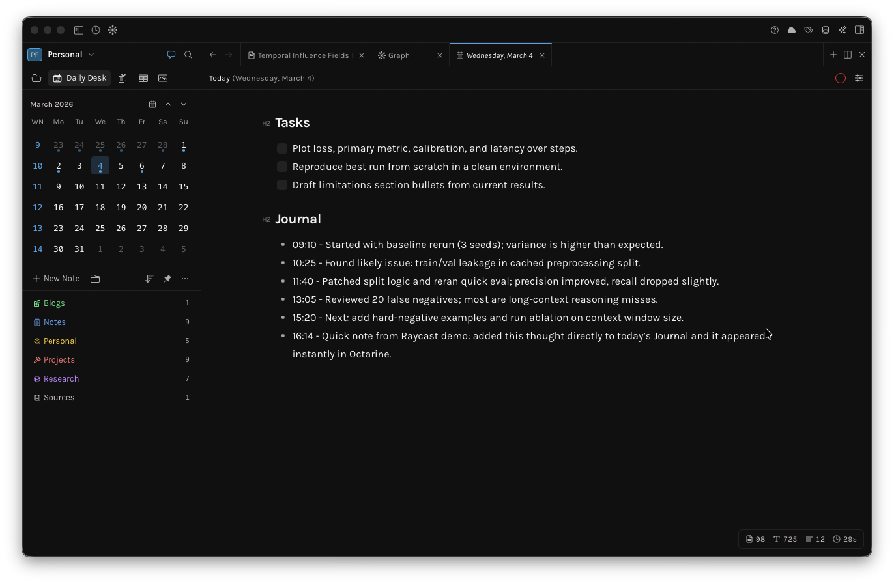

# Octarine Quick Capture

A minimal Raycast extension for fast daily capture into your Octarine notes.

Octarine is a personal knowledge and journaling app focused on daily notes and intentional workflows: [octarine.app](https://octarine.app/).

## What It Does

- Adds quick thoughts to today’s `## Journal` section.
- Lets you add and tick off tasks in today’s `## Tasks` section.
- Works only on the current day’s note in `Daily/yyyy-MM-dd.md`.
- Supports multiple vaults via workspace selection.

## Commands

- `Quick Thought`: Save a timestamped line to `## Journal`.
- `Task Manager`: Add tasks and toggle checkboxes in `## Tasks`.
- `Select Workspace`: Pick which configured vault path to use.

## Screenshots

### Quick Thought

### Task Manager (Task List)

### Task Manager (Add Task)

### Octarine Daily Note

## Install

### Local (Now)

1. Clone this repo.
2. Run `npm install`.
3. Run `npm run dev`.
4. Open Raycast and search for `Quick Thought`, `Task Manager`, or `Select Workspace`.

### Raycast Store (After Approval)

1. Open Raycast.
2. Go to the Store and search for `Octarine Quick Capture`.
3. Install and run `Select Workspace` once.

## Setup

1. Open Raycast extension preferences.
2. Set `Workspace Paths` (comma or newline separated).
3. Run `Select Workspace` and choose one.
4. Use `Quick Thought` or `Task Manager`.

## Notes

- If today’s note does not exist, the extension creates it with a simple daily template.
- If `## Tasks` or `## Journal` is missing, the extension inserts the section automatically.
