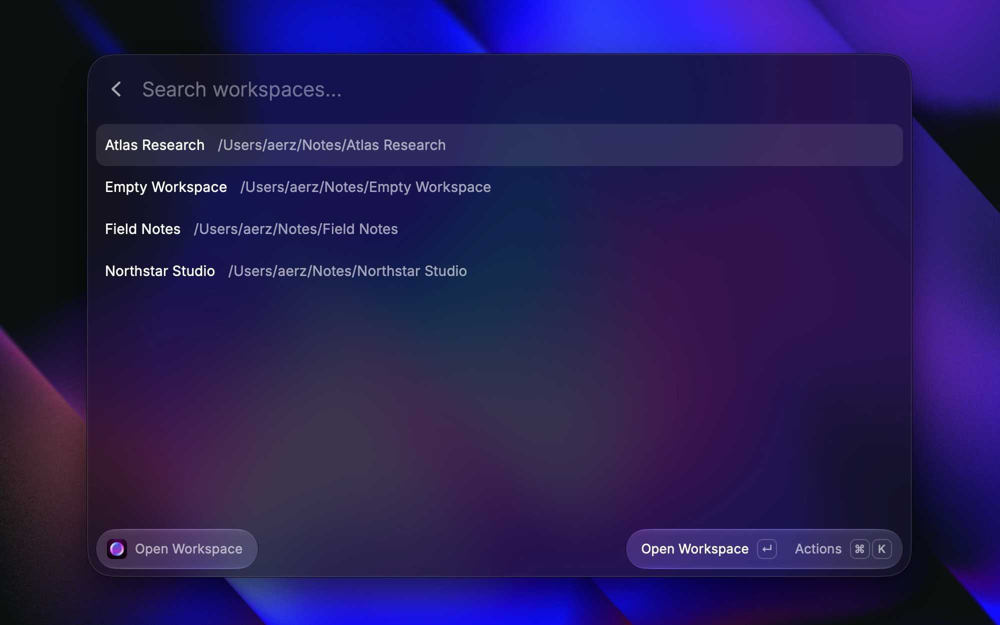
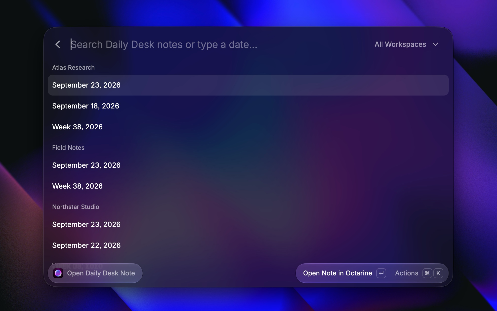
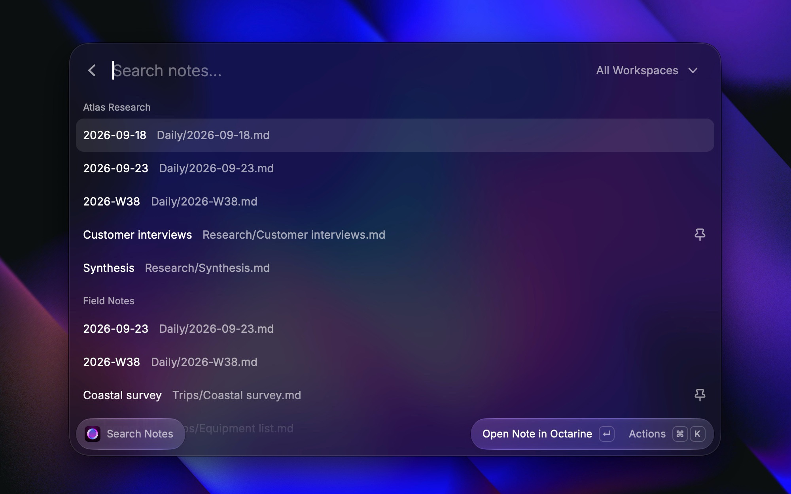
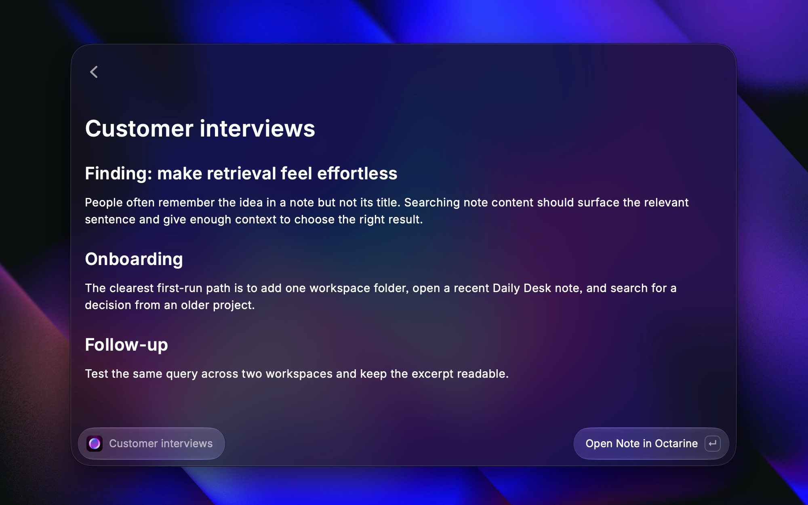
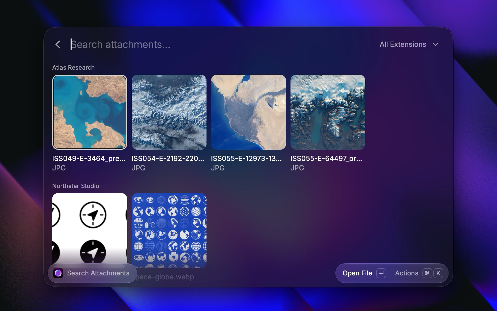

  

# Octarine for Raycast

Use [Octarine](https://octarine.app) from Raycast to open today's Daily Desk note in a workspace, browse Daily Desk notes by date, and search notes and attachments.

Install the extension from the Raycast Store, then configure **Workspace paths** in extension preferences.

## Overview

- [Open Workspace](#open-workspace)
- [Open Daily Desk Note](#open-daily-desk-note)
- [Search Notes](#search-notes)
- [Search Attachments](#search-attachments)

**Extension Preferences**

- **Workspace paths** *(required)*. Enter comma-separated paths to workspaces or parent folders. For a parent folder, Raycast checks its immediate subfolders. Each workspace must contain a `.octarine` folder.
- **Workspaces to exclude**. Workspace names to skip, separated by commas.
- **Folders to exclude**. Folder names to omit from note and attachment results across all workspaces, separated by commas.

Press `⌘ K` in any command to open the Action Panel.

## Open Workspace

Select a [workspace](https://docs.octarine.app/core-concepts/workspaces) to open its [Daily Desk](https://docs.octarine.app/daily-desk/) note for today.

**Arguments**

- **Workspace** *(optional)*. Enter a workspace name to open today's note there directly.

**Actions**

| Shortcut  | Action                                      |
|-----------|---------------------------------------------|
| `Enter`   | Open Workspace in the selected workspace   |
| `⌘ Enter` | Copy Path for the selected workspace        |
| `⌘ R`     | Refresh the workspace list                 |

## Open Daily Desk Note

Open a Daily Desk note by date, or browse daily and weekly notes in the `Daily` folder of each workspace.

**Arguments**

- **Date** *(optional)*. Enter a supported date or week format to open that note.
- **Workspace** *(optional)*. With a date, opens the note in that workspace. Without a date, filters the list to that workspace.

**Actions**

| Shortcut  | Action                  |
|-----------|-------------------------|
| `Enter`   | Open Note in Octarine   |
| `⌘ Enter` | Force Open [date or week] |
| `Enter`   | Open [date or week]     |
| `Enter`   | Open in [workspace]     |
| `⌘ Enter` | Choose Workspace…       |
| `Enter`   | Open Daily Desk Note    |
| `⌘ Enter` | Copy Path               |
| `⌘ R`     | Refresh                 |

Without a date argument, the command lists daily and weekly notes from each workspace's `Daily` folder. Results are grouped by workspace and ordered from newest to oldest within each workspace. Use the dropdown to filter by workspace. Type a date to find matching notes; exact date matches move to the top of their workspace section. Other search terms match note titles, file paths, and workspace names.

**Opening a Missing Date**

When a supported date has no matching note, the list shows a suggestion titled with the formatted date or week. With **All Workspaces** selected, the suggestion appears in the last used workspace section when one is available. Otherwise, it appears under **Choose a Workspace**. When a specific workspace is selected, the suggestion targets that workspace.

Press `Enter` to open the suggestion. If no workspace is selected or remembered, `Enter` opens the workspace selector. When a suggestion uses the last workspace, **Choose Workspace…** selects another one and **Clear Last Workspace** removes the saved workspace. With a supported date in the search field, press `⌘ Enter` from any visible note row to open that date, even when another row is selected.

**Preferences**

- **Default workspace**. Selects the workspace for a date argument when no **Workspace** argument is provided. If unset, choose a workspace from the list.
- **Use the file name as the result title**. Shows the file name without its extension, such as `2023-02-18`. The formatted date or week label appears as the subtitle.
- **Use the last workspace for date suggestions**. When **All Workspaces** is selected, date suggestions use the workspace where you last opened a Daily Desk note.

**Supported Date Formats**

| Format                 | Examples                                   |
|------------------------|--------------------------------------------|
| ISO date               | `2024-01-15`, `2024-12-25`                 |
| ISO week               | `2024-W03`, `2026-W01`                     |
| Natural language dates | `today`, `yesterday`, `tomorrow`           |
| Relative dates         | `2 days ago`, `next monday`, `last friday` |
| Partial dates          | `jan 15`, `december 25`, `nov 3`           |
| Full dates             | `jan 15 2026`, `22 Dec, 2026`              |
| Natural language weeks | `this week`, `last week`, `next week`      |
| Relative weeks         | `2 weeks ago`, `in 2 weeks`                |

**References**

- [Daily Desk / Smart Dates](https://docs.octarine.app/daily-desk/smart-dates)
- [`daily` — Open a daily or weekly note](https://docs.octarine.app/workflows/uri-scheme#daily---open-a-daily-or-weekly-note)

## Search Notes

Search notes by title, path, or workspace name. Enable content search to include note text.

**Actions**

| Shortcut  | Action                                                  |
|-----------|---------------------------------------------------------|
| `Enter`   | Open Note in Octarine                                   |
| `⌘ Enter` | Show or hide the note preview                           |
| `⌘ Y`     | Quick Look Note                                         |
| `⌘ ⇧ P`   | Show Pinned Notes Only or Show All Notes                |
| `⌘ ⇧ F`   | Search Note Contents or Search Titles and Paths Only    |
| `⌘ R`     | Refresh                                                 |

**Search & Filter**

- When content search is off, all query terms must match a note title, file path, or workspace name.
- Use the dropdown to filter by workspace.
- Select **Show Pinned Notes Only** to show only [pinned notes](https://docs.octarine.app/note-management/pinned) across all workspaces or within the selected workspace. Select **Show All Notes** to remove the filter.
- Select **Search Note Contents** to include note content in the current search. Content-only matches show an excerpt. Select **Search Titles and Paths Only** to turn off content search. If content search is unavailable, results fall back to titles and paths.

**Preferences**

- **Show a note count in each workspace section**. Adds a note count to each workspace section title.
- **Show pinned notes first**. Moves pinned notes to the top of results in each workspace.
- **Include note content by default**. Searches note content alongside note titles and file paths.
- **Show a note preview by default**. Shows the selected note beside the results list when Search Notes opens.

## Search Attachments

Browse [files attached](https://docs.octarine.app/editor/attachments) to notes across your workspaces. Search by filename, extension, or workspace name, then preview or open a file. Choose Grid for image previews or List for compact system file icons from the Action Panel.

**Actions**

| Shortcut  | Action              |
|-----------|---------------------|
| `Enter`   | Open File           |
| `⌘ Enter` | Search in Octarine  |
| `⌘ R`     | Refresh             |
| `⌘ Y`     | Toggle Quick Look   |
| `⌘ ⇧ ,`   | Copy File Path      |
| —         | Reveal in Finder    |
| —         | Switch Grid/List in the Action Panel |

**Search & Filter**

Type to search by filename, extension, or workspace name. Use the dropdown to filter by file extension.

**Preferences**

- **Show an attachment count in each workspace section**. Adds an attachment count to each workspace section title when results are grouped by workspace.
- **Show attachments in one list**. Applies when **All Extensions** is selected.
- **Show attachments in a list by default**. Opens Search Attachments in List view instead of Grid.
- **File extensions to exclude**. Comma-separated extensions to omit from results. A leading dot is optional.
