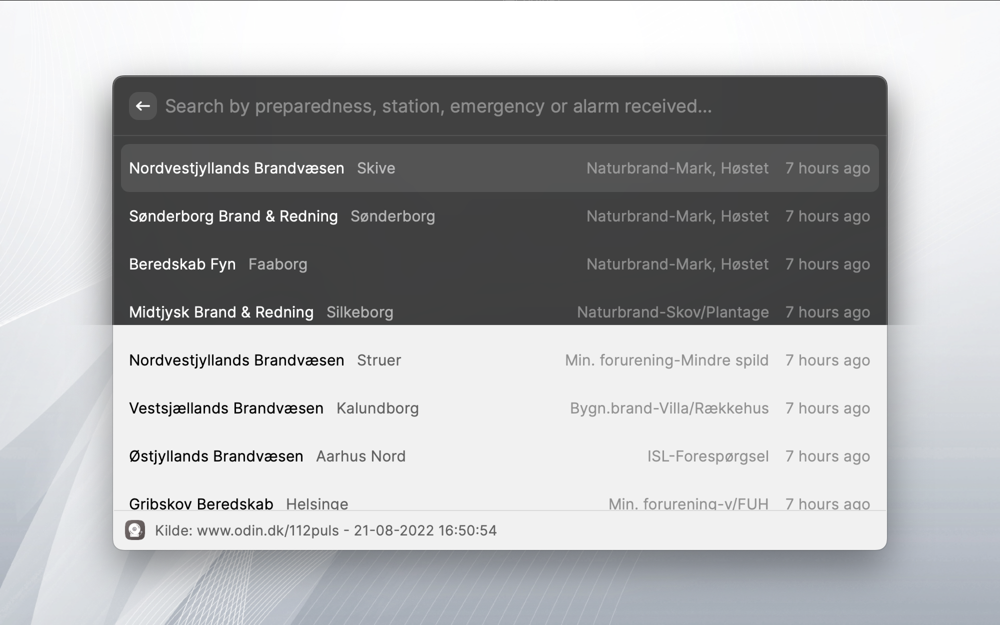

  
<h1 align="center">ODIN</h1>

Raycast extension to retrieve emergency alarms from [Online Dataregistrerings- og INdberetningssystem (ODIN)](https://www.brs.dk/da/redningsberedskab-myndighed/viden2-data-og-dokumentation/indberetninger-odin/), a system by The Danish Emergency Management Agency (DEMA), through www.odin.dk/112puls/.

    
    
  

  
  

  
## Features
- See latest 20 emergencies reported to ODIN, with responsible preparedness unit, location, emergency category and timestamp/relative time for report of accident.
  
## Disclaimer
Usage of ODIN data is permitted by 'www.odin.dk/112puls/', given that an attribution in the format **'Kilde: www.odin.dk/112puls'** exists. This is indeed the case as it's apparent in the bottom of the attached screenshot.
