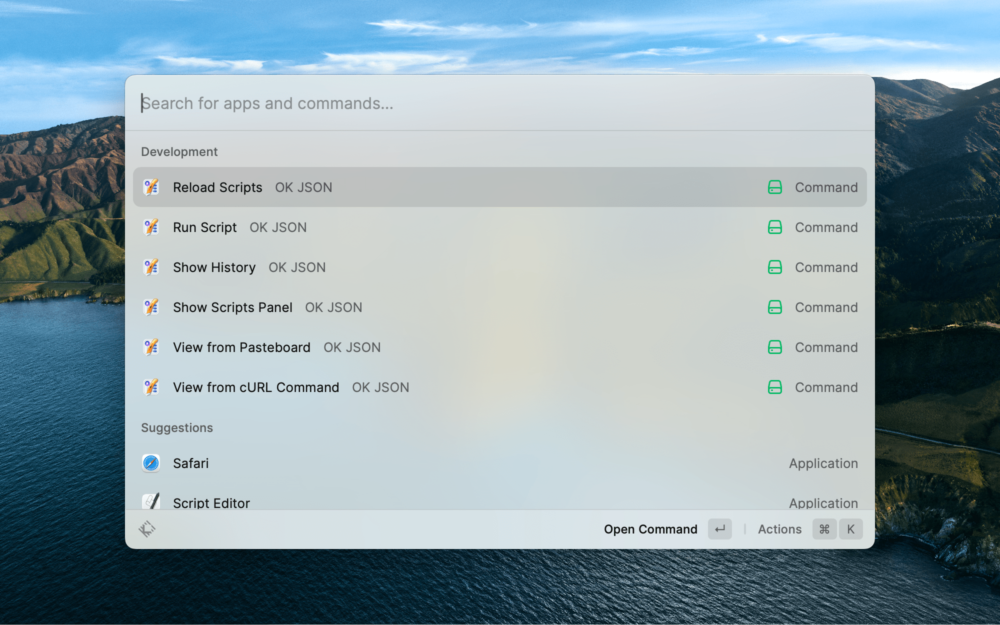

<h1 align="center">OK JSON Extension for Raycast</h1>

View JSON string or file from pasteboard, show History window, run scripts or do other things right in Raycast.




[View in Raycast Store](https://www.raycast.com/anybox/ok-json)

## Supported Commands

1. View from Pasteboard

	View JSON string or file from pasteboard in OK JSON.

2. View from Selected Text

	View selected text as JSON string in OK JSON.

3. Run Script

	Run custom scripts with pasteboard content as the input or with specified input in OK JSON.

4. Show Scripts Panel

	Open Scripts Panel window in OK JSON.

5. Show History

	Open Scripts Panel window in OK JSON.

6. Reload Scripts

	Reload scripts folder in OK JSON.

## Development

Open the project in your IDE of choice and install the dependencies via:

```bash
$ npm install
```

To run and test the Xcode extension locally:

```bash
$ npm run dev
```
