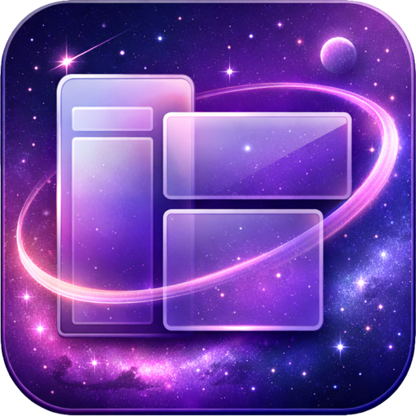
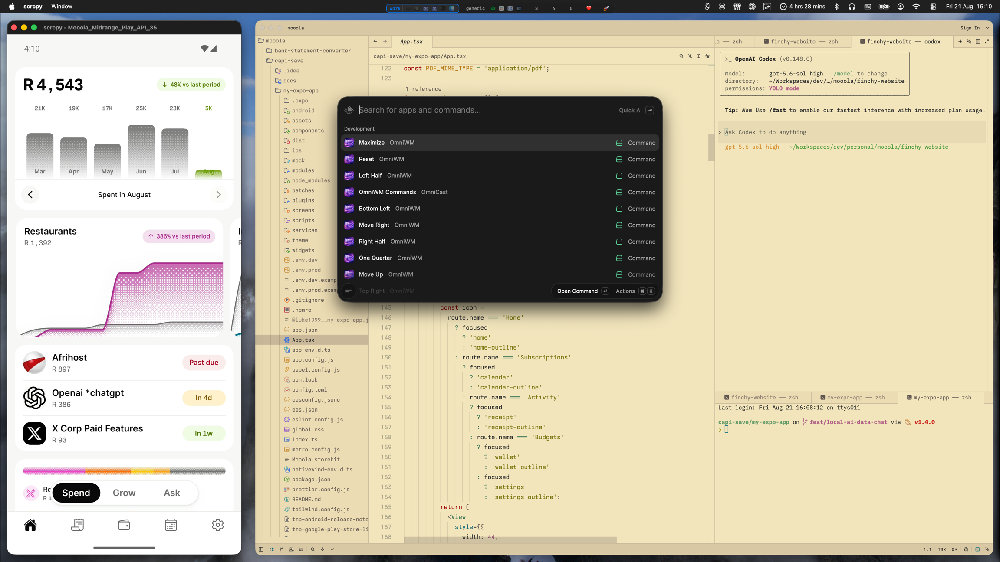
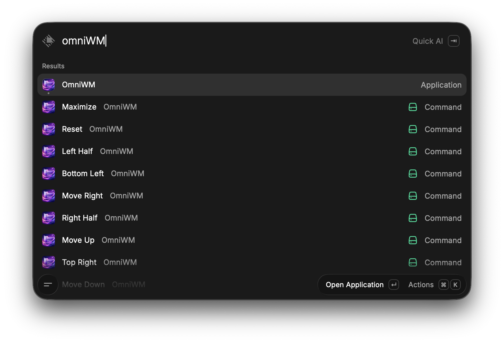
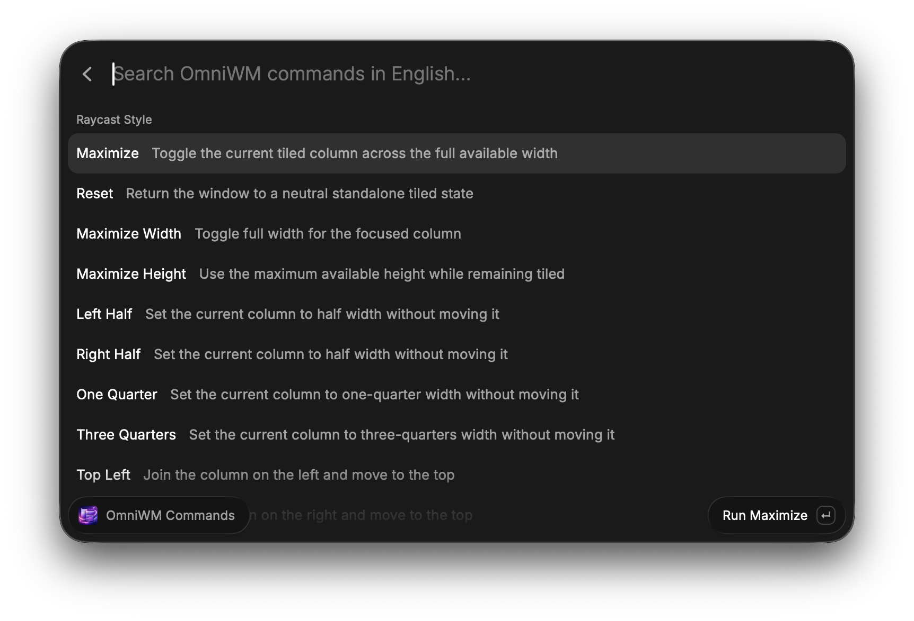

<div align="center">
  

  # OmniCast

  **Control OmniWM from Raycast, in plain English.**

  [](https://www.apple.com/macos/)
  [](https://www.raycast.com/)
  [](https://www.typescriptlang.org/)
  [](LICENSE)
</div>

OmniCast gives [OmniWM](https://github.com/BarutSRB/OmniWM) a searchable Raycast command palette and a focused set of first-class commands. It talks directly to OmniWM through `omniwmctl`; Raycast's own Window Management engine is not involved.

<p align="center">
  <a href="https://youtu.be/o-LTRq1FxyI">
    
  </a>
  <br>
  <em>OmniCast in a real OmniWM workspace. Select the image to watch the walkthrough.</em>
</p>

## Why I built this

I wanted OmniWM to own my window layout completely, while keeping Raycast's fast, searchable way of running commands. OmniCast connects the two: common layout actions appear by clear English names and short aliases, without Raycast's Window Management engine competing with OmniWM.

The [macOS workflow walkthrough](https://youtu.be/o-LTRq1FxyI) shows OmniCast in daily use: resizing tiles, moving through an OmniWM workspace, and keeping an Android device alongside the development environment.

## Highlights

- Search OmniWM actions using readable names such as “move column right”, “focus workspace 4”, or “balance window sizes”.
- Keep your most-used layout actions directly in Raycast's root search.
- Resize columns without accidentally changing their position.
- Move whole columns left or right while moving individual windows up or down.
- Recover floating and native-full-screen windows before applying tiled layouts.
- Use short search aliases such as `lh`, `tr`, `ml`, and `w4`.

## Main commands

<p align="center">
  
  <br>
  <em>Keep common OmniWM layout commands directly in Raycast's root search.</em>
</p>

| Search | Command | Behaviour |
| --- | --- | --- |
| `m` | Maximize | Toggle the focused tiled column across the available width |
| `r` | Reset | Return the focused window to a neutral standalone tile |
| `lh`, `rh` | Left Half, Right Half | Set the focused column to half width without moving it |
| `oq`, `tq` | One Quarter, Three Quarters | Set the focused column to 25 or 75 percent width |
| `tl`, `tr` | Top Left, Top Right | Join the neighbouring column and place the window at the top |
| `bl`, `br` | Bottom Left, Bottom Right | Join the neighbouring column and place the window at the bottom |
| `ml`, `mr` | Move Left, Move Right | Move the entire focused column |
| `mu`, `md` | Move Up, Move Down | Move the focused window within its column |
| `w1` through `w5` | Workspace 1 through 5 | Switch directly to an OmniWM workspace |

Open **OmniWM Commands** for the extended palette: navigation, workspaces, column and window movement, resizing, layouts, displays, scratchpad actions, and utilities.

<p align="center">
  
  <br>
  <em>Search the extended OmniWM command palette using plain English.</em>
</p>

## Requirements

- macOS on Apple Silicon
- [Raycast](https://www.raycast.com/)
- [OmniWM](https://github.com/BarutSRB/OmniWM) with `omniwmctl` installed at `/opt/homebrew/bin/omniwmctl`
- Node.js 22 or later

OmniWM IPC must be enabled in `~/.config/omniwm/settings.toml`:

```toml
[general]
ipcEnabled = true
```

Restart OmniWM after changing the setting.

## Install from source

```bash
git clone https://github.com/imprisonedmind/omni-cast.git
cd omni-cast
npm install
npm run dev
```

Keep `npm run dev` running while developing. Raycast registers the local extension and reloads it when source files change.

## Optional Script Command

`omni-ctl.sh` opens OmniWM's built-in command palette as a lightweight fallback. Add this repository under **Raycast Settings**, **Extensions**, **Script Commands** if you want to use it.

## Troubleshooting

### OmniWM has no focused managed window

Focus a window that OmniWM manages, then run the command again. OmniCast retries focus discovery briefly because Raycast itself temporarily owns focus while its window is open.

### Commands do nothing

Confirm that OmniWM is running, IPC is enabled, and this succeeds in Terminal:

```bash
/opt/homebrew/bin/omniwmctl query focused-window --format json
```

### A window remains floating

Use **Reset**. It leaves native macOS full screen, returns a floating window to tiling, and separates it into a neutral standalone tile when necessary.

## Development

```bash
npm run dev
npm run lint
npm run build
```

## License

[MIT](LICENSE)
