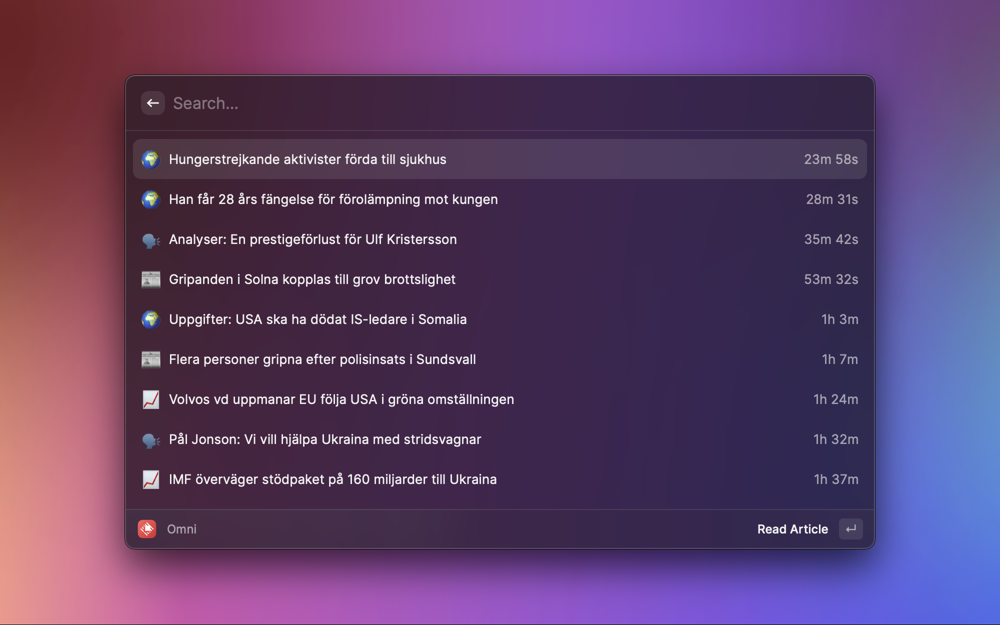

  
  <h1 align="center">Omni News</h1>

Raycast extension for fetching and displaying news from omni.se

The amount of news that are to be fetched can be changed in the Raycast settings menu.
The default is 100.

By default, ads from the API are removed from the result. This can also be changed in the Raycast settings menu.
