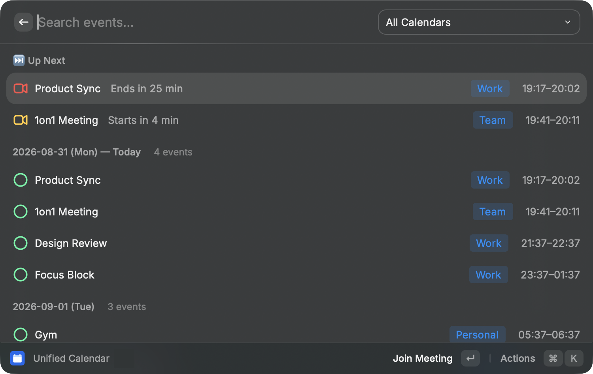

# OneCal Unified Calendar

View your [OneCal Unified Calendar View](https://app.onecal.io/calendar-view) in Raycast.



> The screenshot shows demo data (in development mode, pass `demo` as the command argument to render mock data without connecting to real calendars).

## Features

- List **all events from all synced calendars**, grouped by day. Failures are never hidden: the initial load shows an error view with retry, and a failed background refresh shows a persistent "⚠️ Update Error" row above cached results
- **Clone events created by OneCal Sync are hidden by default** (toggle with `⌘⇧H`), using the server-side `isClone` flag
- **"Up Next" section** pinned to the top: all ongoing meetings plus meetings starting within 5 minutes (or the next upcoming event), with relative times like "Starts in 4 min" / "Ends in 25 min". **Press Enter to join the meeting** (Google Meet / Zoom / Teams / Webex / Whereby)
- Meeting URLs are extracted from the provider's native event (`hangoutLink` / `conferenceData` / `onlineMeeting.joinUrl`) or from location/description text (text-sourced URLs are validated against a hostname allowlist)
- **Instant display from cache** with background refresh (stale-while-revalidate)
- Data source: the official OneCal MCP server (`https://mcp-server.onecal.io/mcp`, OAuth 2.0 + PKCE)

## Requirements

- A OneCal account with an **active Free Trial or any paid plan**
- The **MCP Config** section available in OneCal Settings (if you don't see it, request enablement at contact@onecal.io) — see the [OneCal MCP Server docs](https://docs.onecal.io/docs/integrations/mcp-server)

## Setup

### 1. Create an MCP client in OneCal

1. Open [OneCal](https://app.onecal.io) → **Settings → MCP Config**
2. Click **Create Client** and enter:
   - Name: `Raycast` (or anything you like)
   - **Redirect URI**: `https://raycast.com/redirect/extension`
   - Scopes: **Read your calendar events** (read-only is sufficient)
3. Copy the generated **Client ID** and **Client Secret** (the secret is shown only once)

> ⚠️ OneCal **strips the query string from redirect URIs** both at registration and at redirect time,
> so Raycast's default query-based redirect (`https://raycast.com/redirect?packageName=Extension`) does not work
> (the `packageName` parameter is lost and the flow can never return to the extension).
> This is why the extension uses Raycast's query-free `https://raycast.com/redirect/extension` redirect instead.

### 2. Run the extension

```bash
npm install
npm run dev
```

Enter the Client ID / Client Secret in the extension preferences on first launch, then approve the authorization in your browser.

## Commands

| Command            | Description                                                                                                                                                                      |
| ------------------ | -------------------------------------------------------------------------------------------------------------------------------------------------------------------------------- |
| `Unified Calendar` | Show events for the next 7 days (configurable). Pass `YYYY-MM-DD` as the argument to change the start date. In development mode, pass `demo` to render mock data for screenshots |

## OneCal MCP API notes (verified 2026-08-31)

- Available tools: `list-calendars`, `get-busy-intervals`, `get-calendar-events`, `get-calendar-event`, `create-calendar-event`, `update-calendar-event`, `delete-calendar-event`, `respond-to-calendar-event`
- `get-calendar-events` accepts **only** `dateMin` / `dateMax` (ISO 8601 **UTC `Z` notation only** — offsets like `+09:00` are rejected by the schema) and `timeZone` (IANA). Per-calendar filtering is not supported
- The response is **grouped per calendar**: `[{calendar: {...}, events: [...]}, ...]`
- Event objects carry an **`isClone` flag** (server-side judgement), which reproduces the web app's "Hide Clone Events" behavior exactly. The title/time-based dedupe fallback is only used if the flag key is ever absent
- Calendar keys: `id,name,email,provider,color,timeZone,isShared,isReadOnly` / Event keys: `id,parentEventId,title,start,end,allDay,isClone,color,attendees,organizer,myResponseStatus,showAs,isRecurring,remindersUseDefault,nativeEvent`
