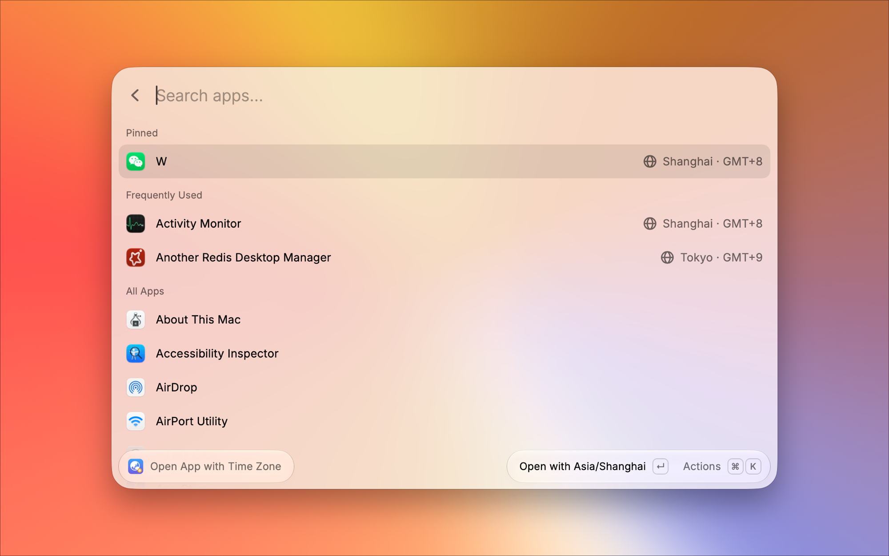

# App Time Zone Launcher

Relaunch any macOS app with its own time zone, without changing the system time zone. For example, keep a chat app on Beijing time while your Mac stays on Los Angeles time.



## Features

- Search installed apps and press Enter to open one with its remembered time zone. Apps you have not opened yet use the system time zone.
- Choose any standard IANA time zone with its UTC offset and current local time. The choice is remembered per app.
- Ask for confirmation before restarting an app that is already running. Closed apps open immediately.
- Sort apps by how often you open them with this extension, and pin apps to keep them on top.
- Check that the relaunched process actually received the time zone.

## Usage

In the app list:

| Shortcut    | Action                                   |
| ----------- | ---------------------------------------- |
| `↵`         | Open with the app's remembered time zone |
| `⌘` `↵`     | Choose another time zone                 |
| `⌘` `⇧` `P` | Pin or unpin the app                     |
| `⌘` `⇧` `F` | Show the app in Finder                   |

In the time zone list, `↵` opens the app with the selected time zone and remembers it. `⌘` `S` remembers it without opening the app.

## How It Works

If the app is running, it is quit through AppleScript, falling back to `SIGTERM`. It is then relaunched with:

```sh
open -n --env TZ=<zone> --env __XPC_TZ=<zone> /path/to/App.app
```

`TZ` sets the time zone of the app process. `__XPC_TZ` passes it on to the app's XPC services, such as the WebKit processes behind web-based interfaces. Only that app instance is affected. The system time zone and all other apps stay unchanged.

## Limitations

- The time zone lasts until the app quits. Opening the app from the Dock, Finder, or Spotlight afterwards uses the system time zone again.
- Apps that ignore the `TZ` environment variable, for example ones that take the time zone from an account setting, are not affected.
- macOS hides the process environment of Apple system apps, so the extension cannot check the result for them and reports it as not verifiable.
- If a running app does not quit within 30 seconds, for example because an unsaved-changes dialog is open, the relaunch is aborted.

## Development

```sh
npm install
npm run dev    # load the extension into Raycast in development mode
npm run lint   # Raycast manifest, icon, ESLint, and Prettier checks
npm run build  # type-check and build the extension
```
