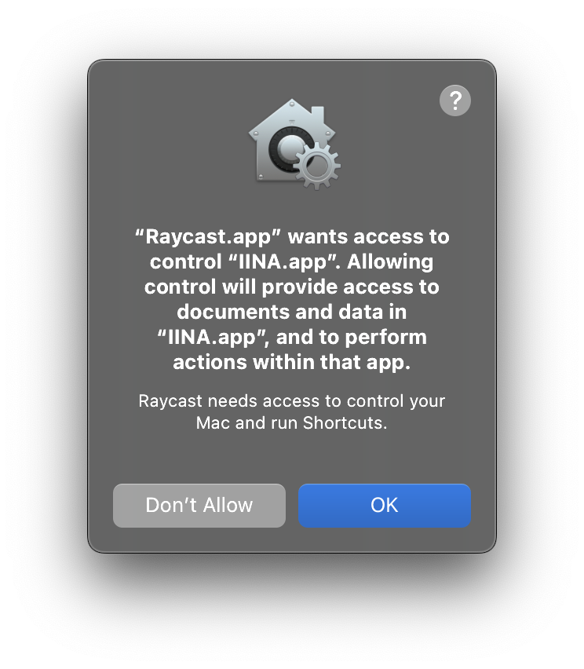

# Open in IINA

> Open any video URL directly in [IINA](https://www.iina.io/)\*

###### _\*IINA must be installed on the system already_

#### Info

The extension does a very basic check to validate the clipboard contains a valid
URL. This is both because IINA supports various URL formats for streaming video,
as well as the fact that determining if a URL is a video solely based on its
contents can be challenging.

<a href="#">
  <picture>
    
  </picture>
</a>

Raycast might prompt you to give permissions the first time you try to use the
extension.

<!-- prettier-ignore -->
> [!IMPORTANT]
> You need to enable Raycast to control your computer for this extension to work properly

#### Contact

For bug reports, improvements or suggestions:
[@yeskunall](https://github.com/yeskunall)

#### Credits

This extension would not exist without IINA, so if you find this boosts your
productivity in any way, please star their
[repository](https://github.com/iina/iina).

---
