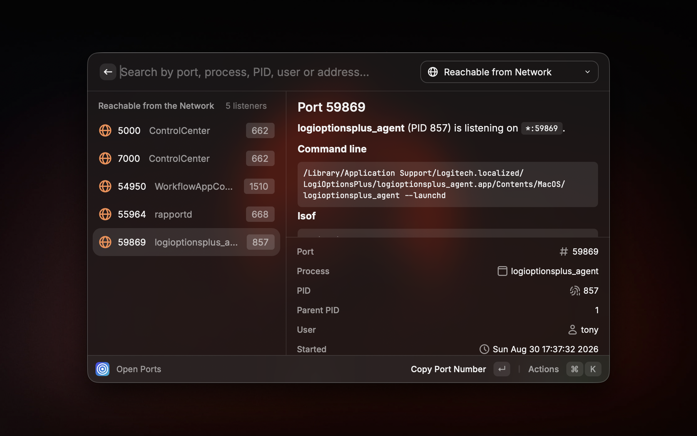
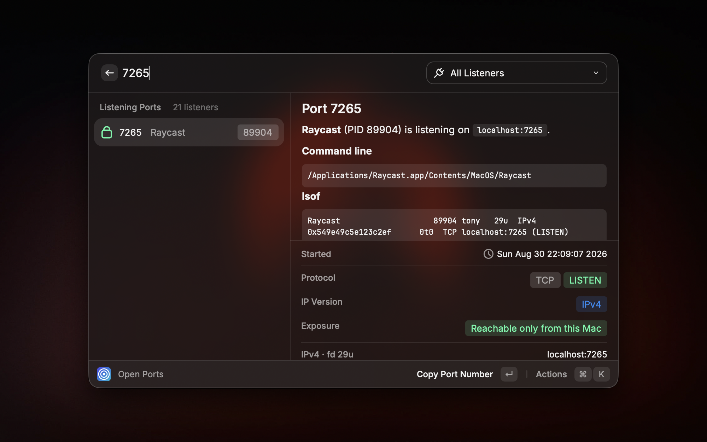
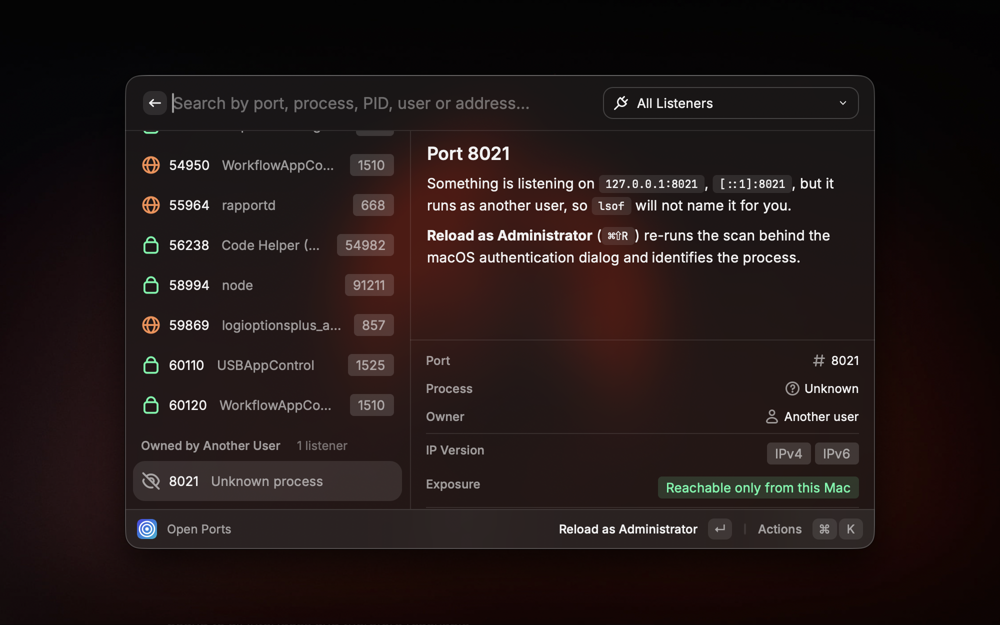
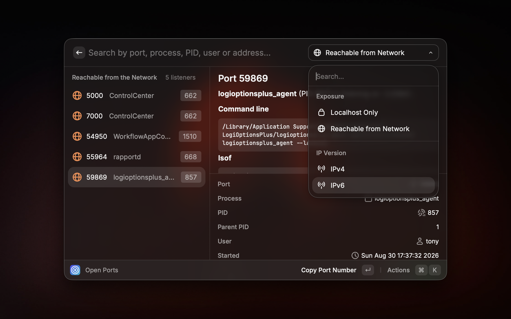
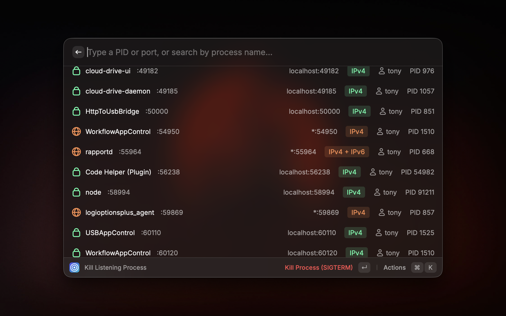
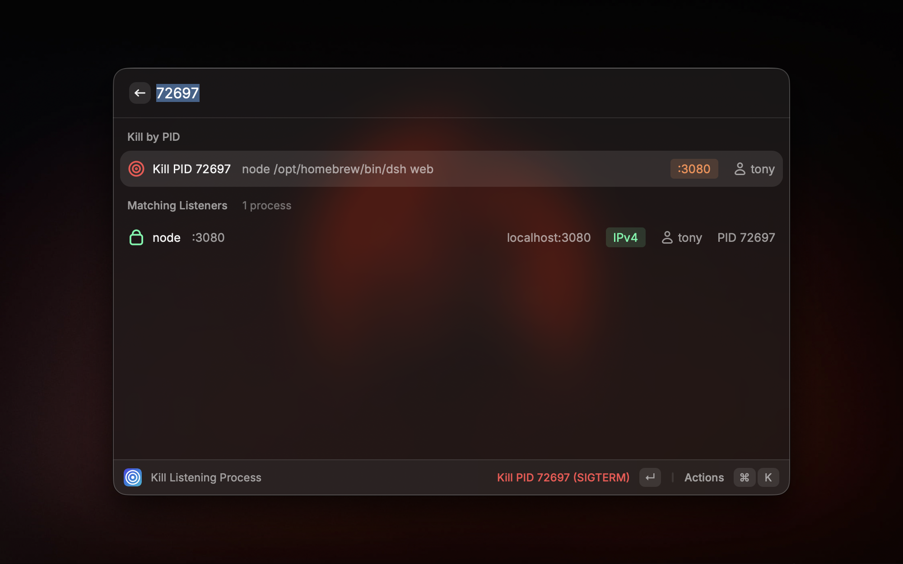

<p align="center">
  
</p>

<h1 align="center">Open Ports</h1>

<p align="center">
  See every TCP port listening on your Mac, find out which process owns it, and kill it without leaving Raycast.
  <br />
  A native reader for <code>lsof</code> — nothing to install, nothing to configure.
</p>

## Screenshots

|                 Open Ports                  |                Port Details                 |
| :-----------------------------------------: | :-----------------------------------------: |
|        |      |

|            Owned by Another User            |             Filter by Exposure              |
| :-----------------------------------------: | :-----------------------------------------: |
|  |  |

|               Kill a Process                |                 Kill by PID                 |
| :-----------------------------------------: | :-----------------------------------------: |
|    |       |

## Commands

| Command                   | Description                                                                            |
| ------------------------- | -------------------------------------------------------------------------------------- |
| **View Open Ports**       | Browse every listening TCP port with its process, PID, user, bind address and IP version |
| **Kill Listening Process** | Kill a process by PID or pick it from the list, gracefully or by force                  |

### View Open Ports

Every entry is one process on one port. The rows `lsof` reports separately for the same process and port — the
usual IPv4 + IPv6 pair — are merged into a single entry, so the list reads as one line per thing that is
actually listening. The detail panel breaks the merge back apart and shows each socket with its file
descriptor, alongside the parent PID, start time, full command line and the raw `lsof` output.

The icon colour answers "can anyone else reach this?" at a glance:

| Colour    | Meaning                                                              |
| --------- | -------------------------------------------------------------------- |
| 🟢 Green  | Bound to loopback — reachable only from this Mac                      |
| 🟠 Orange | Bound to `*` — reachable from anyone on your network                  |
| 🔵 Blue   | Bound to one specific interface address                               |

Search matches the port, process name, PID, user, bind address and the well-known service for that port, so
typing `postgres`, `5432` or `redis` all get you there. The dropdown filters by exposure or IP version.

Ports held by a process you are not allowed to inspect appear in a separate **Owned by Another User** section
rather than silently going missing, so a port never looks free when it is not. See
[Listeners owned by other users](#listeners-owned-by-other-users).

### Kill Listening Process

Type a plain number to kill **by PID** — the process is resolved against the process table and can be killed
whether or not it holds a port. Type anything else to search the list and kill **by port or name**.

Every kill is verified rather than assumed: after the signal is sent the process is polled for about a second
to confirm it actually exited. If it is still alive after a graceful signal the toast offers a force kill; if it
belongs to another user the toast offers to retry with administrator rights.

## Configuration

| Preference                          | Default   | Description                                                     |
| ----------------------------------- | --------- | --------------------------------------------------------------- |
| Ask for confirmation before killing | On        | Show a confirmation dialog before any signal is sent            |
| Show the detail panel by default    | On        | Open **View Open Ports** with the metadata panel expanded       |
| Default Signal                      | `SIGTERM` | Signal used by the primary kill action, `SIGINT` or `SIGKILL` also available |

## Keyboard Shortcuts

| Shortcut | Action                      |
| -------- | --------------------------- |
| `⌘` `D`  | Toggle the detail panel     |
| `⌘` `O`  | Open the port in a browser  |
| `⌘` `R`  | Reload                      |
| `⌘⇧` `R` | Reload as administrator     |
| `⌘⇧` `P` | Copy PID                    |
| `⌘⇧` `N` | Copy process name           |
| `⌘⇧` `A` | Copy bind address           |
| `⌘⇧` `K` | Copy `kill -9` command      |
| `⌘⇧` `L` | Copy the raw `lsof` row     |
| `⌘⇧` `F` | Show the executable in Finder |
| `⌃` `X`  | Kill process                |
| `⌃⇧` `X` | Force kill (`SIGKILL`)      |
| `⌃⌥` `X` | Force kill as administrator |

Destructive actions sit on `Control` so they cannot be hit while reaching for a `Command` shortcut.

## How it works

Everything on screen comes from these read-only commands, and the `lsof` one can be copied straight from the
action panel so you can run it yourself:

```bash
lsof -P -iTCP -sTCP:LISTEN +c0            # which process holds which port
ps -Ao pid=,ppid=,user=,lstart=,command=  # parent PID, start time, command line
ps -Ao pid=,comm=                         # executable path, spaces included
netstat -an -p tcp                        # every listening socket the kernel knows about
```

No daemon, no polling, no network access — the extension reads the same information you would read in a
terminal.

### Listeners owned by other users

`lsof` only names sockets you are allowed to inspect, so a listener owned by `root` or another user would
normally vanish from the list entirely. You would not just lose the process name — you would not even know the
port was taken.

The extension closes that gap without asking for a password. `netstat` reports every listening socket on the
machine and needs no privileges, but it cannot say who owns one. Subtracting what `lsof` managed to attribute
from what the kernel reports leaves exactly the ports that exist but cannot be named, and those appear in an
**Owned by Another User** section. The answer to "what is on port 8021?" stays honest even when the owner is
out of reach.

**Reload as Administrator** (`⌘⇧R`) then re-runs the scan behind the macOS authentication dialog and names
them. macOS caches that authorisation for a few minutes, so a refresh right after a kill does not ask again.

The two sources are matched on port plus IP version rather than on the host string, because `lsof` resolves
names (`localhost:7265`) while `netstat` stays numeric (`127.0.0.1.7265`). A socket that cannot be matched is
therefore under-reported rather than wrongly flagged as hidden.

## Security

The extension spawns system binaries and can terminate processes as root, so a few invariants are deliberate
and are covered by tests:

- **No shell.** Commands run through `execFile`, so arguments reach the process via `execve` and are never
  parsed by a shell. The one exception is the macOS authentication dialog, which takes a single string; there
  every dynamic value is POSIX-quoted, then AppleScript-quoted, and control characters are rejected outright.
- **Absolute paths, minimal environment.** Child processes get `PATH=/usr/sbin:/usr/bin:/bin:/sbin` and
  `LC_ALL=C` only, so nothing from your shell profile can redirect `lsof` or `kill`.
- **Validated PIDs.** `kill(0, …)` signals the caller's whole process group and `kill(-1, …)` signals every
  process you own — only positive safe integers ever reach `process.kill`.
- **Allowlisted signals.** A preference value that is not `SIGTERM`, `SIGINT` or `SIGKILL` falls back to
  `SIGTERM` instead of being interpolated into a command.
- **PID reuse is checked, including under the auth dialog.** A PID captured when the list was drawn may belong
  to a different process by the time you press a kill action, so the process start time is re-read and compared
  first. For an administrator kill that comparison is carried *into* the privileged command and runs immediately
  before the signal, because the authentication dialog can sit on screen long enough for a PID to be recycled.
- **Untrusted text is escaped.** Process names come from other users' processes; they are Markdown-escaped or
  wrapped in a fence long enough that they cannot break out of it.

## Development

```bash
npm install
npm run dev     # build and load into Raycast, with hot reload
npm test        # type-check everything, then run the node:test suites
npm run lint    # manifest validation, ESLint and Prettier
npm run build   # production build
```

Store screenshots live in `metadata/` (captured with Raycast's Window Capture at 2000 x 1250). The Store
reads that folder directly, so README assets must live elsewhere: `npm run sync-screenshots` mirrors them
into `media/`, which is what this README renders.

The code is split along one boundary: **`src/core` never imports `@raycast/api`**, so all the branching logic
can be tested without Raycast running.

```
src/
  view-open-ports.tsx          Command: browse listeners
  kill-listening-process.tsx   Command: kill by PID or from the list
  core/                        Pure domain logic
    exec.ts                    Process spawning and the authenticated shell
    lsof.ts                    lsof invocation, parsing, grouping
    netstat.ts                 Kernel socket list and the unattributed-port cross-check
    ps.ts                      Process table snapshot and start-time fingerprint
    signals.ts                 PID/signal validation and delivery
    ports.ts                   Well-known ports, browser URLs, formatting
    search.ts                  Relevance ranking for the kill command
    markdown.ts                Escaping for untrusted text in detail panels
    types.ts                   Shared domain types
  ui/                          Everything that touches the Raycast API
    listener-actions.tsx       The shared action panel
    listener-detail.tsx        The detail panel
    hidden-listener-item.tsx   Row for a port owned by another user
    kill-flow.ts               Confirmation, signalling, outcome reporting
    use-listeners.ts           Data loading hook shared by both commands
    presentation.ts            Icons, colours and labels
    preferences.ts             Validated preference access
    shortcuts.ts               Every keyboard shortcut, in one table
tests/                         node:test suites over src/core
```

To add a command, add it to the `commands` array in `package.json` and create `src/<name>.tsx`; reuse
`useListeners`, `ListenerActions` and `killTarget` rather than reimplementing them.
