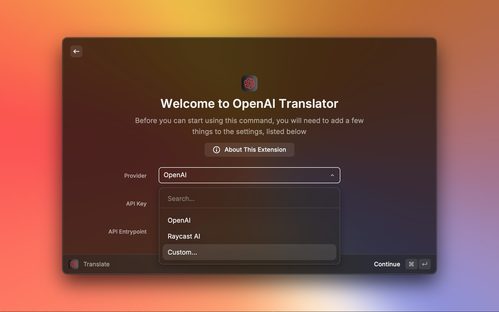
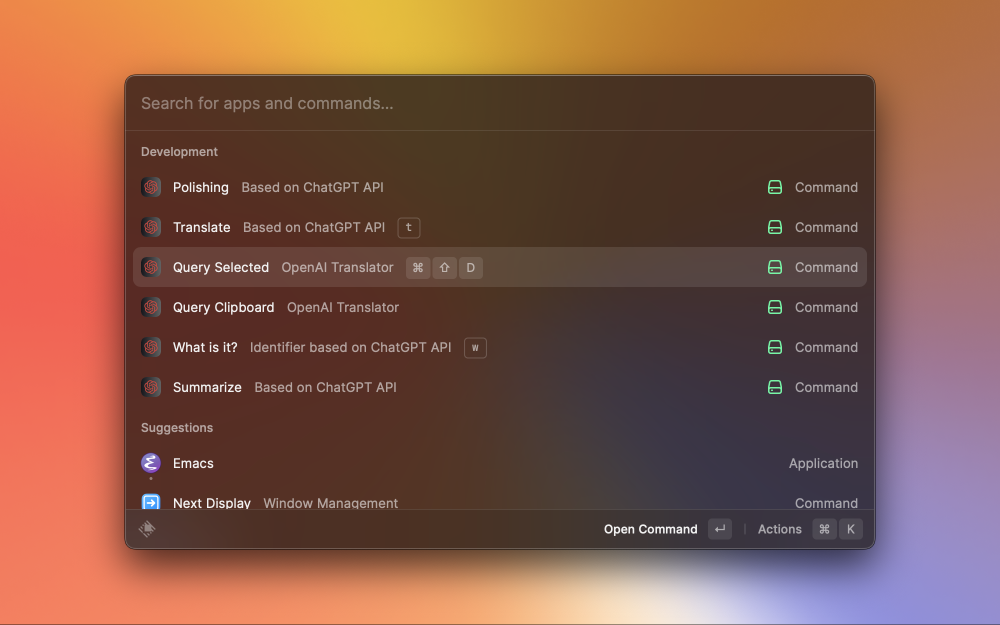

# OpenAI Translator

基于 ChatGPT API 的 [Raycast](https://www.raycast.com/) 翻译扩展。

https://user-images.githubusercontent.com/743074/226975894-de840861-d1c9-4c9e-8fe1-636f568570fe.mov


# Insipired By

- [yetone/openai-translator](https://github.com/yetone/openai-translator)
- [yihong0618/iWhat](https://github.com/yihong0618/iWhat)

# 参考(Cpoy)

- [yetone/openai-translator](https://github.com/yetone/openai-translator) (MIT License)
- [abielzulio/chatgpt-raycast](https://github.com/abielzulio/chatgpt-raycast) (MIT License)

# 安装

## 商店

[Raycast OpenAI Translator](https://www.raycast.com/douo/openai-translator)

## 手动

``` shell
git clone https://github.com/douo/raycast-openai-translator.git
cd raycast-openai-translator
npm install && npm run dev
```

扩展成功显示后就可以 `Ctrl-c` 结束 npm 进程，扩展能继续使用。

# 功能



获取你的 [OpenAI](https://platform.openai.com/account/api-keys) API Key.

## 主要功能

- 划词翻译
- 截图翻译
- 剪切板文本翻译
- 可绑定全局快捷键(需要手动去 Raycast 插件配置页配置)


## 翻译模式



感谢 [yetone/openai-translator](https://github.com/yetone/openai-translator)：

- 翻译
- 润色
- 总结


- What/What is it?(文本识别) (感谢 [yihong0618/iWhat](https://github.com/yihong0618/iWhat) 的 Prompts)


## 其他

- [x] 历史记录
- [x] 文本复制
- [x] 流式文本显示
- [x] 手动指定文本语言（自动检测在混合有多语言字符的情况下还不太靠谱）
- [x] 自定义 API URL
- [x] Proxy
- [ ] i18n
- [ ] TTS


# 如何配置划词搜索

- 进入扩展配置（`⌘+⇧+,`）
  1. 选择 "Query Selected"
  2. 如下图所示配置快捷键
  3. 确保 "Query Mode" 为 "Translate"


